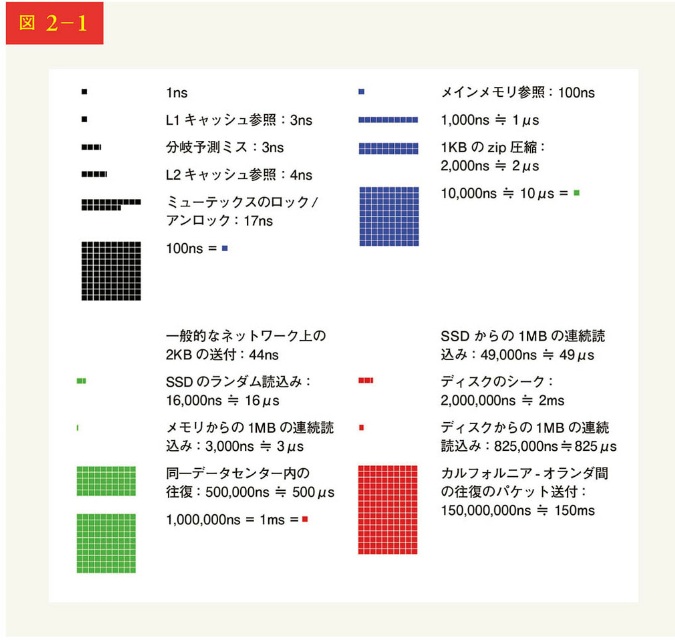

# 第 2 章 おおまかな見積もり

システム設計の面接試験では、しばしばシステム容量や性能要件をおおざっぱに見積もるように依頼されます。Google のシニアフェローであるジェフ・ディーンによれば、「おおまかな見積もりとは、思考実験と一般的な性能数値を組み合わせて、どの設計が要件を満たすかについて良い感触を得るために行う見積もり」だそうです。

おおまかな見積もりを効果的に行うには、スケーラビリティの基本的な感覚を身に付ける必要があります。2 のべき乗、プログラマが知っておくべきレイテンシの数値、可用性の数値などといった概念をよく理解しておく必要があります。

## 2 のべき乗

分散システムではデータ量が膨大になることもありますが、計算は基本に忠実です。正しい計算には、データ量の単位の 2 のべき乗で把握するのが重要になります。ASCII 文字は 1 バイト（8 ビット）のメモリを使用します。

| べき乗 | おおまそのデータ容量 | Full name    | Short name |
| ------ | -------------------- | ------------ | ---------- |
| 10     | 1,000                | 1 キロバイト | 1KB        |
| 20     | 10 万                | 1 メガバイト | 1MB        |
| 30     | 100 億               | 1 ギガバイト | 1GB        |
| 40     | 100 兆               | 1 テラバイト | 1TB        |
| 50     | 100 京               | 1 ペタバイト | 1PB        |

## プログラマが知っておくべきレイテンシの数値

Google のディーン Dr.は 2010 年における典型的なコンピュータ操作の時間を明らかにしています。コンピュータの高速化、高性能化に伴って、いくつかの数値は古くなっています。しかし、これらの数値はさまざまなコンピュータ操作の速さや遅さを知る上で、依然として有効であるはずです。

| コンピュータ操作名                            | 時間                  |
| --------------------------------------------- | --------------------- |
| L1 キャッシュ参照                             | 0.5ns                 |
| 分岐予測ミス                                  | 5ns                   |
| L2 キャッシュ参照                             | 7ns                   |
| ミューテックスのロック／アンロック            | 100ns                 |
| メインメモリ参照                              | 100ns                 |
| 1KB の zip 圧縮                               | 10,000ns = 10 μs      |
| 1Gbps ネットワーク上の 2KB 送付               | 20,000ns = 20 μs      |
| メモリからの 1MB の連続読み込み               | 250,000ns = 250 μs    |
| 同一データセンター内の往復                    | 500,000ns = 500 μs    |
| ディスクのシーク                              | 10,000,000ns = 10ms   |
| ネットワークからの 1MB の連続読み込み         | 10,000,000ns = 10ms   |
| ディスクからの 1MB の連続読み込み             | 30,000,000ns = 30ms   |
| カルフォルニア-オランダ間の往復のパケット送付 | 150,000,000ns = 150ms |

Google のソフトウェアエンジニアは、ディーン博士の数字を可視化するツールを作っています。このツールには、時間的な要素も考慮されています。

図 2-1 の数字を分析することで、次のような結論が得られます：

- メモリは速いが、ディスクは遅い
- 可能ならディスクのシークは避ける
- 単純な圧縮アルゴリズムは速い
- 可能であれば、インターネット送信前にデータを圧縮する
- データセンターは通常、異なる地域にあり、データセンターにデータを送るのに時間がかかる

## 可用性の数値

高可用性とは、望ましく長い時間に渡って継続的に稼働するシステムの能力です。高可用性はパーセンテージで測定され、100%はダウンタイムがゼロのサービスを意味します。多くのサービスは 99%から 100%の間にあります。

サービスレベルアグリーメント（SLA）とは、サービスプロバイダーに対してよく使われる言葉です。これは、サービスプロバイダーとその顧客との契約であり、この契約によって、サービスがどの程度の稼働率を実現するかは正式に定義されます。クラウドプロバイダーの Amazon、Google、Microsoft は、SLA を 99.9%以上に設定しています。稼働時間は、伝統的に 9 で測定されます。9 が多ければ多いほど良いわけです。表 2-3 に示すように、9 の数は予想されるシステムの停止時間と相関があります。

| 可用性 (%) | 1 日の ダウンタイム | 1 週間の ダウンタイム | 1 月の ダウンタイム | 1 年の ダウンタイム |
| ---------- | ---------------------- | ------------------------ | ---------------------- | ---------------------- |
| 99%        | 14.40 分               | 1.68 時間                | 7.31 時間              | 3.65 日                |
| 99.9%      | 1.44 分                | 10.08 分                 | 43.83 分               | 8.77 時間              |
| 99.99%     | 8.64 秒                | 1.01 分                  | 4.38 分                | 52.60 分               |
| 99.999%    | 864.00 ミリ秒          | 6.05 秒                  | 26.30 秒               | 5.26 分                |
| 99.9999%   | 86.40 ミリ秒           | 604.80 ミリ秒            | 2.63 秒                | 31.56 秒               |

## 例：Twitter の QPS と必要なストレージの見積もり

以下の数字は、Twitter の実際の数字ではなく、この演習のためだけのものであることに注意してください。

前提条件：

- 月間アクティブユーザー数 3 億人
- 50%のユーザーが毎日 Twitter を利用
- ユーザーは 1 日平均 2 件のツイートを投稿
- ツイートの 10%はメディアを含む
- データは 5 年間保存

推定値：
クエリ/秒（QPS）の推定値：

- デイリーアクティブユーザー（DAU）= 3 億人 × 50% = 1 億 5,000 万人
- ツイートの QPS = 1 億 5000 万 × 2 ツイート/24 時間/3600 秒間 = ~3500
- ピーク時の QPS = 2 × QPS = ~7000

ここではメディアストレージのみを試算します。

平均的なツイートサイズ：

- ツイート ID：64 バイト
- テキスト：140 バイト
- メディア：1 メガバイト

メディアの保存量：1 億 5000 万 ×2×10%×1MB=30TB/日
5 年間のメディア保存量：30 TB × 365 × 5 = ~55 PB

## ヒント

おおざっぱな見積もりでは、プロセスが重要です。結果を得ることよりも、問題を解決することが重要なのです。面接官は、あなたの問題解決能力を試しているのかもしれません。ここでは、いくつかのヒントを紹介しましょう。

- 四捨五入と概算：面接では、複雑な計算をするのは難しい。例えば、「99987/91」の答えはどうなるか。複雑な計算問題を解くために貴重な時間を費やす必要はない。正確さは求められないのだ。おおざっぱな数字や近似値を上手に使おう。割り算の問題は"100,000/10"のように単純化できる
- 仮定を書き出す：後で参照できるように、仮定を書き留めておくとよい
- 単位にラベルを付ける："5"と書くと、5KB を意味するのか、5MB を意味するのか、と混乱するかもしれない。"5MB"と書けば曖昧さがなくなる。単位を書くのだ
- おおまかな見積もりはよく聞かれる：QPS、ピーク QPS、ストレージ、キャッシュ、サーバー数などだ。面接の準備の際に、これらの計算を練習しておくとよい。練習すれば完璧になる

ここまで来られたが、おめでとうございます。さあ、自分をほめてあげてください。よくやったと。
