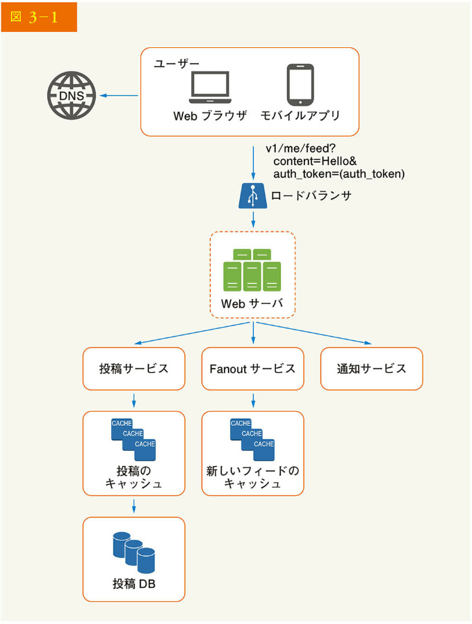
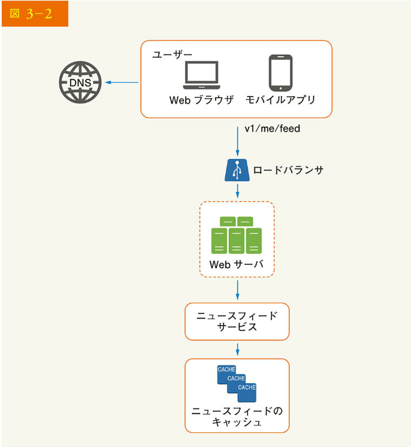
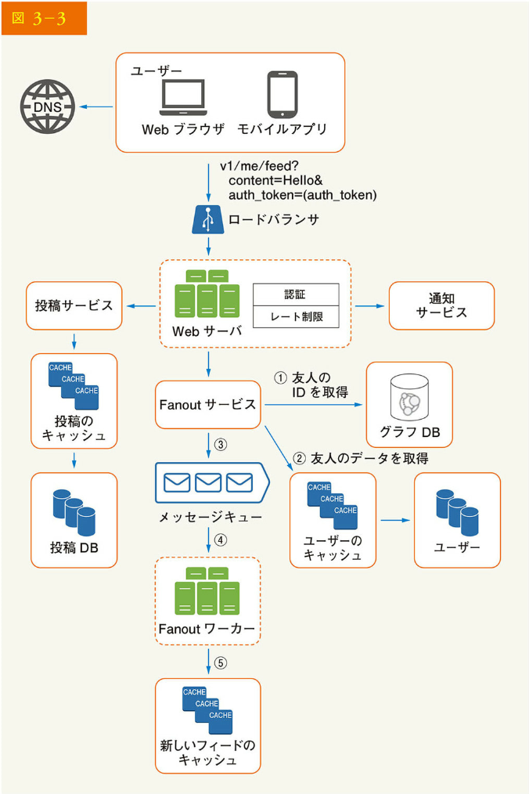
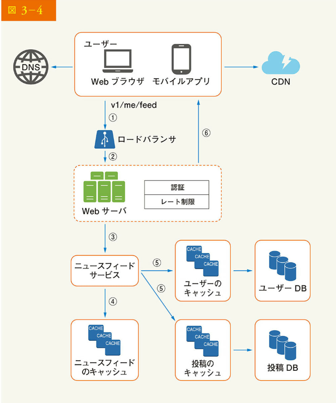

# 3 章 システム設計の面接試験のフレームワーク

憧れの企業での対面の面接が決まりました。採用担当者から当日のスケジュールが送られてきます。良い感じでスケジュールを読み進めていくと、「システム設計の面接試験」という項目に目が留まります。

システム設計の面接試験は、しばしば威圧的です。「有名な製品 X を設計していますか」というように、漠然としているかもしれません。質問も曖昧で、理不尽に範囲が広く感じられます。あなたが疲れるのも無理ありません。何しろ、何千人とは言わないまでも、何百人ものエンジニアが苦労して作り上げた人気の製品を、誰が 1 時間で設計できるのでしょう。

幸いなことに、誰もあなたにそのようなことを期待しているわけではありません。現実のシステム設計は非常に複雑です。例えば、Google の検索は非常にシンプルですが、そのシンプルさを支えている膨大な技術には本当に驚かされます。では、1 時間で現実のシステムを設計することは期待されないとしたら、システム設計の面接試験の利点とは何でしょう。

システム設計の面接試験は、2 人の同僚が共同で曖昧な問題に対して目標を満たすソリューションを考え出すという、現実世界における問題解決の疑似体験なのです。問題には、結論はなく、完璧な答えもありません。最終的な設計は、設計プロセスに費やした努力に比べれば、それほど重要ではありません。設計のプロセスによって、自らの設計スキルを証明し、設計上の選択を擁護し、フィードバックに対して建設的に対応するのです。

ここで、あなたに会いに会議室へ入ってくるとき、面接官が何を考えているかについて考察してみましょう。面接官の第一の目標は、あなたの能力を正確に評価することです。面接官が一番避けたいのは、面接がうまくいかず、十分なメッセージが得られずに、結論の出ない評価をすることです。では、システム設計の面接試験において面接官は何を求めているのでしょう。

システム設計の面接試験で問われるのは技術的な設計能力がすべてであると考える人が多いようです。しかし、それだけではありません。優れたシステム設計の面接では、その人の協調性、プレッシャーでの仕事ぶり、曖昧さを建設的に解決する能力がよくわかります。良い質問をする能力もまた、不可欠なスキルであり、多くの面接官に求められるでしょう。

優秀な面接官は、危険信号にも目を向けます。過剰なエンジニアリングは多くのエンジニアが抱く病であり、彼らは設計の純粋さに寄りを感じ、トレードオフを無視します。そのため、過剰なシステム設計がもたらす複合的なコストにしばしば気づかず、多くの企業がその代償を支払っています。こうした傾向は、システム設計の面接では絶対に見せたくありません。その他、視野の狭さ、頑固さなども危険信号となります。

この章では、システム設計の面接試験のヒントをいくつか理解し、問題を解決する上で有用なシンプルで効果的なフレームワークを紹介します。

## 優れたシステム設計の面接試験の 4 ステップ

システム設計の面接試験に同じものはありません。優れたシステム設計の面接試験には結論はなく、万能な解決策もありません。しかし、すべてのシステム設計の面接試験には、カバーすべきステップと共通のフレームワークがあります。

### ステップ 1：問題を理解し、設計範囲を明確にする

「なぜ、虎は吠えたのですか？」
教室の後ろのほうで手があがりました。
「はい、ジミー？」と教師が指します。
「お腹が空いていたからです」
「よくできました、ジミー」

幼い頃から、ジミーはクラスで真っ先に質問に答えていました。先生が質問をすると、答えがわかってもわからなくても、必ず質問にチャレンジするのを好む子が教室にいます。それがジミーです。

ジミーは優等生です。すべての答えに早く到達することにプライドを持っています。試験でも、たいてい最初に問題を解き終わります。どのような学問分野の競争でも、教師が真っ先に選ぶのは彼なのです。

でも、ジミーのようになってはいけません。

システム設計の面接試験では、何も考えずに素早く答えを出しても、ボーナスポイントはもらえません。また、要件を十分に理解せずに答えるのは、面接試験が雑学コンテストでない以上、大きな危険信号となるでしょう。正解はないのです。

だから、すぐに飛びついて答えを出してはいけません。ゆっくりと考えてください。深く考え、質問をして、要件や前提条件を明確にします。これは非常に重要なことです。

エンジニアとしては、難しい問題を解決して最終的な設計へと飛び込みたいところですが、このやり方では間違ったシステムを設計してしまう可能性が高いのです。エンジニアにとって最も重要なスキルの 1 つは、正しく質問し、適切な仮定を立て、システムを構築するために必要なすべての情報を収集することです。ですから、躊躇することなく質問してください。

質問された面接官は、あなたの質問に直接答えたり、あなたの仮説を問いただしたりします。後者の場合は、ホワイトボードや紙に仮説を書き出してください。後で必要になるかもしれません。

どのような質問をすればいいのでしょう。要件を正確に理解するための質問です。以下は、質問のリストです。

• 具体的にどのような機能を開発するのか
• 製品のユーザー数はどのくらいか
• どの程度のスピードでスケールアップすることを想定しているか。3 ヶ月後、6 ヶ月後、1 年後のスケールアップはどの程度を想定しているか
• その会社の技術的な問題は何か。設計をシンプルにするために活用できそうな既存サービスは何か

例

ニュースフィードのシステム設計を依頼されたとき、要件の明確化のために質問するとします。あなたと面接官の会話は、次のようなものになるでしょう。

候補者：これはモバイルアプリですか、それとも Web アプリですか、それとも両方ですか？
面接官：両方です。
候補者：製品において最も重要な機能は何ですか？
面接官：投稿できることと、友だちのニュースフィードが見られることです。
候補者：ニュースフィードの並び順は、逆時系列ですか、それとも特定の順序ですか？特定の順序とは、各投稿に異なる重みが与えられていることを意味します。例えば、親しい友人からの投稿は、グループからの投稿よりも重要視されるのです。
面接官：シンプルにするため、フィードは逆時系列でソートされていると仮定しましょう。
候補者：1 人のユーザーが持てる友だちの数はどのくらいですか？
面接官：5,000 人です。
候補者：トラフィック量はどのくらいですか。
面接官：1,000 万人のデイリーアクティブユーザー（DAU）です。
候補者：フィードには、画像や動画、あるいはテキストが含まれますか？
面接官：画像と動画の両方を含むメディアファイルが含まれます。

以上は、面接官への質問のサンプルです。要件を理解し、あいまいな点を明確にすることが重要なのです。

ステップ 2：高度な設計を提案し、発展を得る

このステップでは、高度な設計を行い、その設計について面接官と合意することを目指します。その際、面接官と協力しながら進めるとよいでしょう。

• 設計の初期設計図を作成し、フィードバックを求める。面接官をチームメイトとして扱い、一緒に仕事をする。優秀な面接官は、話をしたり、関わったりするのが好きだ

• ホワイトボードや紙に、主要な構成要素をボックス図に描く。クライアント（モバイル/Web）、API、Web サーバ、データストア、キャッシュ、CDN、メッセージキューなどが含まれるかもしれない

• 青写真がスケールの制約に合っているか、おおざっぱな計算で評価する。声に出して考える。設計に入る前におおざっぱな計算が必要なら、それを面接官に伝える

可能であれば、いくつかの具体的なユースケースを確認しましょう。そうすることで、高度な設計を組み立てられます。ユースケースはまた、あなたがまだ考慮に入れていない特別なケースを発見するのに役立つでしょう。

設計に、API エンドポイントやデータベーススキーマも含めるべきでしょうか。これは、問題によります。「Google の検索エンジンの設計」のような大きな設計であれば、少しレベルが低過ぎるでしょう。多人数参加型ポーカーゲームのバックエンド設計のような問題であれば、適切でしょう。面接官とコミュニケーションを取るのです。

### 例

「ニュースフィードシステムの設計」を例に、高度な設計への取り組み方を説明します。ここでは、システムが実際、どのように動くかを理解する必要はありません。詳細は 11 章で説明します。

高度な設計は、フィードの公開とニュースフィードの構築という 2 つの流れに分けられます。

• フィードの公開：ユーザーが投稿を公開すると、対応するデータがキャッシュ/データベースに書き込まれ、その投稿は友人のニュースフィードに取り込まれる

• ニュースフィードの構築：友人の投稿を逆時系列に集約し、ニュースフィードを構築する

図 3-1、図 3-2 は、それぞれフィード公開フローとニュースフィード構築フローの高度な設計を示しています。

図には以下のコンポーネントが示されています：

- DNS
- ユーザー（Web ブラウザ、モバイルアプリ）
- ロードバランサ (v1/me/feed?content=Hello&auth_token=(auth_token))
- Web サーバ
- 3 つのサービス（投稿サービス、Fanout サービス、通知サービス）
- キャッシュ（投稿のキャッシュ、新しいフィードのキャッシュ）
- 投稿 DB

[図 3-2 の内容：システム構成図が示されており、以下のコンポーネントが含まれています]

- DNS
- ユーザー（Web ブラウザ、モバイルアプリ）
- ロードバランサ（v1/me/feed）
- Web サーバ
- ニュースフィードサービス
- ニュースフィードのキャッシュ

## ステップ 3：設計の深掘り

このステップでは、あなたと面接官はすでに以下の目的を達成しているはずです。

• 全体的なゴールと機能の範囲について合意した
• 全体設計のために高度な青写真を描いた
• 高度な設計に対して面接官からのフィードバックを得た

• フィードバックに基づいて深掘りすることで、フォーカスすべきエリアについて最初のアイデアを得た

面接官と協力して、アーキテクチャの構成要素を特定し、優先順位を付けましょう。面接は好回異なることを強調しておきます。時には、面接官が高度な設計に集中するのが好きだというヒントを与えてくれるかもしれません。上級職階の面接では、システムの性能特性について議論されることもあり、ボトルネックやリソースの見積もりに焦点が当てられる可能性もあります。ほとんどの場合、面接官はシステムの構成要素の詳細を掘り下げるのを望むかもしれません。URL 短縮システムであれば、長い URL を短い URL に変換するハッシュ関数の設計に踏み込むと面白いでしょう。チャットシステムであれば、待ち時間をいかに減らすか、オンライン/オフラインの状態をどのようにサポートするか、などが重要なトピックです。

細かな作業に追われると自分の能力を発揮できないので、タイムマネジメントは必須です。面接官に見せるメッセージを用意しておく必要があります。余計なことに首を突っ込まないようにしましょう。例えば、Facebook のフィードランキングの EdgeRank アルゴリズムについて詳しく話すことは、システム設計の面接では望ましくありません。

### 例

この時点で、ニュースフィードシステムの高度な設計について議論し、面接官はあなたの提案に満足しています。次に、最も重要な 2 つのユースケースを調査します。

1. フィードの公開
2. ニュースフィードの検索

図 3-3、図 3-4 に、この 2 つのユースケースの詳細設計を示しますが、これについては 11 章で詳しく説明します。

### ステップ 4:まとめ

この最終ステップでは、面接官がいくつかフォローアップの質問したり、その他の点について自由に話したりできます。以下はその例です。

• 面接官は、システムのボトルネックを特定し、改善の可能性について議論するように求めるかもしれない。あなたの設計が完璧で、何も改善できないとは決して言わない。改善すべき点は必ずある。これは、あなたの批判的思考を示し、最終的に良い印象を残すための絶好の機会である
• 面接官にあなたの設計を振り返ってもらうのも有効である。これは、あなたがいくつかの解決策を提案した場合に特に重要である。良いセッションの後に面接官の記憶をリフレッシュさせるのは有効だろう
• エラー事例（サーバ障害、ネットワーク損失など）を話すのは興味深い
• 運用上の問題は、言及する価値がある。数値やエラーログをどのように監視しているか、システムをどのようにロールアウトするか
• 次のスケールカーブにどのように対応するかも、興味深いトピックである。例えば、現在の設計で 100 万ユーザーをサポートしている場合、1000 万ユーザーをサポートするにはどのような変更が必要だろうか
• その他、時間があれば必要な改良を提案する。最後に、やるべきこととやるべきでないことのリストをまとめる

やるべきこと
• つねに説明を求めること。自分の思い込みが正しいと思い込まないこと
• 問題の要件を理解する
• 正解もベストアンサーもない。若いスタートアップ企業の問題を解決するために設計されたソリューションは、何百万人ものユーザーを持つ老舗企業のそれとは異なる。要件は必ず理解すること
• あなたが考えていることを面接官に伝えよう。面接ではコミュニケーションを取ること
• 可能であれば、複数のアプローチを提案する
• 青写真について面接官と合意したら、各構成要素の詳細を確認する。最も重要な構成要素を最初に設計する
• 面接官にアイデアをぶつける。良い面接官は、チームメイトとしてあなたと一緒に仕事をする
• 決してあきらめないこと

やるべきでないこと
• 面接での典型的な質問に対する準備を怠らないこと
• 要件や前提条件を明確にしないまま、解決策に飛びつかないこと
• 最初に 1 つのコンポーネントについてあまり詳しく説明しないこと。最初に高度な設計を行い、その後掘り下げる
• 行き詰まったら、遠慮なくヒントを求めること
• 繰り返しになるが、コミュニケーションを取ること。黙って考えないこと
• 設計を伝えたら面接が終わったと思わないこと。面接官が「終わった」と言うまで、あなたは終わっていない。早く、そして頻繁にフィードバックを求める

各ステップの時間配分

システム設計の面接試験の質問は通常非常に幅広いので、設計全体をカバーするのに 45 分や 1 時間では足りません。時間管理は必須です。では、各ステップにどれくらいの時間をかけるべきなのでしょうか。以下は、45 分のインタビューセッションにおける時間配分の非常に大まかな目安です。あくまで目安であり、実際の時間配分は問題の範囲や面接官の要求によって異なることを覚えておいてください。

ステップ 1 問題を理解し、設計範囲を確定する：3 分～ 10 分
ステップ 2 高度な設計を提案し、賛同を得る：10 分～ 15 分
ステップ 3 設計を深掘りする：10 分～ 25 分
ステップ 4 まとめる：3 分～ 5 分
