# 4 章 レートリミッターの設計

ネットワークシステムでは、クライアントやサービスから送信されるトラフィックの速度を制御するためにレートリミッターが使用されます。HTTP の世界では、レートリミッターが指定期間に送信できるクライアントリクエストの数を制限します。API リクエストの数がレートリミッターで定義された閾値を越えると、すべての過剰なコールがブロックされるのです。以下はその例です。

• ユーザーは 1 秒間に 2 件までしか書き込みができない
• 同じ IP アドレスから 1 日に作成できるアカウントは最大 10 個まで
• 同じデバイスから報酬を請求できるのは、1 週間に 5 回まで

この章では、レートリミッターを設計しましょう。設計を始める前に、まず API レートリミッター使用のメリットを見ていきます。

• サービス拒否（DoS）攻撃によるリソースの枯渇を防ぐ [1]。大手ハイテク企業が公開するほぼすべての API は、何らかの形でレート制限を実施している。例えば、Twitter は、3 時間あたりのツイート数を 300 に制限している [2]。Google docs の API は、デフォルトで「読み取り要求について、1 ユーザーあたり 60 秒間に 300 回 [3]」という制限を設けている。レートリミッターは、過剰な呼び出しをブロックすることで、意図的または非意図的な DoS 攻撃を防止するのだ

• コストを削減する。過剰なリクエストを制限することは、サーバの数を減らし、より多くのリソースを優先度の高い API に割り当てることを意味する。レート制限は、有料のサードパーティ API を使用している企業にとって非常に重要である。例えば、クレジットチェック、支払い、健康記録の取得といった外部 API を利用する場合、呼び出しごとに課金される。コスト削減には、呼び出し回数の制限が不可欠となる

• サーバの過負荷を防ぐ。サーバ負荷を軽減するため、ボットやユーザーの不正行為による過剰なリクエストをフィルタリングするレートリミッターを使用する

## ステップ 1 問題を理解し、設計範囲を明確にする

レートリミッターは様々なアルゴリズムで実装可能であり、それぞれに長所と短所があります。面接官と候補者のやりとりは、作ろうとしているレートリミッターの種類を明確にする上で役立ちます。

候補者：どのようなレートリミッターを設計しようとしているのですか？クライアントサイドのレートリミッターなのでしょうか、それともサーバサイドの API レートリミッターなのでしょうか？

面接官：良い質問ですね。私たちはサーバサイドの API レートリミッターを考えています。

候補者：レートリミッターは、IP やユーザー ID、あるいは他のプロパティに基づいて API リクエストを制限（スロットリング）するのでしょうか。

面接官：そうです。レートリミッターは、異なる制限ルールのセットをサポートする上で十分な柔軟性を持っている必要があります。

候補者：システムの規模はどの程度ですか。スタートアップ企業向けなのでしょうか、それとも大規模なユーザー基盤を持つ大企業向けなのでしょうか。

面接官：システムは、大量のリクエストを処理できなければなりません。

候補者：システムは分散環境で動作するのでしょうか。

面接官：はい、そうです。

候補者：レートリミッターは別のサービスでしょうか、それともアプリケーションコードに実装すべきでしょうか。

面接官：それは、あなたの設計に対する判断次第です。

候補者：制限されたユーザーに通知する必要がありますか。

面接官：はい。

### 必要条件

システムに対する要求事項の概要は以下の通りです。

• 過剰なリクエストを的確に制限すること
• 低遅延であること。HTTP のレスポンスタイムを遅くしない
• できるだけ少ないメモリで動作すること
• 分散型レートリミッターであること。複数のサーバやプロセスでレートリミッターを共有可能
• 例外処理。リクエストが制限されたとき、ユーザーに明確な例外を表示する
• 高い障害耐性。レートリミッターに何らかの問題が発生した場合（例えばキャッシュサーバがオフラインになった場合）も、システム全体には影響しない

## ステップ 2 高度な設計を提案し、賛同を得る

ここでは、シンプルに基本的なクライアント-サーバモデルで通信することにしましょう。

### レートリミッターはどこに置くのか

直感的には、レートリミッターはクライアント側あるいはサーバ側のどちらにも実装できます。

• クライアント側での実装：一般に、クライアントのリクエストは悪意のある行為者によって簡単に偽造される可能性があるため、クライアントはレート制限を実施するには信頼性の低い場所である。さらに、クライアントの実装を制御できない可能性もある

• サーバ側での実装：図 4-1 は、サーバサイドに設置されたレートリミッターを示したものである

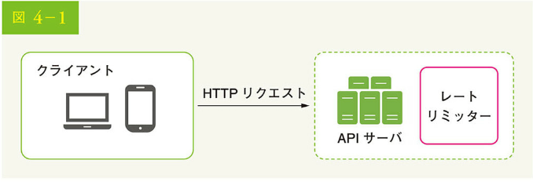

クライアント側とサーバ側の実装以外にも、方法はあります。API サーバにレートリミッターを置くかわりに、図 4-2 に示すように、API へのリクエストをスロットルで制限するレートリミッターミドルウェアを作成するのです。

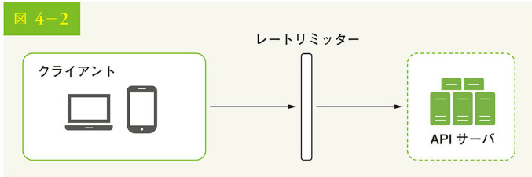

図 4-3 の例を使って、この設計でレート制限がどのように機能するかを説明しましょう。API が 1 秒間に 2 つのリクエストを許可し、クライアントが 1 秒間に 3 つのリクエストをサーバに送ると仮定します。最初の 2 つのリクエストは API サーバにルーティングされます。しかし、レートリミッターミドルウェアは、3 番目のリクエストを制限（スロットリング）し、HTTP ステータスコード 429 を返します。HTTP 429 のレスポンスステータスコードは、ユーザーがあまりにも多くのリクエストを送信したことを示します。

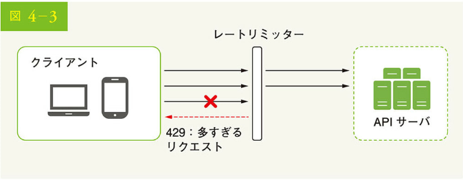

クラウドマイクロサービス [4] は広く普及しており、レート制限は通常、API ゲートウェイと呼ばれるコンポーネント内に実装されています。API ゲートウェイは、レート制限、SSL 終了、認証、IP ホワイトリスト、静的コンテンツのサービスなどをサポートするフルマネージドサービスです。ここでは、API ゲートウェイがレートリミッターをサポートするミドルウェアであることだけを知っておけばよいでしょう。

レート制限を設計する際に重要なのは、「レート制限はどこに実装するべきか、サーバ側あるいはゲートウェイ内か」です。絶対的な答えはありません。それは、あなたの会社における現在の技術スタック、エンジニアリング・リソース、優先順位、目標などに依存します。ここでは、いくつかの一般的なガイドラインを紹介しましょう。

• プログラミング言語、キャッシュサービスなど、現在の技術スタックを評価する。現在使用しているプログラミング言語が、サーバ側でレート制限を実装するのに有効であることを確認する

• ビジネスニーズに合ったレート制限アルゴリズムを特定する。サーバ側にすべてを実装する場合、アルゴリズムは完全に制御できる。しかし、サードパーティのゲートウェイを使用する場合は、選択肢は制限される可能性がある

• すでにマイクロサービス・アーキテクチャを採用し、認証や IP アドレスリスト作成などのために API ゲートウェイを設計に組み込んでいる場合、API ゲートウェイにレート制限を追加できる

• レートリミッターサービスを独自に構築するのは時間がかかる。レートリミッターを実装するための十分なエンジニアリングリソースがない場合は、商用 API ゲートウェイを利用するのがよいだろう

### レートリミッターのアルゴリズム

レートリミッターは様々なアルゴリズムを使って実装でき、それぞれに明確な長所と短所があります。この章ではアルゴリズムに焦点を当てませんが、高レベルでそれらを理解することは、ユースケースに合致する正しいアルゴリズムやアルゴリズムの組み合わせを選択するのに役立ちます。以下は、一般的なアルゴリズムのリストです。

• トークンバケット（Token bucket）
• リーキーバケット（Leaky bucket）
• 固定ウインドウカウンタ（Fixed window counters）
• スライディングウインドウログ（Sliding window log）
• スライディングウインドウカウンタ（Sliding window counters）

### トークンバケットアルゴリズム

トークンバケットアルゴリズムは、レート制限に広く使われます。シンプルでわかりやすく、インターネット企業でよく使われているのです。Amazon [5] と Stripe [6] は、このアルゴリズムを使って API リクエストを制限しています。

トークンバケットアルゴリズムは、以下のように動作します。

• トークンバケットとは、あらかじめ決められた容量を持つコンテナである。トークンバケットはあらかじめ決められた容量を持つ容器で、定期的にトークンが入れられる。バケットが満杯になると、それ以上トークンは追加されない。図 4-4 に示すように、トークンバケットの容量は 4 である。補充係は 1 秒に 2 個のトークンをバケットに入れる。バケットが一杯になると、余分なトークンが溢れ出す

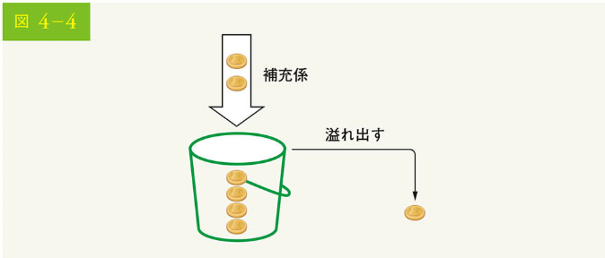

• 各リクエストは 1 つのトークンを消費する。リクエストが届くと、バケットに十分なトークンがあるかを確認する。図 4-5 はその様子を示している
• 十分なトークンがある場合、各リクエストに対して 1 つのトークンを取り出し、リクエストは通過する
• 十分なトークンがない場合、リクエストは破棄される

図 4-6 は、トークン消費、再充填、およびレート制限ロジックがどのように機能するかを示しています。この例では、トークンのバケットサイズは 4 で、補充レートは 1 分間に 4 です。

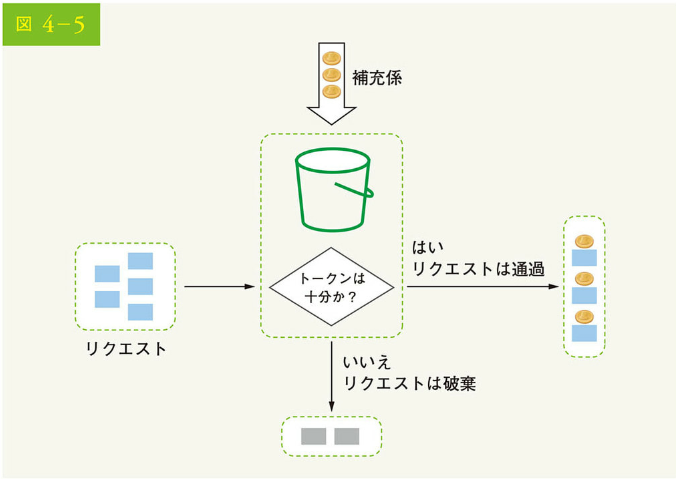

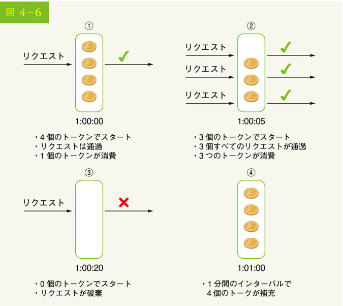

トークンバケットアルゴリズムは 2 つのパラメータを取ります。

• バケットサイズ：バケットに入れられるトークンの最大数
• 補充率：1 秒間にバケットに入れられるトークンの数

バケットはいくつ必要でしょう。これは様々で、レート制限のルールによって変わります。以下はその例です。

• 通常、API エンドポイントごとに異なるバケットを用意する必要がある。たとえば、あるユーザーが 1 秒間に 1 回の投稿、1 日あたり 150 人の友だち追加、1 秒間に 5 回の「いいね！」が許可されている場合、各ユーザーに対して 3 つのバケットが必要である
• IP アドレスに基づいてリクエストを制限する必要がある場合、各 IP アドレスに 1 つのバケットが必要である
• もしシステムが 1 秒間に最大 10,000 のリクエストを許可するなら、すべてのリクエストで共有されるグローバルバケットを持つことは理にかなっている

#### 長所

• アルゴリズムの実装が簡単
• メモリ効率が良い
• トークンバケットは短時間のバーストトラフィックを可能にする。トークンが残っている限り、リクエストは通過できる

#### 短所

• バケットサイズとトークン補充率という 2 つのパラメータがあるが、これらを適切に調整するのは難しいかもしれない

### リーキーバケットアルゴリズム

リーキーバケットアルゴリズムは、リクエストの処理速度が一定であることを除けば、トークンバケットと似ています。これは通常、先入れ先出し（FIFO）のキューで実装されます。このアルゴリズムは次のように動作します。

• リクエストが到着すると、システムはキューが満杯かをチェックする。もし満杯でなければ、リクエストはキューに追加される
• 満杯であればリクエストはキューに追加され、満杯でなければリクエストは削除される
• リクエストはキューから引き出され、一定時間ごとに処理される

図 4-7 は、このアルゴリズムの仕組みを説明しています。

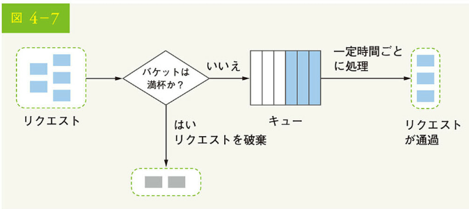

リーキーバケットアルゴリズムは、以下の 2 つのパラメータを取ります。

• バケットサイズ：キューサイズに等しい、キューは一定の割合で処理されるリクエストを保持する
• 流出率：一定の割合で処理できるリクエスト数を定義するもので、通常は秒単位で指定する

EC 企業の Shopify は、リーキーバケットアルゴリズムをレート制限に使用しています [7]。

#### 長所

• キューサイズに制限があるため、メモリ効率が良い
• リクエストは固定レートで処理されるため、安定した流出レートが必要なユースケースに適している

#### 短所

• トラフィックのバーストは古いリクエストでキューを満たし、それらが時間内に処理されない場合、新しいリクエストはレート制限される
• アルゴリズムには 2 つのパラメータがある。それらを適切にチューニングするのは簡単ではないかもしれない

###固定ウインドウカウンタアルゴリズム

固定ウインドウカウンタアルゴリズムは、次のように動作します。

• このアルゴリズムは、タイムラインを固定サイズのタイムウインドウに分割し、各ウインドウにカウンタを割り当てる
• 各リクエストはカウンターを 1 つずつ増加させる
• カウンタが事前に定義された閾値に達すると、新しいタイムウインドウが始まるまで新しいリクエストは新しいタイムウインドウが始まるまで落とされる

具体的な例を用いて、その仕組みを説明しましょう。図 4-8 では、時間単位は 1 秒で、システムは 1 秒間に最大 3 つのリクエストを許可しています。各秒数ウインドウにおいて、3 つ以上のリクエストを受信した場合、図 4-8 に示すように、余分なリクエストは落とされます。

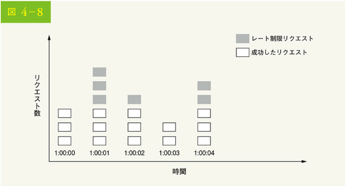

このアルゴリズムの大きな問題は、タイムウインドウの端でトラフィックのバーストが発生すると、許容されるクォータよりも多くのリクエストが通過してしまうことです。次のようなケースを考えてみましょう。

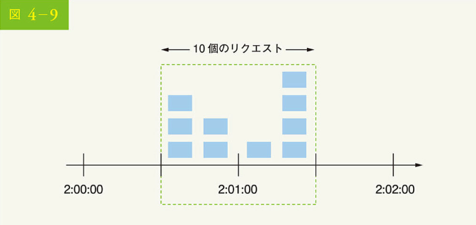

図 4-9 では、システムは 1 分間に最大 5 つのリクエストを許可し、利用可能な割り当ては早いことに、おおよそ 1 分でリセットされます。見ての通り、2 時 00 分 00 秒から 2 時 01 分 00 秒の間に 5 つのリクエストがあり、2 時 01 分 00 秒から 2 時 02 分 00 秒の間にさらに 5 つのリクエストがあります。2:00:30 から 2:01:30 までの 1 分間では、10 個のリクエストが通過しました。これは、許可されたリクエストの 2 倍です。

#### 長所

• メモリ効率が良い
• 理解しやすい
• 単位時間のウインドウが終了した時点で利用可能な割り当てをリセットすることは、特定のユースケースに適合している

#### 短所

• ウインドウの端におけるトラフィックの急増は、通過する許容割り当てよりも多くのリクエストを引き起こす可能性がある

### スライディングウインドウログアルゴリズム

前述したように、固定ウインドウカウンタアルゴリズムには、ウインドウの端でより多くのリクエストを通過させるという大きな問題があります。スライディングウインドウログアルゴリズムはこの問題を解決します。このアルゴリズムは次のように動作します。

• アルゴリズムは、リクエストのタイムスタンプを追跡する。タイムスタンプのデータは通常、Redis [8] のソートされたセットのようなキャッシュに保持される
• 新しいリクエストが来たら、古いタイムスタンプをすべて削除する。古いタイムスタンプとは、現在のタイムウインドウの開始時点より古いものを指す
• 新しいリクエストのタイムスタンプをログに追加する
• ログのサイズが許容カウントと同じかそれ以下の場合、リクエストは受け入れられる。そうでなければ、拒否される

図 4-10 を例に、このアルゴリズムを説明しましょう。

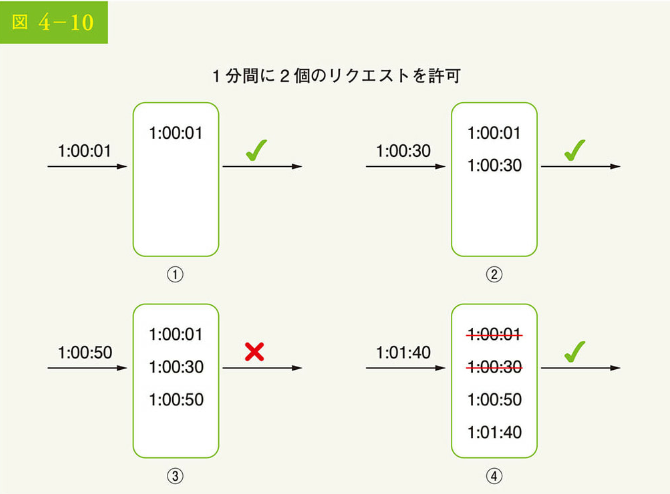

この例では、レートリミッターが 1 分間に 2 個のリクエストを許可しています。通常、Linux のタイムスタンプはログに UNIX 保存されます。ただし、この例では読みやすくするために、人間が読める時間の表現が使われています。

• 1:00:01 に新しいリクエストが到着したとき、ログは空である。したがって、そのリクエストは許可される
• 新しいリクエストが 1:00:30 に到着すると、タイムスタンプ 1:00:30 がログに挿入される。挿入後、ログのサイズは 2 であり、許容カウントより大きくはない。したがって、このリクエストは許可される
• 新しいリクエストは 1:00:50 に到着し、タイムスタンプがログに挿入される。挿入後、ログのサイズは 3 であり、許可されたサイズ 2 より大きい。したがって、このリクエストは、ログにタイムスタンプが残っていても拒否される
• 新しいリクエストが 1 時 01 分 40 秒に到着した。[1:00:40,1:01:40]の範囲にあるリクエストは最新の時間枠内だが、1:00:40 より前に送られたリクエストは古くなっている。2 つの古いタイムスタンプ、すなわち 1:00:01 と 1:00:30 はログから削除される。再移動操作の後、ログのサイズは 2 になるため、リクエストは受け入れられる

#### 長所

• このアルゴリズムによって実装されたレート制限は、非常に正確である。どのローリングウィンドウにおいても、リクエストはレート制限を超えることはない

#### 短所

• たとえ再探索が拒否されても、そのタイムスタンプがまだメモリに保存されているかもしれないため、このアルゴリズムは多くのメモリを消費する

### スライディングウィンドウカウンタアルゴリズム

スライディングウィンドウカウンタアルゴリズムは、固定ウィンドウカウンタとスライディングウィンドウログを組み合わせたハイブリッドアプローチです。このアルゴリズムは、2 つの異なるアプローチで実装できます。本節では一方の実装を説明し、もう一方の実装については本章の最後に文献を紹介します。図 4-11 に、このアルゴリズムがどのように動作するかを示しました。

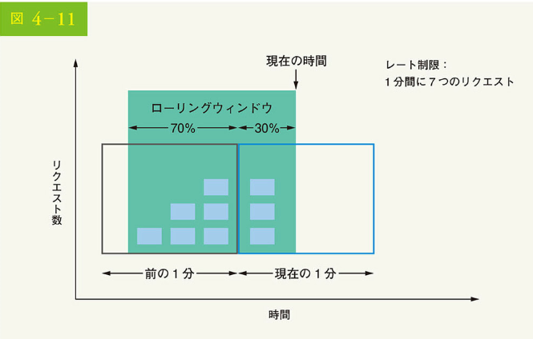

レートリミッターが 1 分間に最大 7 つのリクエストを許可し、前の 1 分に 5 つ、現在の 1 分に 3 つのリクエストがあると仮定します。現在の 1 分の 30%の位置に到着した新しいリクエストに対する、ローリングウィンドウ内のリクエスト数は次の式で算出されます。

• 現在のウィンドウのリクエスト数 + 前のウィンドウのリクエスト数 × ローリングウィンドウと前のウィンドウの重なり率

• この式で計算すると、3 + 5 × 0.7% = 6.5 リクエストとなる。ユースケースによって、この数値は切り上げられたり、切り下げられたりすることがある。この例では、6 に切り捨てられている

レートリミッターは 1 分間に最大 7 つのリクエストを許可するので、現在のリクエストは通過できます。しかし、あと 1 回リクエストを受けると制限に達します。

スペースの関係で、他の実装についてはここでは触れません。興味のある読者は参考文献[9]を参照してください。またこのアルゴリズムは完璧ではありません。長所と短所があるのです。

#### 長所

• 直前のウィンドウの平均レートに基づいているため、トラフィックのスムーズな急増が可能になる
• メモリ効率が良い

#### 短所

• あまり厳密でないルックバックウィンドウにしか使えない。前のウィンドウのリクエストが均等に分散していると仮定しているため、実際のレートに近接している。しかし、この問題は意外と悪くないかもしれない。Cloudflare の実験によれば[10]、4 億のリクエストのうち、間違って許可またはレート制限されたリクエストは 0.003%だけである

### 高度なアーキテクチャ

レート制限アルゴリズムの基本的な考え方は単純です。高度なレベルでは、同じユーザーや IP アドレスなどから送られたいくつかのリクエストを追跡するためのカウンターが必要です。もしカウンターが制限値より大きければ、リクエストは許可されません。

では、カウンターをどこに保存すればいいのでしょう。データベースを使うのは、ディスクアクセスの遅さから良いアイデアとは言えません。高速で、時間ベースの有効期限戦略をサポートしているインメモリキャッシュを選択しましょう。例えば、Redis[11]はレートリミッターを実装する上での一般的な選択肢であり、2 つのコマンドを提供するインメモリ・ストアです。Redis では、INCR と EXPIRE という 2 つのコマンドを提供します。

• INCR：格納されたカウンターを 1 だけ増加させる
• EXPIRE：カウンターにタイムアウトを設定する。タイムアウトが終了するとカウンターは自動的に削除される

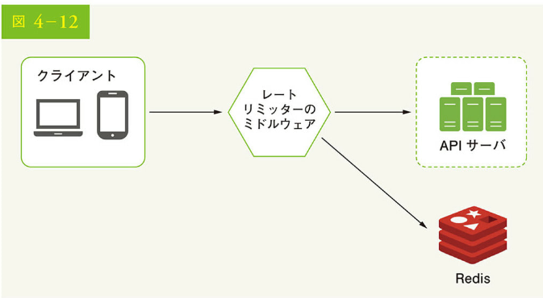

図 4-12 にレート制限の上位アーキテクチャを示しますが、これは次のように動作します。

• クライアントは、レートリミッティングミドルウェアにリクエストを送信する
• レート制限ミドルウェアは、Redis の対応するバケットからカウンターを取得し、上限に達しているかをチェックする
• リミットに達している場合、リクエストは拒否される
• リミットに達していない場合、リクエストは API サーバに送信される。その間、システムはカウンターを増加させ、Redis に保存し直す

## ステップ 3 設計の深掘り

図 4-12 の高度な設計は、次の質問に答えていません。

• レート制限のルールはどのように作成されるか。ルールはどこに保存されるか
• レート制限されたリクエストをどのように処理するか

このセクションでは、最初にレート制限のルールに関する質問に答え、次にレート制限されたリクエストを処理するための戦略を説明します。最後に、分散環境におけるレート制限、詳細設計、性能最適化、および監視について説明しましょう。

### レート制限ルール

Lyft は、レート制限のコンポーネントをオープンソース化しました[12]。このコンポーネントの裏側を覗いて、料金制限ルールの例をいくつか見てみましょう。

```yaml
domain: messaging
descriptors:
  - key: message_type
    value: marketing
    rate_limit:
      unit: day
      requests_per_unit: 5
```

上記の例では、システムは 1 日に最大 5 通のマーケティング・メッセージを許可するように設定されています。もう 1 つ例をあげましょう。

```yaml
domain: auth
descriptors:
  - key: auth_type
    value: login
    rate_limit:
      unit: minute
      requests_per_unit: 5
```

このルールでは、クライアントは 1 分間に 5 回以上のログインが許可されていません。ルールは通常、設定ファイルに記述され、ディスクに保存されます。

### レート制限の超過

リクエストがレート制限されている場合、API はクライアントに HTTP レスポンスコード 429 (too many requests) を返します。ユースケースによっては、レート制限されたリクエストを後で処理するためにキューに入れることがあります。例えば、システムの過負荷によって一部の注文がレート制限された場合、それらの注文を後で処理するために待機させてもいいでしょう。

### レートリミッターのヘッダ

クライアントはどのように自分が制限されていることを知るのでしょう。また、クライアントはどのように制限される前に許容される残りのリクエスト数を把握するのでしょう。答えは、HTTP レスポンスヘッダにあります。レートリミッターは以下の HTTP ヘッダをクライアントに返します。

• X-Ratelimit-Remaining：ウィンドウ内で許可される残りのリクエストの数
• X-Ratelimit-Limit：これは、クライアントが 1 つのタイムウィンドウで行える呼び出しの回数を示す
• X-Ratelimit-Retry-After：制限されずに再びリクエストを行えるようになるまでの待ち時間（秒数）

ユーザーがあまりにも多くのリクエストを送った場合、429 too many requests エラーと X-Ratelimit-Retry-After ヘッダがクライアントに返されます。

### 詳細設計

図 4-13 に、システムの詳細設計を示します。

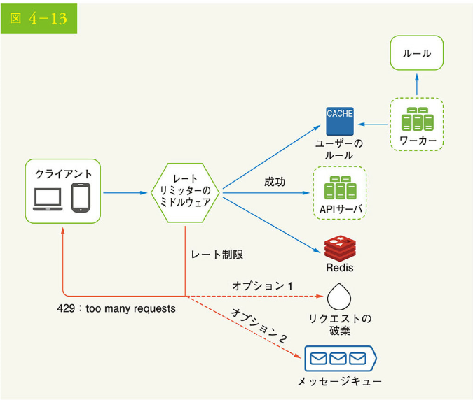

• ルールはディスクに保存される。ワーカーは頻繁にディスクからルールを取り出し、キャッシュに保存する
• クライアントがサーバにリクエストを送信すると、まずレートリミッターミドルウェアに送られる
• レートリミッターミドルウェアは、キャッシュからルールをロードする。Redis キャッシュからカウンターと最終リクエストのタイムスタンプを取得する。そのレスポンスに基づいて、レートリミッターが決定する
• リクエストがレート制限されていない場合、API サーバに転送される
• リクエストがレート制限されている場合、レートリミッターはクライアントに 429 too many requests エラーを返す。その間、要求はドロップされるか、キューに転送されるかのどちらかである

### 分散環境におけるレートリミッター

単一サーバ環境で動作するレートリミッターを構築するのは難しいことではありません。しかし、複数のサーバと同時実行スレッドをサポートするためにシステムを拡張するのは、また別の話です。課題は 2 つあります：

• レースコンディション
• 同期の問題

#### レースコンディション

先に述べたように、レートリミッターは高度なレベルで次のように動作します。

• Redis からカウンター値を読み込む
• Redis からカウンター値を読み込み、(カウンター値 + 1) が閾値を超えたかをチェックする
• そうでない場合は、Redis でカウンター値を 1 だけ増やす

図 4-14 に示すように、高度な並行処理環境ではレースコンディション発生の可能性があります。

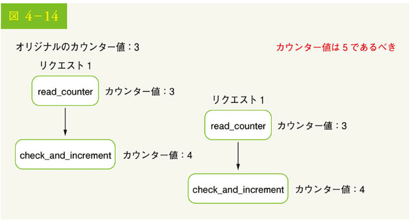

Redis のカウンタ値が 3 であると仮定します。2 つのリクエストが同時にカウンター値を読み、どちらかが値を書き戻す前に、それぞれがカウンターを 1 つ増やし、他のスレッドをチェックせずに値を書き戻すとします。両方のリクエスト（スレッド）は、自分が正しいカウンター値 4 を持っていると信じています。しかし、正しいカウンター値は 5 であるべきです。

ロックは、レースコンディションを解決する上で最もわかりやすい解決策です。しかし、ロックはシステムの速度を著しく低下させます。この問題を解決するために一般に 2 つの方策が用いられます。すなわち、Lua スクリプトと Redis のソート済みセットデータ構造です。これらの方策に興味のある読者は、対応する参考資料を参照してください。

#### 同期の問題

同期もまた、分散環境において考慮すべき重要な要素です。数百万のユーザーをサポートするには、1 台のレートリミッター・サーバではトラフィックを処理し切れないかもしれません。複数のレートリミッター・サーバを使用する場合には同期が必要です。たとえば、図 4-15 の左側では、クライアント 1 がレートリミッター 1 にリクエストを送信し、クライアント 2 がレートリミッター 2 にリクエストを送信しています。Web 層はステートレスなので、クライアントは図 4-15 の右側に示すように、異なるレートリミッターに再びリクエストを送れます。同期が行われない場合、レートリミッター 1 にはクライアント 2 に関するデータが含まれません。したがって、レートリミッターは正しく動作しないのです。

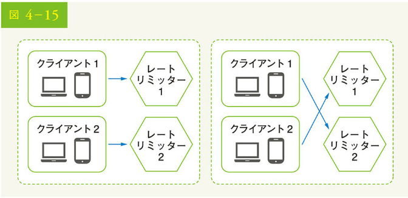

1 つの可能な解決策は、クライアントが同じレートリミッターにトラフィックを送信できるようにするスティッキーセッションの使用です。この解決策は、スケーラブルでも柔軟でもないので、推奨されません。より良いアプローチは、Redis のような集中型データストアを使用することです。その設計を図 4-16 に示しました。

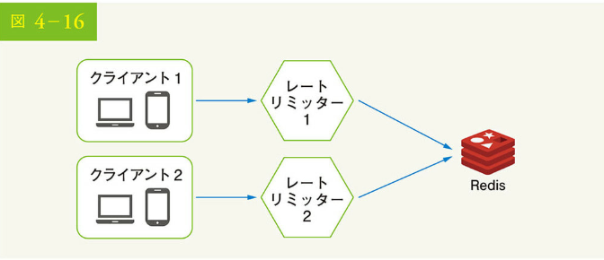

### 性能の最適化

性能の最適化は、システム設計の面接試験でよく取り上げられるトピックです。ここでは、2 つの改善点を取り上げます。

まず、データセンターから離れた場所にいるユーザーのレイテンシーが高いため、レートリミッターでは複数のデータセンターの設定が重要です。多くのクラウドサービス・プロバイダーは、世界中に多数のエッジサーバ拠点を構築しています。例えば、2020 年 5 月 20 日現在、Cloudflare は 194 の地理的に分散したエッジサーバを有しています。トラフィックは自動的に最も近いエッジサーバにルーティングされ、レイテンシーを低減します。

第 2 に、最終的な一貫性モデルでデータを同期させます。最終的な一貫性モデルについて不明な点がある場合は、「6 章 キーバリューストアの設計」の「一貫性」の項目を参照ください。

#### モニタリング

レートリミッターを導入した後、レートリミッターが有効かを確認する上では分析データの収集が重要です。主に確認したいのは以下の通りです。

• レートリミッターのアルゴリズムが有効であること
• レートリミッターのルールが有効か

例えば、レートリミッターのルールが厳しすぎると、有効なリクエストが多く落とされます。この場合、ルールを少し緩和する必要があります。また、フラッシュセールのようにトラフィックが急増した場合、レートリミッターが効かなくなることに気づきました。このシナリオでは、バーストトラフィックをサポートするためにアルゴリズムを置き換えることが考えられます。この場合、トークンバケットアルゴリズムが適しています。

## ステップ 4 まとめ

この章では、レート制限の様々なアルゴリズムとその長所・短所について議論しました。取り上げたアルゴリズムは以下の通りです。

• トークンバケット
• リーキーバケット
• 固定ウィンドウカウンタ
• スライディングウィンドウログ
• スライディングウィンドウカウンタ

次に、システムアーキテクチャ、分散環境におけるレートリミッター、性能の最適化、監視について説明しました。システム設計の面接の質問と同様に、時間が許す限り、追加で言及できる論点があります。

• ハードウェアとソフトウェアのレートリミッター
• ハードウェア：リクエストの数が閾値を超えられない
• ソフトウェア：短時間であれば、リクエストが閾値を超えることがある
• 異なるレベルでのレート制限。この章では、アプリケーションレベル（HTTP: レイヤー 7）でのレート制限についてのみ話した。他のレイヤーでレート制限を適用することは可能である。例えば、Iptables（IP：レイヤー 3）を用いて、IP アドレスによるレート制限を行うことができる※
• レート制限を受けないようにする。ベストプラクティスでクライアントを設計する
• 頻繁な API コールを避けるためにクライアントキャッシュを使用する
• クライアントキャッシュを使用して、頻繁な API コールを避ける
• クライアントが例外から優雅に回復できるように、例外やエラーをキャッチするコードを含める
• 再試行ロジックに十分なバックオフタイムを追加する

注：OSI モデル（Open Systems Interconnection model）は 7 層構造。レイヤ 1：物理層、レイヤ 2：データリンク層、レイヤ 3：ネットワーク層、レイヤ 4：トランスポート層、レイヤ 5：セッション層、レイヤ 6：プレゼンテーション層、レイヤ 7：アプリケーション層

ここまで来られた方、おめでとうございます。さあ、自分をほめてあげてください。よくやったと。

参考文献
[1] Rate-limiting strategies and techniques: https://cloud.google.com/solutions/rate-limiting-strategies-techniques
[2] Twitter rate limits: https://developer.twitter.com/en/docs/basics/rate-limits
[3] Google docs usage limits: https://developers.google.com/docs/api/limits
[4] IBM microservices: https://www.ibm.com/cloud/learn/microservices
[5] Throttle API requests for better throughput: https://docs.aws.amazon.com/apigateway/latest/developerpguide/api-gateway-request-throttling.html
[6] Stripe rate limiters: https://stripe.com/blog/rate-limiters
[7] Shopify REST Admin API rate limits: https://help.shopify.com/en/api/reference/rest-admin-api-rate-limits
[8] Better Rate Limiting With Redis Sorted Sets: https://engineering.classdojo.com/blog/2015/02/06/rolling-rate-limiter/
[9] System Design — Rate limiter and Data modelling: https://medium.com/@saisandeepmopuri/system-design-rate-limiter-and-data-modelling-9304b0d18250
[10] How we built rate limiting capable of scaling to millions of domains: https://blog.cloudflare.com/counting-things-a-lot-of-different-things/
[11] Redis website: https://redis.io/
[12] Lyft rate limiting: https://github.com/lyft/ratelimit
[13] Scaling your API with rate limiters: https://gist.github.com/ptarjan/e38f45f2dfe601419ca3af937fff-574d#request-rate-limiter
[14] What is edge computing: https://www.cloudflare.com/learning/serverless/glossary/what-is-edge-computing/
[15] Rate Limit Requests with Iptables: https://blog.programster.org/rate-limit-requests-with-iptables
[16] OSI model: https://en.wikipedia.org/wiki/OSI_model#Layer_architecture
