# 5 章 コンシステントハッシュの設計

水平スケーリングを実現するには、サーバ間で効率よく均等にリクエスト/データを分散させることが重要です。コンシステントハッシュは、この目標を達成するためによく使われる技術です。しかし、まずは以下の問題を詳しく見てみましょう。

## 再ハッシュ問題

キャッシュサーバが n 台ある場合、負荷分散させる一般的な方法として、以下のようなハッシュ方式があります。

```
serverIndex = hash(key) % N
N = サーバプールの大きさ
```

どのように動作するか、例を用いて説明しましょう。表 5-1 に示すように、4 台のサーバと 8 個の文字列キーとそのハッシュがあります。

表 5-1:

| キー   | ハッシュ | ハッシュ %4 |
| ------ | -------- | ----------- |
| キー 0 | 18358617 | 1           |
| キー 1 | 26143584 | 0           |
| キー 2 | 18131146 | 2           |
| キー 3 | 35863496 | 0           |
| キー 4 | 34085809 | 1           |
| キー 5 | 27581703 | 3           |
| キー 6 | 38164978 | 2           |
| キー 7 | 22530351 | 3           |

あるキーが保存されているサーバを取り出すには、モジュール演算（%key）%4 を実行します。例えば、hash(key)%4=1 の場合、クライアントはキャッシュされたデータを取得するためにサーバ 1 に連絡する必要があることを意味します。図 5-1 は、表 5-1 に基づくキーの分布を示したものです。

図 5-1:
サーバインデックス = ハッシュ %4

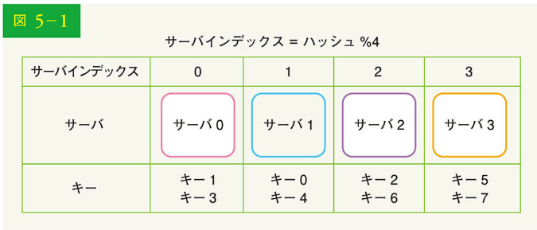

この方法は、サーバプールのサイズが一定で、データの分布が均一な場合にはうまく機能します。しかし、新しいサーバが追加されたり、既存のサーバが削除されたりすると、問題が発生します。例えば、サーバ 1 がオフラインになった場合、サーバプールのサイズは 3 です。同じハッシュ関数を使えば、キーに対するハッシュ値も同じになります。しかし、剰余演算を適用すると、サーバの数が 1 つ減るので、異なるサーバインデックスが得られます。ハッシュ %3 を適用した結果を、表 5-2 に示します。

表 5-2:

| キー   | ハッシュ | ハッシュ %3 |
| ------ | -------- | ----------- |
| キー 0 | 18358617 | 0           |
| キー 1 | 26143584 | 0           |
| キー 2 | 18131146 | 1           |
| キー 3 | 35863496 | 2           |
| キー 4 | 34085809 | 1           |
| キー 5 | 27581703 | 0           |
| キー 6 | 38164978 | 1           |
| キー 7 | 22530351 | 0           |

図 5-2 に、表 5-2 に基づく新しいキーの配分を示します。

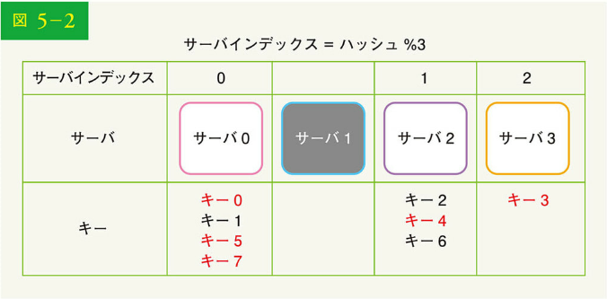

図 5-2 に示すように、オフラインのサーバ（サーバ 1）に元々保存されていたキーだけでなく、ほとんどのキーが再配布されます。つまり、サーバ 1 がオフラインになると、ほとんどのキャッシュクライアントはデータを取得するために誤ったサーバに接続することになり、キャッシュミスの原因となるのです。コンシステントハッシュは、この問題を軽減する効果的な手法です。

## コンシステントハッシュ

Wikipedia によれば、「コンシステントハッシュは、ハッシュテーブルのサイズが変更されてコンシステントハッシュが使用された場合、平均して k/n 個のキーしか再マッピングする必要がない特殊なハッシュである。これに対し、従来のほとんどのハッシュテーブルでは、配列のスロット数が変わると、ほぼすべてのキーが再マッピングされることになる[1]」。

### ハッシュ空間とハッシュリング

コンシステントハッシュの定義が理解できたところで、その仕組みを見ていきましょう。ハッシュ関数 f として SHA-1 を用い、ハッシュ関数の出力範囲を x0、x1、x2、x3…、xn と仮定します。つまり、x0 は 0 に、xn は 2^160-1 に対応し、中間のハッシュ値は 0 と 2^160-1 の間に位置します。図 5-3 に、ハッシュ空間を示します。

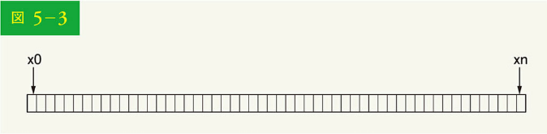

両端を接続すると、図 5-4 に示すようなハッシュリングになります。

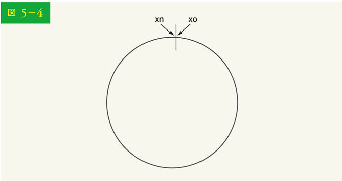

### ハッシュサーバ

同じハッシュ関数 f を用いて、サーバ IP または名前に基づくサーバをリングにマッピングします。図 5-5 は、4 台のサーバがハッシュリングにマッピングされていることを示しています。

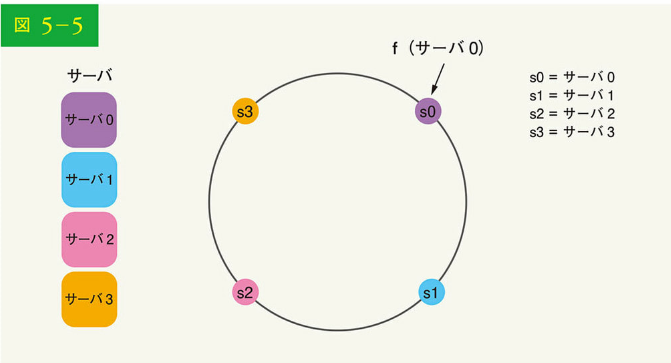

### ハッシュキー

特筆すべきことは、ここで使われているハッシュ関数が「再ハッシュ問題」の関数とは異なること、そして剰余演算がないことです。図 5-6 に示すように、4 つのキャッシュキー（キー 0, キー 1, キー 2, キー 3）がハッシュのリングのハッシュ化されます。

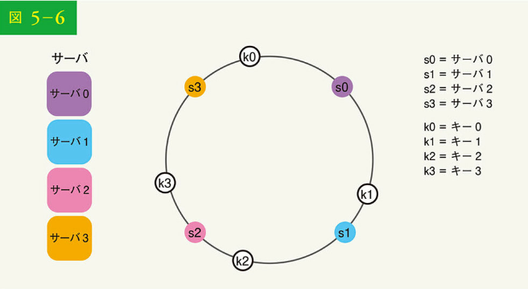

### サーバの探索

キーがどのサーバに保存されているかを調べるには、リング上のキーの位置から時計回りに、サーバが見つかるまで移動します。図 5-7 はこのプロセスを説明しています。時計回りに、キー 0 はサーバ 0 に、キー 1 はサーバ 1 に、キー 2 はサーバ 2 に、キー 3 はサーバ 3 に格納されます。

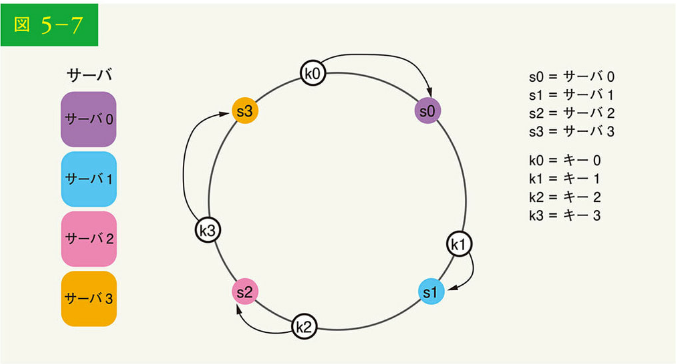

### サーバの追加

上記のロジックにより、新しいサーバを追加する場合、一部のキーの再分配のみが必要となります。

図 5-8 では、新サーバ 4 が追加された後、キー 0 のみ再配布が必要であり、k1、k2、k3 は同じサーバに残っています。このロジックを詳しく見てみましょう。サーバ 4 が追加される前、キー 0 はサーバ 0 に格納されていましたが、サーバ 4 はキー 0 のリング上の位置から時計回りで数えた最初のサーバであるため、キー 0 はサーバ 4 に格納されることになります。他のキーはコンシステントハッシュのアルゴリズムに基づいて再分配されることはありません。

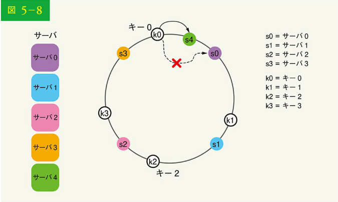

### サーバの削除

サーバが削除された場合、コンシステントハッシュで再割り当てが必要なキーはごく一部です。図 5-9 では、サーバ 1 が移動した場合、キー 1 だけをサーバ 2 に再マッピングする必要があります。残りのキーは影響を受けません。

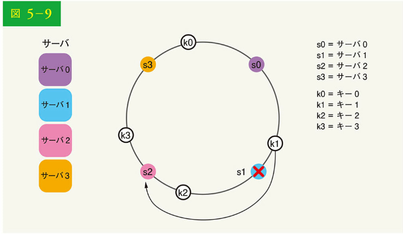

### 基本的なアプローチにおける 2 つの問題点

コンシステントハッシュ・アルゴリズムは、MIT のカーガーらによって紹介されました[1]。基本的な手順は以下の通りです。

- 均一な分散ハッシュ関数を用いて、サーバとキーをリングにマッピングする
- あるキーがどのサーバにマッピングされているかを知るには、キーの位置から時計回りにリング上の最初のサーバを見つけるまで移動する

この方法には 2 つの問題があります。まず、サーバの追加や削除を考慮すると、すべてのサーバでリング上のパーティションサイズを同じにすることは不可能です。パーティションとは、隣接するサーバ間のハッシュ空間です。各サーバに割り当てられたリング上のパーティションサイズは、非常に小さいことも、かなり大きいこともあり得ます。図 5-10 では、s1 が削除された場合、s2 のパーティション（双方向矢印で強調表示）は s0 と s3 のパーティションの 2 倍の大きさになっています。

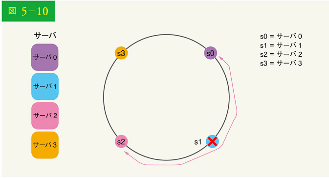

第 2 に、リング上のキーの分布が不均一になる可能性があります。例えば、図 5-11 のような位置にサーバをマッピングした場合、ほとんどのキーはサーバ 2 に格納されますが、サーバ 1、サーバ 3 にはデータがありません。

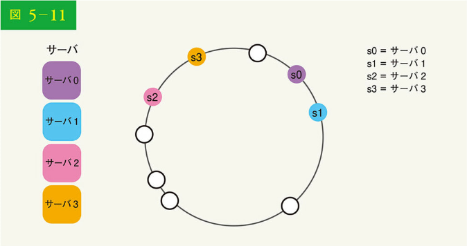

これらの問題を解決するために、仮想ノードやレプリカと呼ばれる技術が使われています。

### 仮想ノード

仮想ノードとは実ノードのことであり、各サーバはリング上の複数の仮想ノードで表現されます。図 5-12 では、サーバ 0 とサーバ 1 の両方が 3 つの仮想ノードを持ちます。3 つの仮想ノードは任意に選んだものであり、現実のシステムではもっと多くの仮想ノードが存在します。s0 を使う代わりに、s0_0、s0_1、s0_2 でリング上のサーバ 0 を表現します。同様に、s1_0、s1_1、s1_2 はリング上のサーバ 1 を表します。仮想ノードの場合、各サーバは複数のパーティションを担当します。ラベル s0 のパーティション（エッジ）はサーバ 0 が管理し、ラベル s1 のパーティションはサーバ 1 が管理するのです。

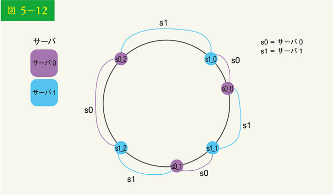

キーがどのサーバに格納されているかを調べるには、キーの位置から時計回りに進み、リング上で最初に出会った仮想ノードを見つけます。図 5-13 では、k0 がどのサーバに格納されているかを把握するため、k0 の位置から時計回りに進み、サーバ 1 を指す仮想ノード s1_1 を見つけます。

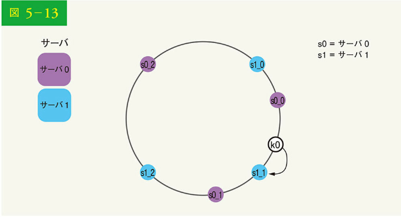

仮想ノードの数が増えると、キーの分布はさらにバランスが良くなります。

これは、仮想ノードの数が増えるほど標準偏差が小さくなり、バランスの取れたデータ分布になるためです。標準偏差とは、データの広がり具合を表すものです。オンラインリサーチ[2]の実験結果によると、100 ～ 200 の仮想ノードの場合、標準偏差は平均値の 5%（200 仮想ノード）～ 10%（100 仮想ノード）であることがわかっています。仮想ノードの数を増やせば、標準偏差は小さくなります。しかし、仮想ノードに関するデータを保存するためのスペースがより多く必要になるでしょう。つまり、トレードオフの関係にあり、システム要件に合わせて仮想ノードの数を調整できるのです。

### 影響を受けるキーの探索

サーバの追加や削除があった場合、データの一部を再分配する必要があります。キーを再分配するために、どのように影響範囲を見つけられるのでしょうか。

図 5-14 では、サーバ 4 がリングに追加されました。影響範囲は s4（新規追加ノード）から始まり、リングを反時計回りに移動し、サーバ（s3）が見つかるまでです。したがって、s3 と s4 の間にあるキーは s4 に再配配される必要があります。

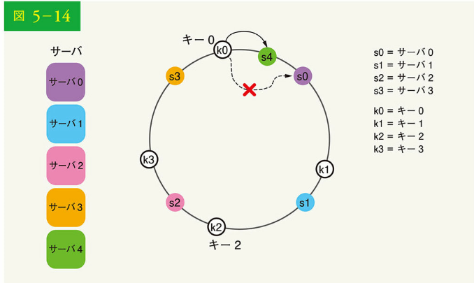

図 5-15 のようにサーバ（s1）が削除されると、影響を受ける範囲は s1（削除されたノード）から始まり、サーバが見つかる（s0）までリングを反時計回りに移動します。したがって、s0 と s1 の間にあるキーは s2 に再分配されなければなりません。

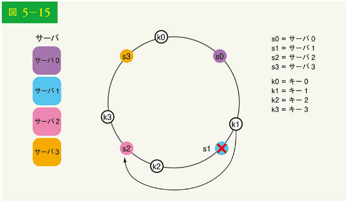

## まとめ

この章では、コンシステントハッシュについて、なぜそれが必要なのか、どのように機能するのかなどを詳しく説明しました。コンシステントハッシュのメリットは以下の通りです。

- サーバの追加・削除時に最小化したキーを再分配できる
- データが均等に分散されるため、水平スケーリングが容易である
- ホットスポット・キー問題を緩和する。特定のシャードへの過剰なアクセスは、サーバの過負荷を引き起こす可能性があります。例えば、タイティー・ペリー、ジャスティン・ビーバー、レディー・ガガのデータがすべて同じシャード上にある場合を想像してほしい。コンシステントハッシュは、データをより均等に分散させることで、この問題を軽減するのに役立つ

コンシステントハッシュは実世界のシステムで広く使われており、その中には有名なものもあります。

- Amazon の Dynamo データベースのパーティショニングコンポーネント[3]
- Apache Cassandra のクラスタ全体のデータパーティショニング[4]
- Discord のチャットアプリケーション[5]
- Akamai のコンテンツデリバリネットワーク[6]
- Maglev ネットワークのロードバランサ[7]

ここまで来られた方、おめでとうございます。さあ、自分をほめてあげてください。よくやったと。

## 参考文献

[1] Consistent hashing: https://en.wikipedia.org/wiki/Consistent_hashing

[2] Consistent Hashing: https://tom-e-white.com/2007/11/consistent-hashing.html

[3] Dynamo: Amazon's Highly Available Key-value Store: https://www.allthingsdistributed.com/files/amazon-dynamo-sosp2007.pdf

[4] Cassandra - A Decentralized Structured Storage System: http://www.cs.cornell.edu/Projects/ladis2009/papers/Lakshman-ladis2009.PDF

[5] How Discord Scaled Elixir to 5,000,000 Concurrent Users: https://blog.discord.com/scaling-elixir-f9b8e1e7c29b

[6] CS168: The Modern Algorithmic Toolbox Lecture #1: Introduction and Consistent Hashing: http://theory.stanford.edu/~tim/s16/l/l1.pdf

[7] Maglev: A Fast and Reliable Software Network Load Balancer: https://static.googleusercontent.com/media/research.google.com/en//pubs/archive/44824.pdf
