# 6 章 キーバリューストアの設計

キーバリューストアは、キーバリューデータベースとも呼ばれる非リレーショナルデータベースです。各々固有の識別子をキーとして、そのキーに関連付けられた値を格納します。このデータの組合せは「キーバリュー」ペアと呼ばれます。

キーと値のペアでは、キーは一意でなければならず、キーに関連付けられた値はキーを介してアクセスできます。キーはプレーンテキストでもハッシュ化された値でも構いません。パフォーマンス上の理由から、短いキーがより効果的です。キーはどのようなものでしょう。以下にいくつかの例を示します：

- プレーンテキストのキー："last_logged_in_at"
- ハッシュキー：253DDEC4

キーバリューペアの値としては、文字列、リスト、オブジェクトなどが使用できます。Amazon dynamo[1]、Memcached[2]、Redis[3] などのキーバリューストアでは、値は通常、不透明なオブジェクトとして扱われます。

以下は、キーバリューストアにおけるデータの断片です：

表 6-1
| キー | バリュー |
|------|----------|
| 145 | john |
| 147 | bob |
| 160 | julia |

本章では、以下の操作をサポートするキーバリューストアを設計するように求められています：

- put(key, value) //"キー"に関連する"バリュー"を挿入する
- get(key) //"キー"に関連付けられた"バリュー"を取得する

## ステップ 1：問題を理解し、設計範囲を明確にする

完璧な設計は存在しません。それぞれの設計は、読み取り、書き込み、メモリ使用量のトレードオフを特定のバランスで達成します。一貫性と可用性の間でも、トレードオフが達成されなければなりません。本章では、以下の特徴を備えるキーバリューストアを設計しましょう：

- キーバリューペアのサイズが小さいこと：10KB 以下
- ビッグデータの保存が可能であること
- 高可用性：障害発生時でも迅速にレスポンス
- 高いスケーラビリティ：大規模なデータセットにも対応できる拡張性
- オートスケーリング：トラフィックに応じて自動でサーバの追加・削除
- 整合性の調整が可能であること
- 低レイテンシー

## 単一サーバのキーバリューストア

1 台のサーバ上に置かれたキーバリューストアの開発は簡単です。直感的なアプローチであれば、ハッシュテーブルにキーバリューペアを格納し、すべてをメモリ内に保持すればいいでしょう。しかし、メモリアクセスは高速でも、容量的な制約から、すべてをメモリに格納することは不可能です。より多くのデータを 1 台のサーバに格納するため、2 つの最適化が可能でしょう。

- データ圧縮
- 使用頻度の高いデータのみをメモリに保存し、残りはディスクに保存すること

これらの最適化を行ったとしても、シングルサーバは急速に大容量に達することがあります。ビッグデータに対応するには、分散型キーバリューストアが必要なのです。

## 分散型キーバリューストア

分散キーバリューストアは分散ハッシュテーブルとも呼ばれ、キーバリューペアを多数のサーバに分散して配置します。分散システムを設計する場合、CAP（一貫性＝ Consistency、可用性＝ Availability、分断耐性＝ Partition Tolerance）定理の理解が重要になります。

## CAP 定理

CAP 定理とは、分散システムにおいて、一貫性、可用性、分割耐性の 3 つを同時に保証するのは不可能であるとするものです。ここで、簡単に定義しておきましょう。

- 一貫性：どのノードに接続しても、すべてのクライアントが同じデータを同時に見られること
- 可用性：一部のノードがダウンしても、データを要求したクライアントが再レスポンスを得られること。
- 分断耐性：分断とは、2 つのノード間で通信が途絶していること。分断耐性とは、ネットワークの分断があっても、システムが動作し続けること

CAP の定理では、図 6-1 のように、3 つの特性のうち 2 つをサポートするには、1 つを犠牲にしなければならないとしています。

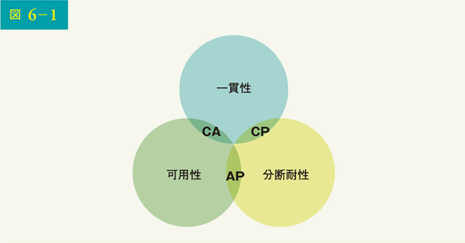

現在、キーバリューストアは 3 つの CAP 特性によって分類されます。

- CP（一貫性と分断耐性）システム：CP キーバリューストアは、可用性を犠牲にしながら、一貫性と分断耐性をサポートする
- AP（可用性と分断耐性）システム：AP キーバリューストアは、一貫性を犠牲にしながら、可用性と分断耐性をサポートする
- CA（一貫性と可用性）システム：CA キーバリューストアは、分断耐性を犠牲にしながら、一貫性と可用性をサポートする。ネットワーク障害は避けられないため、分散システムはネットワークの分断を許容する必要がある。したがって、CA システムは実世界のアプリケーションには存在し得ない

以上が、ほぼ定義です。理解のために、具体例を見ましょう。分散システムにおいて、データは通常複数回複製されます。図 6-2 のように、3 つの複製ノード n1、n2、n3 にデータが複製されるとします。

## 理想的な状況

理想的には、ネットワークの分断が発生することはありません。n1 に書き込まれたデータは自動的に n2 と n3 に複製され、一貫性と可用性の両方が達成されます。

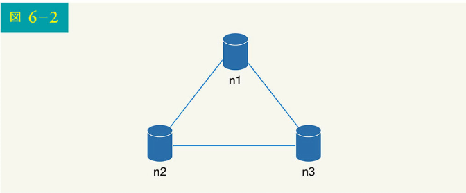

## 実世界の分散システム

分散システムでは分断は回避できず、分断が発生した場合、一貫性と可用性のどちらかを選択しなければなりません。図 6-3 では、n3 がダウンし、n1、n2 と通信できなくなります。クライアントが n1 や n2 にデータを書き込んでも、n3 にはデータが伝搬しません。もし、n3 にデータが書き込まれても、n1 と n2 にまだ伝搬されていなければ、n1 と n2 は古いデータを持っていることになります。

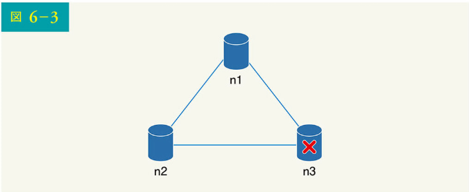

もし、可用性より一貫性を選んだ場合（CP システム）、これら 3 つのサーバ間でのデータの不整合を避けるため、n1 と n2 への書き込み操作をすべてブロックしなければならず、システムが利用できなくなります。銀行のシステムは通常、極めて高い一貫性が求められます。例えば、銀行システムにとって、最新の残高表示は極めて重要です。ネットワークの分断が原因で不整合が発生した場合、銀行システムは不整合が解消される前にエラーを返します。

しかし、一貫性よりも可用性を優先する場合（AP システム）、システムは古いデータを返すかもしれませんが、読み込みを受け付け続けます。書き込みの場合、n1 と n2 は書き込みを受け付け続け、ネットワークの分断が解消された時点で n3 にデータが同期されます。

ユースケースに合わせて適切な CAP 保証を選択することは、分散キーバリューストアを構築する上で重要なステップとなります。面接官と相談しながら、それに応じた設計をすればいいのです。

## システム構成要素

このセクションでは、キーバリューストアを構築するために使用する以下のコアとなる構成要素とテクニックを説明します：

- データの分割
- データの複製
- 一貫性
- 不整合の解消
- 障害対応
- システム構成図
- 書き込みパス
- 読み込みパス

以下の内容は、主に 3 つの有名なキーバリューストアのシステムに基づいています。すなわち、Dynamo [4]、Cassandra [5]、BigTable [6] です。

## データの分割

大規模なアプリケーションの場合、1 台のサーバにデータ全体を収めることは不可能です。最もシンプルな方法は、データをより小さなパーティションに分割し、複数のサーバに格納することでしょう。しかし、データの分割には 2 つの課題があります：

- 複数のサーバにデータを均等に分散させること
- ノードの追加や削除に伴うデータの移動を最小限に抑えること

5 章で説明した一貫性ハッシュは、これらの問題を解決するための優れた技術です。ここで、コンシステントハッシュの仕組みを大まかに再確認しておきましょう。

- まず、サーバをハッシュリング上に配置する。図 6-4 では、s0、s1、……s7 で表される 8 台のサーバがハッシュリング上に配置されている
- 次に、キーが同じリングにハッシュ化され、時計回りに移動しながら最初に出会ったサーバに格納される。例えば、キー 0 はこのロジックで s1 に格納される

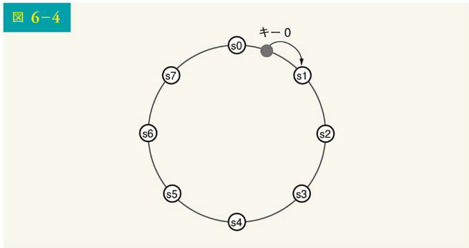

データの分割にコンシステントハッシュを使用することには、以下のようなメリットがあります：

- オートスケーリング：負荷に応じてサーバを自動的に追加・削除できる
- 不均一性：サーバの仮想ノード数は、サーバの容量に比例する。例えば、容量が大きいサーバには、より多くの仮想ノードが割り当てられる

## データの複製

高い可用性と信頼性を実現するには、データを N 台のサーバに非同期で複製する必要があります。この N 台のサーバは以下のロジックにより、選択されます。すなわち、キーがハッシュリング上のある位置にマップされた後、その位置から時計回りに進み、リング上にある最初の N 個のサーバを選んで複製データを保存するのです。図 6-5（N = 3）では、キー 0 は s1、s2、s3 で複製されています。

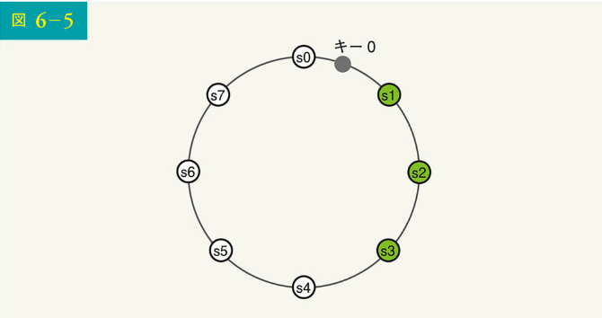

仮想ノードの場合、リング上の最初の N 個のノードは、N 個以下の物理サーバ上にある可能性があります。この問題を回避するため、時計回りの進行ロジックを実行する際に、固有のサーバーのみを選択します。

同じデータセンター内のノードは、停電、ネットワークの問題、自然災害などにより、しばしば同時に故障します。信頼性を高めるため、複製データは別々のデータセンターに配置され、データセンター間は高速ネットワークで接続されているのです。

## 一貫性

データは複数のノードに複製されるため、複製データ間を同期する必要があります。クォーラムコンセンサス（Quorum consensus）は、読込みと書込みの両方において一貫性を保証します。まず、いくつかをきちんと定義しましょう。

N = 複製データの数
W = サイズ W の書込みクォーラム。書込みが成功したら、W 個の複製データから書込みを確認する必要がある
R = サイズ R のリードクォーラム。読込みが成功したら、少なくとも R 個の複製データからのレスポンスを待つ必要がある

図 6-6 に示す N=3 の例で考えてみましょう。

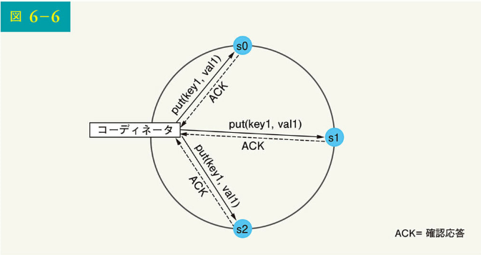

W = 1 は、1 台のサーバへのデータ書き込みを意味します。例えば、図 6-6 の構成では、s0、s1、s2 でデータが複製されます。W = 1 は、コーディネータが少なくとも 1 つの確認レスポンスを受信しなければ、書き込み操作が成功したとみなされないことを意味します。たとえば、s1 から確認レスポンスがあれば、s0 と s2 からの確認レスポンスを待つ必要はなくなります。コーディネータは、クライアントとノード間のプロキシとして機能するのです。

W、R、N の構成は、レイテンシーと一貫性との典型的なトレードオフです。W = 1 または R = 1 の場合、コーディネータはいずれかの複製データからのレスポンスを待つだけで良いため、操作は迅速に返されます。W または R>1 の場合、システムはより優れた一貫性を提供しますが、コーディネータは最も遅い複製データからのレスポンスを待つ必要があるため、クエリは遅くなります。

W + R > N の場合、最新のデータを持つ重複ノードが少なくとも 1 つ存在する必要があるため、強い一貫性が保証されます。

ユースケースに合わせて N、W、R をどのように設定すればいいのでしょう。以下に可能な設定を示します：

R = 1、W = N の場合：システムは高速読込み出しに最適化されている
W = 1、R = N の場合：システムは高速書き込みに最適化される
W + R > N の場合：強い一貫性が保証される（通常 N = 3、W = R = 2）
W + R <= N の場合：強い一貫性は保証されない

要件に応じて、W、R、N の値を調整し、望ましいレベルの一貫性を実現できるのです。

## 一貫性モデル

一貫性モデルは、キーバリューストアを設計する際に考慮すべきもう 1 つの重要な要素です。一貫性モデルとはデータの一貫性の程度を定義するものであり、幅広い一貫性モデルが存在します。

- 強い一貫性：どのような読込取り操作でも、最も更新された書き込みデータ項目の結果に対応する値が返される。クライアントは古いデータを見ることはない
- 弱い一貫性：後続の読み取り操作では、最も更新された値が見えないことがある
- 最終的な一貫性：これは弱い一貫性の特定の形である。十分な時間があれば、すべての更新が伝搬され、すべての複製データが一貫性を持つ

強い一貫性は、通常、すべての複製データが現在の書き込みに合意するまで、新しい読み取り/書き込みを受け付けないようにすることで実現されます。この方法は、新しい操作をブロックしてしまう可能性があるため、高可用性のシステムには向いていません。Dynamo と Cassandra は最終的な一貫性の一貫性モデルを採用しており、これはキーバリューストアに推奨されます。同時書き込みから、最終的な一貫性により、一貫性のない値がシステムに入ると、クライアントが値を読み調整することが余儀なくされます。次のセクションでは、バージョン管理による照合がどのように機能するかを説明しましょう。

## 不整合の解消：バージョン管理

レプリケーションは高可用性を実現するが、複製データ間で不整合が生じます。この不整合を解消する上で使用されるのが、バージョン管理とベクタークロックです。バージョン管理とは、すべてのデータ修正を新しい不変のデータバージョンとして扱うことです。バージョン管理について説明する前に、不整合がどのように発生するのかを例を使って説明します。

図 6-7 に示すように、複製ノード n1 と n2 の両方が同じ値を持ちます。この値を元の値と呼ぶことにします。サーバ 1 とサーバ 2 は、get("name")操作で同じ値を取得します。

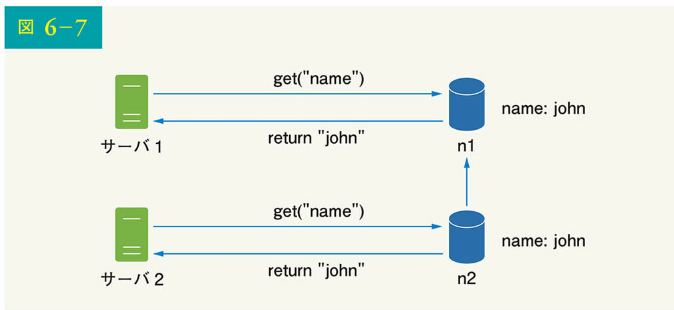

次に、図 6-8 に示すように、サーバ 1 は"johnSanFrancisco"に、サーバ 2 は"johnNewYork"に名前を変更します。この 2 つの変更は同時に行われます。これで、バージョン v1、v2 という異なる値を持つようになりました。

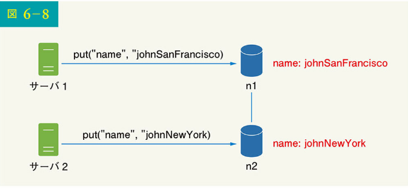

この例では、変更前の値をベースにしているため、元の値を無視できます。しかし、最後の 2 つのバージョンの不整合を解決する明確な方法はありません。この問題を解決するには、不整合を検出し、調整できるバージョン管理システムが必要です。この問題を解決するための一般的な手法として、ベクタークロックがあります。ベクタークロックがどのように機能するかを見てみましょう。

ベクタークロックは、データ項目に関連付けられた[サーバ、バージョン]のペアであり、あるバージョンが先行するか、後続するか、互いに不整合かをチェックするために使用されます。

ベクタークロックは D([S1, v1], [S2, v2], ..., [Sn, vn])で表され、D はデータアイテム、v1 はバージョンカウンタ、s1 はサーバ番号などであると仮定します。データ項目 D がサーバ Si に書き込まれた場合、システムは以下のタスクのいずれかを実行する必要があります：

- [Si, vi]が存在する場合には、vi をインクリメントする
- そうでなければ、新しいエントリ[Si, 1]を作成する

以上の抽象的なロジックを、図 6-9 に示す具体例で説明しましょう。

1. クライアントがシステムにデータ項目 D1 を書き込むと、サーバ Sx により、その書き込みがハンズオンで行われる。サーバ Sx はベクタークロック D1([Sx, 1])を持つようになる

2. 別のクライアントが最新の D1 を読み込んで、D2 に更新し、それを書き込む。D2 は D1 から随順なので、D1 を上書きする。この書き込みが同じサーバ Sx で処理されると仮定すると、このサーバは現在ベクタークロック D2([Sx, 2])を持つ

3. 別のクライアントが最新の D2 を読み込み、D3 に更新し、それを書き込む。この書き込みは、現在ベクタークロック D3([Sx, 2], [Sy, 1])を持つサーバ Sy によって処理されると仮定する

4. 別のクライアントが最新の D2 を読み込み、D4 に更新し、それを書き込む。この書き込みはサーバ Sz によって処理され、サーバ Sz は現在 D4([Sx, 2], [Sz, 1])を持っていると仮定する

5. 別のクライアントが D3 と D4 を読み込むと、データ項目 D2 が Sy と Sz の両方によって変更されたことによる不整合が発見される。この不整合はクライアントによって解消され、更新されたデータがサーバに送信される。書き込みは Sx によって処理され、D5([Sx, 3], [Sy, 1], [Sz, 1])となったと仮定する。不整合を検出する方法については、後ほど説明する

ベクタークロックを使用すると、Y のベクタークロックにおける各データのバージョンカウンタがバージョン X 以上であれば、バージョン X がバージョン Y の先祖である（すなわち不整合がない）ことが簡単にわかります。例えば、ベクタークロック D([s0, 1], [s1, 1])は D([s0, 1], [s1, 2])の先祖であり、不整合は記録されません。

同様に、Y のベクタークロックにおいて X に対応するカウンターより小さいカウンターを持つデータがあれば、あるバージョン X が Y の兄弟である（すなわち、不整合が存在する）とわかります。例えば、D([s0, 1], [s1, 2])と D([s0, 2], [s1, 1])という 2 つのベクタークロックには不整合が存在することを示しているのです。

ベクタークロックは不整合を解決できますが、2 つの顕著な欠点があります。まず、ベクタークロックは競合解消ロジックを実装する必要があるため、クライアントが複雑化します。

第 2 に、ベクタークロックの[サーバ：バージョン]のペアが急激に大きくなる可能性もあります。この問題を解決するには、長さに閾値を設定し、制限を越えた場合は最も古いペアを削除します。このやり方は、予孫関係を正確に判断できないため、調整の効率が悪くなるかもしれません。しかし、Dynamo の論文[4]によれば、Amazon は稼働中にこうした問題にまだ直面していないため、おそらくほとんどの企業で受け入れ可能な解決策なのでしょう。

## 障害対応

大規模システムにおいて、障害は避けられないだけでなく、よくあることです。障害対応のシナリオは非常に重要です。このセクションでは、まず障害を検出するための技術を紹介します。その上で、一般的な障害対策を説明しましょう。

## 障害の検出

分散システムでは、他のサーバが微候を示しても、あるサーバがダウンしているとは限りません。通常、サーバのダウンを判断するには、少なくとも 2 つの独立した情報源が必要です。

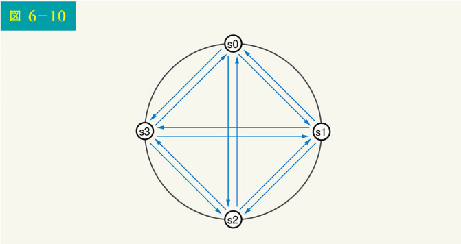

図 6-10 に示すように、網羅的なマルチキャストは簡単な解決策です。しかし、この解決策は、多くのサーバがシステム内にある場合には非効率的でしょう。

より良い解決策は、ゴシッププロトコルのような分散型の障害検知方法を用いることです。ゴシッププロトコルは次のように動作します：

- 各ノードは、メンバー ID およびハートビートの回数を含むノードメンバーシップリストを保持する
- 各ノードは定期的にハートビートカウントを増加させる
- 各ノードは定期的にランダムなノードの集合にハートビートを送信する。ハートビートを送信すると、そのハートビートが別のノードに伝搬される
- ノードはハートビートを受信すると、メンバーシップリストを最新の情報に更新する
- ハートビートが事前に定義された時間以上増加しなかった場合、そのメンバーはオフラインと見なされる

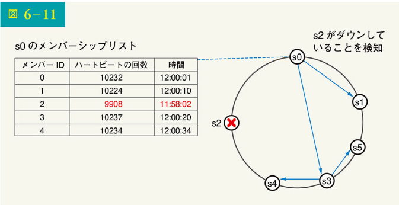

図 6-11 に示すように、以下のようになります。

- ノード s0 は左側に示すノードのメンバーシップリストを保持している
- ノード s0 は、ノード s2（メンバー ID ＝ 2）のハートビートの回数が長期間増加していないことに気づく
- ノード s0 は、ノード s2 の情報を含むハートビートをランダムなノード群に送信する。他のノードが s2 のハートビートの回数が長期間更新されていないことを確認すると、ノード s2 はマークダウンされ、その情報が他のノードに伝搬される

## 一時的な障害の対応

ゴシッププロトコルによって障害が検出された後、システムは可用性を確保するために、ある種のメカニズムを導入する必要があります。厳密なクォーラム方式では、クォーラムコンセンサスのセクションで説明したように、読取りと書込みの操作がブロックされる可能性があるのです。

可用性を向上させる上では、「いい加減なクォーラム方式[6]」と呼ばれる技術が使用されます。クォーラム要件を強制する代わりに、システムはハッシュリング上の最初の W 台の健全なサーバを書き込み用に、最初の R 台の健全なサーバを読み出し用に選択し、オフラインのサーバは無視します。

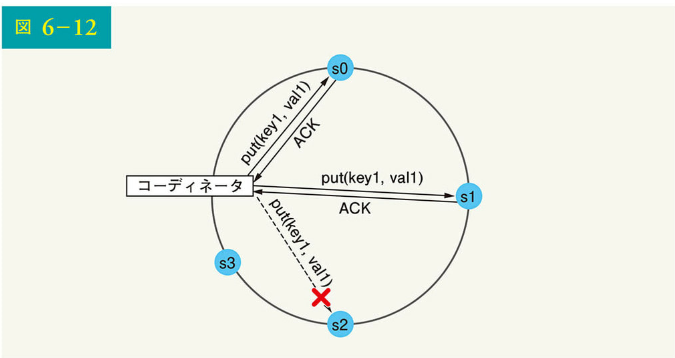

ネットワークやサーバの障害でサーバが利用できない場合、別のサーバが一時的にリクエストを処理します。ダウンしているサーバが立ち上がると、データの一貫性を保つために変更が先送りされます。このプロセスはヒンテッドハンドオフと呼ばれます。図 6-12 では s2 が利用できないため、読み取りと書き込みは一時的に s3 によって処理されています。s2 がオンラインに戻ると、s3 は s2 にデータを戻すのです。

## 恒久的な障害の対応

一時的な障害には、ヒンテッドハンドオフを使用します。では、複製データが永久に利用できなくなったらどうするのでしょう。このような事態に対処するために、複製データの同期を保つためのアンチエントロピー・プロトコルを実装しているのです。アンチエントロピーとは、各々の複製データを比較し、最新版に更新することです。不整合検出と転送データ量最小化のためには、マークルツリーが使用されます。

Wikipedia[7]より引用：「ハッシュツリーまたはマークルツリーは、非リーフノードがその子ノードのラベルまたは値（リーフの場合）のハッシュでラベル付けされているツリーである。ハッシュツリーは、大規模なデータ構造の内容を効率的かつ安全に検証できる」

鍵空間が 1 ～ 12 であると仮定して、以下の手順でマークルツリーを構築する方法を示します。ハイライトされたボックスは不一致を示します。

ステップ 1：図 6-13 に示すように、鍵空間をバケット（この例では 4）に分割する。バケットをルートレベルのノードとして使用することで、ツリーの深さを制限できる

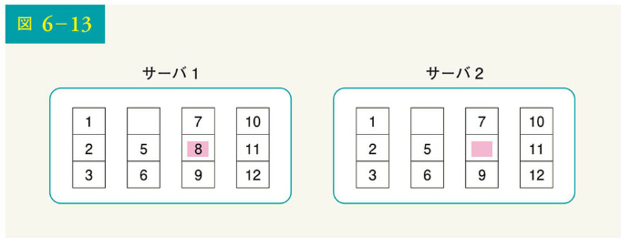

ステップ 2：バケットを作成したら、バケット内の各キーを一様なハッシュ法でハッシュ化する（図 6-14）

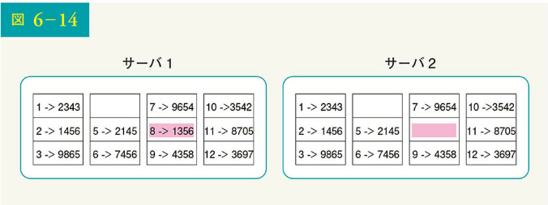

ステップ 3：バケットごとに 1 つのハッシュノードを作成する（図 6-15）

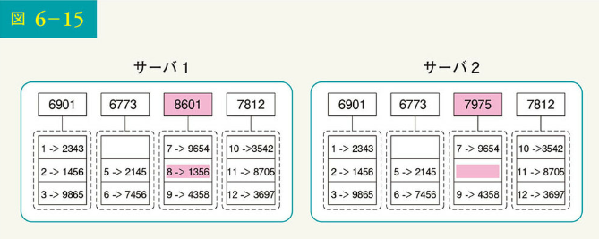

ステップ 4：子のハッシュを計算し、ルートまでツリーを構築する（図 6-16）

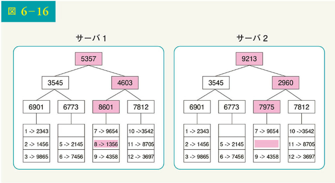

2 つのマークルツリーを比較するには、まずルートハッシュを比較します。ルートハッシュが一致すれば、両サーバは同じデータを持っていることになります。ルートハッシュが一致しない場合は、左の子ハッシュを比較し、次に右の子ハッシュを比較します。ツリーを走査して、同期されていないバケットを見つけ、そのバケットだけを同期させることができます。

マークルツリーを用いると、同期に必要なデータ量は 2 つの複製データの差分に比例し、含まれるデータ量には比例しません。現実のシステムでは、バケットサイズはかなり大きくなります。例えば、10 億のキーに対して 100 万のバケットという構成を考えた場合には、各バケットには 1000 のキーしか入っていないことになるでしょう。

## データセンター停止の対応

データセンターは、停電、ネットワーク障害、自然災害などで停止する可能性があります。データセンターが停止しても対応できるシステムを構築するには、複数のデータセンターでデータを複製することが重要です。あるデータセンターが完全にオフラインになっても、ユーザーは他のデータセンターを経由してデータにアクセスできます。

## システム構成図

これまで、キーバリューストアを設計する上で考慮すべきさまざまな技術的事項について述べてきましたが、今度は図 6-17 に示すシステム構成図に焦点を移しましょう。

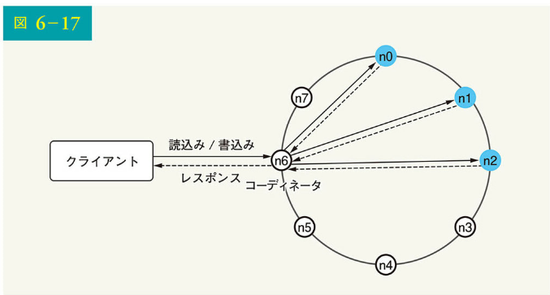

このアーキテクチャの主な特徴を以下に列挙します：

- クライアントは get(key)と put(key, value)というシンプルな API でキーバリューストアと通信する
- コーディネータは、クライアントとキーバリューストアの間のプロキシとして機能するノードである
- ノードは一貫したハッシュを使用してリング上に分散されている
- システムは完全に分散化されているので、ノードの追加や移動は自動的に行われる
- データは複数のノードで複製される
- すべてのノードが同じ責任を負うので、単一障害点はない

設計が分散化されているため、図 6-18 に示すように、各ノードは多くのタスクを実行します。

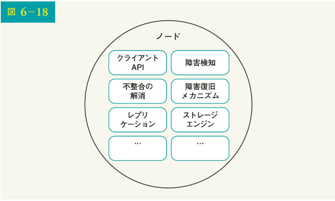

## 書込みパス

図 6-19 で、書込みリクエストが特定のノードに向けられた後の動作を説明します。提案されている書込み/読込みパスの設計は、主に Cassandra[8]のアーキテクチャに基づくことに注意してください。

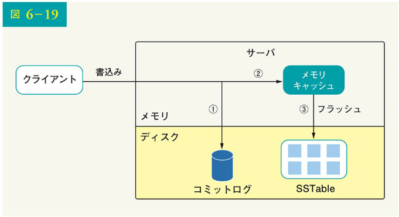

1. 書込みリクエストはコミットログファイルに保存される
2. データはメモリキャッシュに保存される
3. メモリキャッシュが満杯になるか、あらかじめ定義された閾値に達すると、データはディスク上の SSTable にフラッシュされる\*

注：Sorted String Table (SSTable) は <key, value> のペアのソートされたリストである。SSTable についてもっと知りたい読者は、参考資料[9]を参照のこと

## 読込みパス

読込みリクエストが特定のノードに向けられた後、まずメモリキャッシュにデータがあるかをチェックします。もしあれば、図 6-20 に示すように、データがクライアントに返されます。

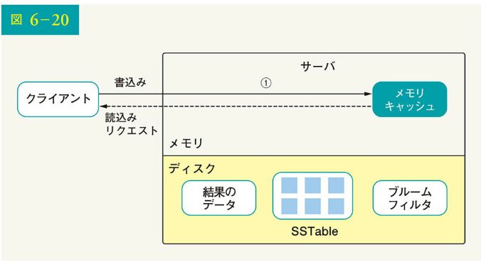

もしデータがメモリにない場合は、代わりにディスクから取得することになります。どの SSTable にキーが含まれているかを見つける効率的な方法が必要です。この問題を解決するために、ブルームフィルタ[10]がよく使われます。

データがメモリ上にない場合の読込みパスは図 6-21 のようになります：

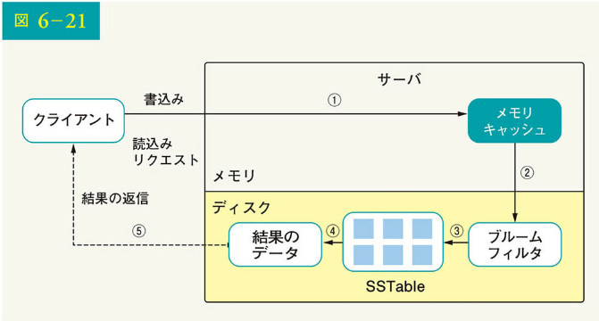

1. システムはまず、データがメモリ内にあるかをチェックする。ない場合は、ステップ 2 に進む
2. データがメモリ内にない場合、システムはブルームフィルタをチェックする
3. ブルームフィルタは、どの SSTables がキーを含む可能性があるかを把握するために使用される
4. SSTables はデータセットの結果を返す
5. データセットの結果はクライアントに返される

## ステップ 4：まとめ

この章では、多くの概念とテクニックを扱いました。記憶を呼び覚ますため、分散型キーバリューストアで使用される機能と対応するテクニックを次の表に要約しました。

はい、画像の文字を起こします。

表 6-2 [技術対照表]
| ゴール／課題 | テクニック |
|--------------|------------|
| ビッグデータを保存する能力 | 一貫性のあるハッシュを使用してサーバに負荷を分散 |
| 読込みの高可用性 | データレプリケーション |
| 書込みの高可用性 | 複数データセンターの設定 |
| データセットの分割 | ベクタークロックのバージョン管理と不整合解消 |
| 段階的なスケーラビリティ | コンシステントハッシュ |
| ヘテロジニアス | コンシステントハッシュ |
| 調整可能な一貫性 | コンシステントハッシュ |
| 一時的な障害の対応 | Sloppy quorum と hinted handoff |
| 恒久的な障害の対応 | マークル木 |
| データセンター停止の対応 | データセンター間のレプリケーション |

参考文献：
[1] Amazon DynamoDB: https://aws.amazon.com/dynamodb/
[2] memcached: https://memcached.org/
[3] Redis: https://redis.io/
[4] Dynamo: Amazon's Highly Available Key-value Store: https://www.allthingsdistributed.com/files/amazon-dynamo-sosp2007.pdf
[5] Cassandra: https://cassandra.apache.org/
[6] Bigtable: A Distributed Storage System for Structured Data: https://static.googleusercontent.com/media/research.google.com/en//archive/bigtable-osdi06.pdf
[7] Merkle tree: https://en.wikipedia.org/wiki/Merkle_tree
[8] Cassandra architecture: https://cassandra.apache.org/doc/latest/architecture/
[9] SSTable: https://www.igvita.com/2012/02/06/sstable-and-log-structured-storage-leveldb/
[10] Bloom filter https://en.wikipedia.org/wiki/Bloom_filter
