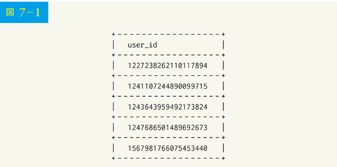
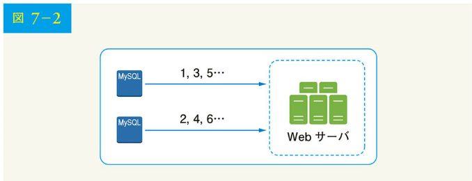
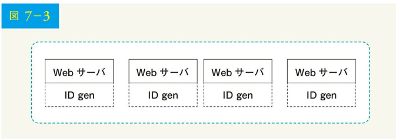
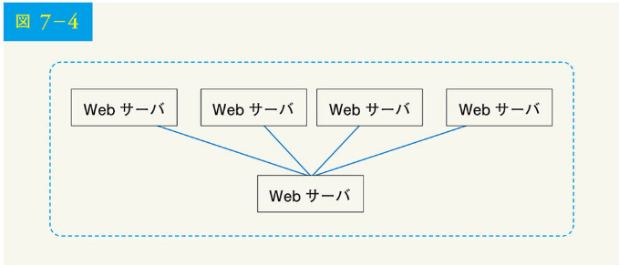
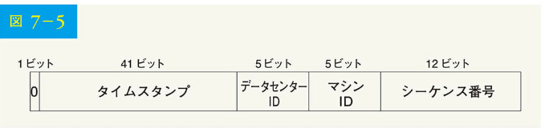
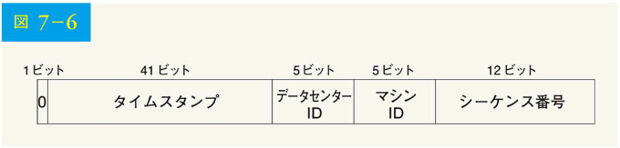
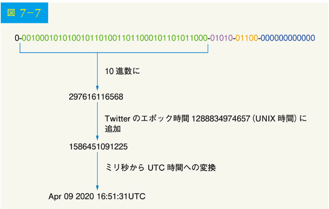

# 第 7 章 分散システムにおけるユニーク ID ジェネレータの設計

この章では、分散システムにおけるユニーク ID ジェネレータの設計が求められます。最初に考えるのは、伝統的なデータベースで auto_increment 属性を持つ主要なキーを使うことかもしれません。しかし、auto_increment は分散環境では機能しません。単一データベースサーバは十分な規模ではなく、最小限の遅延で複数のデータベース間でユニーク ID を生成するのは困難だからです。

ここで、ユニーク ID の例をいくつかあげましょう。

図 7-1



```
+--------------------+
|     user_id        |
+--------------------+
| 1227238262110117894|
| 1241107244890099715|
| 1243643959492173824|
| 1247686501489692673|
| 1567981766075453440|
+--------------------+
```

## ステップ 1 問題を理解し、設計範囲を明確にする

システム設計の面接試験における最初のステップは、明確な質問をすることです。以下は、候補者と面接官のやりとりの例です。

候補者：ユニーク ID の特徴は何ですか？
面接官：ID は一意であり、ソート可能でなければなりません。

候補者：新しいレコードのたびに、ID が 1 ずつ増えるのですか？
面接官：ID は時間単位で増えますが、必ずしも 1 ずつしか増えないわけではありません。また、同じ日の朝に作成した ID よりも、夕方に作成した ID の方が大きくなります。

候補者：ID は数値だけで構成されますか？
面接官：はい、そうです。

候補者：ID の長さについての条件は何ですか？
面接官：ID は 64 ビット以内に収まる必要があります。

候補者：システムの規模は？
面接官：1 秒間に 10,000 個の ID を生成できなければなりません。

以上が面接官への質問例です。要件を理解し、曖昧な点を明確にすることが重要なのです。今回の質問では、以下のような要件が挙げられています：

- ID は一意でなければならない
- ID は数値のみである
- ID は 64 ビット以内に収まる
- ID は日付順に並んでいる
- 1 秒間に 10,000 以上のユニーク ID を生成できる

##ステップ 2 高度な設計を提案し、賛同を得る

分散システムにおいてユニーク ID を生成する上では、複数の選択肢を選択できます。検討するオプションは以下の通りです。

- マルチマスターレプリケーション
- 汎用一意識別子（UUID）
- チケットサーバ
- Twitter による snowflake アプローチ

それぞれの仕組みと長所・短所を見ていきましょう。

### マルチマスターレプリケーション

最初のアプローチは、図 7-2 に示したマルチマスターレプリケーションです。

図 7-2


このアプローチでは、データベースの auto_increment 機能を利用しています。ID は、1 ずつではなく、「使用中のデータベースサーバの数」である k ずつ増えます。図 7-2 に示すように、次に生成される ID は、同じサーバの前の ID に 2 を加えたものになります。これにより、ID はデータベースサーバの数に応じて変化するため、スケーラビリティの問題を解決できるのです。

ただし、この戦略には以下のような大きな欠点があります。

- 複数のデータセンターで拡張することが困難
- ID は複数のサーバ間で時間と共に増えない
- サーバが追加されたり削除されたりしても、うまくスケーリングしない

### UUID

UUID は、ユニーク ID を取得する別の簡単なアプローチです。UUID は、コンピュータシステム内の情報を識別するために使われる 128 ビットの番号です。UUID では、データ衝突（コリジョン）の可能性が非常に低くなります。Wikipedia によれば、「毎秒 10 億個の UUID を約 100 年間生成した後、1 回衝突する確率が 50%」です。

以下は UUID の例です：09c93e02-50b4-468d-bf8a-c07e10400fb2.

UUID はサーバ間で連携することなく、独自に生成できます。図 7-3 に UUID の設計を示します。

図 7-3



この設計では、各 Web サーバが ID ジェネレータを持ち、独自に ID を生成する責任を担っています。

#### 長所

- UUID の生成が簡単である。サーバ間の連携が不要なので、同期の問題が発生しない
- 各 Web サーバが独自する ID の生成に責任を持つため、システムのスケーリングが容易である。ID ジェネレータは、Web サーバに合わせて容易にスケーリングできる

#### 短所

- ID の長さは 128 ビットだが、求めているのは 64 ビットである
- ID が時間と共に増加することはない
- ID は数字でない可能性がある

### チケットサーバ

チケットサーバは、ユニーク ID を生成するもう 1 つの興味深いアプローチです。Flickr は分散型の主キーを生成するためにチケットサーバを開発しました。このシステムがどのように機能するかについて、触れておく価値があります。

図 7-4


このアプローチでは、単一のデータベースサーバ（チケットサーバ）で集中的に auto_increment 機能を使用します。これについては、Flicker のエンジニアリングブログの記事 [2] を参照ください。

#### 長所

- 数値による ID
- 実装が簡単で、小規模から中規模のアプリケーションに有効である

#### 短所

- 障害点が単一。チケットサーバが 1 台ということは、チケットサーバがダウンした場合、依存するすべてのシステムが問題に直面する。単一障害点を回避する上では、複数のチケットサーバの設置が可能。しかし、この場合、データの同期など新たな課題が発生する

### Twitter による snowflake アプローチ

これまでのアプローチは、様々な ID ジェネレータシステムがどのように機能するかについて、いくつかのアイデアを与えてくれました。しかし、どれも要求を満たすものではないため、別のアプローチが必要です。Twitter によるユニーク ID ジェネレータシステム「snowflake」は魅力的で、我々の要求を満たすことができます。

分割管理が有効です。ID を直接生成する代わりに、ID を異なるセクションに分割しましょう。図 7-5 に 64 ビット ID の設計を示します。

図 7-5



以下、各セクションについて説明します。

- 符号ビット：1 ビット。将来の用途に備え、常に 0 とする。符号付きと符号なしを区別するために使用される可能性がある
- タイムスタンプ：41 ビット。エポックまたはカスタムエポックからのミリ秒。Twitter による snowflake のデフォルトエポック 1288834974657 を使用しており、これは Nov 04, 2010, 01:42:54 UTC に相当する
- データセンター ID：5 ビット、2⁵ = 32 のデータセンターがあることになる
- マシン ID：5 ビット。データセンターごとに 2⁵ = 32 台のマシンが存在することになる
- シーケンス番号：12 ビット。マシン/プロセスで ID が生成されるたびに、シーケンス番号が 1 ずつ増加する。この番号は 1 ミリ秒ごとに 0 にリセットされる

## ステップ 3 設計の深掘り

高度な設計では、分散システムにおけるユニーク ID ジェネレータを設計するための様々な選択肢について議論し、Twitter による snowflake の ID ジェネレータをベースにしたアプローチに落ち着きました。では、その設計を詳しく見ていきましょう。記憶を呼び起こすために、設計図を以下に再掲します。

図 7-6



データセンター ID とマシン ID は起動時に選択され、システムが稼働すれば概ね固定されます。データセンター ID とマシン ID の変更は、偶発的な値の変更によって ID 衝突が発生する可能性があるため、慎重に検討する必要があります。タイムスタンプとシーケンス番号は、ID ジェネレータが動作しているときに生成されます。

### タイムスタンプ

最も重要な 41 ビットがタイムスタンプ部を構成しています。タイムスタンプは時間と共に大きくなるため、ID は時間ごとにソート可能です。図 7-7 に、2 進法表現を UTC に変換した例を示します。同様の方法で UTC をバイナリ表現に戻すことも可能です。

図 7-7



41 ビットで表現できるタイムスタンプの最大値は、
2^41-1 = 2199023255551 ミリ秒（ms）

となります。すなわち、～ 69 年 = 2199023255551 ms / 1000 / 365 日 / 24 時間 / 3600 秒です。つまり、ID ジェネレータは 69 年間動作し、今日の日付に近いカスタムエポック時間を持つことで、オーバーフローまでの時間を遅らせることができます。69 年後には、新しいエポック時間が必要になるか、あるいは ID を移行するために他の技術を採用するかになるでしょう。

### シーケンス番号

シーケンス番号は 12 ビットであり、2^12 = 4096 通りの組み合わせがあります。同じサーバで 1 ミリ秒間に複数の ID が生成されない限り、このフィールドは 0 になるでしょう。理論的には、1 台のマシンは 1 ミリ秒間に最大 4096 個の新しい ID をサポートできます。

### ステップ 4 まとめ

この章では、ユニーク ID ジェネレータを設計するための様々なアプローチについて説明しました。マルチマスターレプリケーション、UUID、チケットサーバ、そして Twitter による snowflake のようなユニーク ID ジェネレータです。そして、すべてのユースケースをサポートし、分散環境においてスケーラブルであることから、snowflake に落ち着きました。

インタビューの最後に余分な時間があったときのために、追加の話題を以下にいくつか紹介します。

- クロックの同期：設計では、ID ジェネレータサーバが同じクロックを持っていると仮定している。この仮定は、サーバが複数のコアで動作している場合には当てはまらないかもしれない。マルチマシン・シナリオでも同じ課題がある。クロック同期の解決策は本書の範囲外であるが、問題の存在を理解しておくことは重要である。ネットワークタイムプロトコルは、この問題に対する最も一般的な解決策である。興味のある読者は、参考資料[4]を参照されたい。

- セクション長のチューニング：例えば、シーケンス番号は少なくても、タイムスタンプビットを多くすることは、並行性の低いアプリケーションや長時間のアプリケーションに有効である

- 高可用性：ID ジェネレータはミッションクリティカルなシステムであるため、高可用性が必要となる

ここまで来られた方、おめでとうございます。さあ、自分をほめてあげてください。よくやったと。

### 参考文献

[1] Universally unique identifier: https://en.wikipedia.org/wiki/Universally_unique_identifier
[2] Ticket Servers: Distributed Unique Primary Keys on the Cheap: https://code.flickr.net/2010/02/08/ticket-servers-distributed-unique-primary-keys-on-the-cheap/
[3] Announcing Snowflake: https://blog.twitter.com/engineering/en_us/a/2010/announcing-snowflake.html
[4] Network time protocol: https://en.wikipedia.org/wiki/Network_Time_Protocol
