# 8 URL 短縮サービスの設計

この章では、興味深いものの古典的なシステム設計の面接問題に取り組みます。tinyurl のような URL 短縮サービスを設計するのです。

## 【ステップ 1】問題を理解し、設計範囲を明確にする

システム設計の面接問題は、意図的に回答形式が自由になっています。よくできるシステムを設計するには、明確な質問をすることが重要です。

候補者：URL 短縮サービスの仕組みを例示してもらえますか？

面接官：「https://www.systeminterview.com/ q=chatsystem&c=loggedin&v=v3&l=long」がオリジナルの URL だと仮定します。あなたのサービスは、https://tinyurl.com/ y7ke- ocwj のように、より短い別の URL を作成します。このエイリアスをクリックすると、元の URL にリダイレクトされるのです。

候補者：トラフィック量はどのくらいですか？

面接官：1 日あたり 1 億件の URL が生成されます。

候補者：短縮 URL の長さはどれくらいですか？

面接官：可能な限り短くします。

候補者：短縮 URL にはどのような文字が許されますか？

面接官：短縮 URL には、数字（0 ～ 9）と文字（a ～ z、A ～ Z）の組み合わせが可能です。

候補者：短縮 URL の削除や更新はできますか？

面接官：簡便のため、短縮 URL は削除も更新もできないとしましょう。

【基本的なユースケース】

1. URL の短縮：長い URL が与えられたら ⇒ すぐに短い URL を返す
2. URL リダイレクト：短縮 URL が与えられたら ⇒ 元の URL にリダイレクトする
3. 高可用性、スケーラビリティ、フォールトトレランスに対する配慮

### 【おおまかな見積もり】

- 書込み操作：1 日あたり 1 億件の URL が生成される
- 1 秒あたりの書込み回数：1 億回/24/3600 = 1,160 回
- 読込み処理：読込みと書込みの比率を 10:1 とすると、1 秒あたりの読込み回数：1160 × 10 = 11,600 回
- URL 短縮サービスが 10 年間稼働すると仮定すると、1 億 ×365×10=3,650 億レコードに対応しなければならない
- 平均的な URL の長さを 100 と仮定する
- 10 年間に必要となるストレージ容量：3,650 億 × 100 バイト = 36.5TB

面接官と一緒に仮定し、計算して、両者が同じ地点に立つことが重要なのです。

## 【ステップ 2】高度な設計を提案し、賛同を得る

このセクションでは、API エンドポイント、URL リダイレクト、URL 短縮の流れについて説明します。

### API エンドポイント

API エンドポイントは、クライアント・サーバ間の通信を容易にします。
ここでは、API を REST スタイルで設計します。restful API に関心がなければ、参考資料[1]などを参照するとよいでしょう。URL 短縮のプライマリには第一に、2 つの API エンドポイントが必要となります。

1. URL の短縮：新しい短い URL を作成するため、クライアントは POST リクエストを送信する。このリクエストには 1 つのパラメータが含まれており、元の長い URL を指定する。API は以下のようになる

POST api/v1/data/shorten

- リクエストパラメータ：{longUrl: longURLString}
- 短い URL を返す

2. URL のリダイレクト：対応する長い URL に短い URL をリダイレクトするため、クライアントは GET リクエストを送信する。API は以下のようになる

GET api/v1/shortUrl

- HTTP リダイレクトのために、長い URL を返す

### URL リダイレクト

図 8-1 は、ブラウザに tinyurl を入力したときの様子を示しています。サーバは tinyurl のリクエストを受け取ると、301 リダイレクトで短い URL を長い URL に変換します。
クライアント・サーバ間の詳細な通信を図 8-2 に示します。

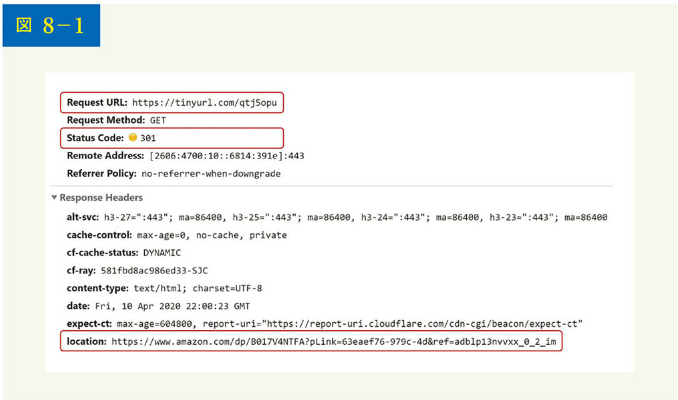

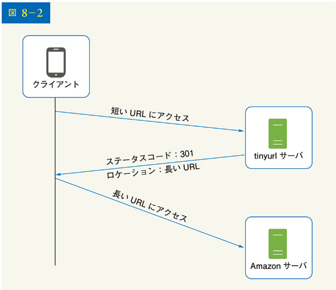

短い URL：https://tinyurl.com/qtj5opu
長い URL：https://www.amazon.com/dp/B017V4NTFA?pLink=63eaef76-979-4d&ref=adbip13nvvxx_0_2_im
ここで 1 つ議論に値するのは、301 リダイレクトと 302 リダイレクトとの比較です。

301 リダイレクト：301 リダイレクトは、要求された URL が「恒久的に」長い URL に移動されることを示す。恒久的にリダイレクトされるため、ブラウザはレスポンスをキャッシュし、同じ URL に対するその後のリクエストは URL 短縮サービスに送られることはない。その代わり、リクエストは直接長い URL のサーバにリダイレクトされる

302 リダイレクト：302 リダイレクトは、URL が「一時的に」長い URL に移動することを意味する。つまり、同じ URL に対するその後のリクエストは、まず URL 短縮サービスに送信される。その後、長い URL のサーバにリダイレクトされることになる

それぞれのリダイレクト方法には、長所と短所があります。サーバの負荷を軽減することを優先するなら、301 リダイレクトを使うと、同じ URL の最初のリクエストだけが URL 短縮サーバに送られるので理にかなっています。しかし、分析を重視する場合、クリック率やクリック元をより簡単に追跡できる 302 リダイレクトの方が適しています。

URL リダイレクトを実装する最も直感的な方法は、ハッシュテーブルの使用です。ハッシュテーブルに＜短い URL、長い URL ＞のペアが格納されていると仮定すると、URL リダイレクトは以下のように実装できます。

- 長い URL を取得：longURL = hashTable.get(shortURL)
- 長い URL を取得したら、URL リダイレクトを実行

### URL の短縮

短い URL が、www.tinyurl.com/ハッシュ値！のようなものであると仮定しましょう。URL短縮のユースケースをサポートするには、図8-3に示すように、長いURLをハッシュ値にマッピングするハッシュ関数fxを見つけなければなりません。

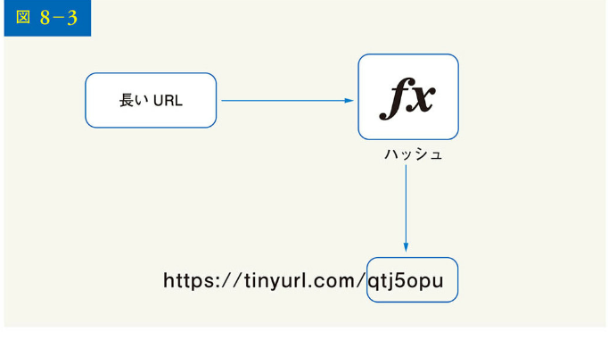

ハッシュ関数は以下の要件を満たす必要があります。

- 長い URL はそれぞれ、1 つのハッシュ値にハッシュ化されなければならない
- 各ハッシュ値は長い URL に対応される

ハッシュ関数の設計の詳細については次のセクションで議論します。

## 【ステップ 3】設計の深掘り

これまで、URL 短縮サービスと URL リダイレクトの高度な設計について説明してきました。このセクションでは、データモデル、ハッシュ関数、URL 短縮サービス、URL リダイレクトサービスについて詳しく説明します。

### データモデル

高度な設計では、すべてがハッシュテーブルに格納されています。これは出発点としては良いものの、メモリ資源が限定されて高価なため、このアプローチは現実のシステムでは実現不可能です。より良い選択肢は、＜短い URL、長い URL ＞のマッピングをリレーショナルデータベースに格納することです。図 8-4 は簡単なデータベーステーブルの設計を示しています。テーブル最適化されたバージョンには、id、短い URL、長い URL という 3 つの列が含まれます。

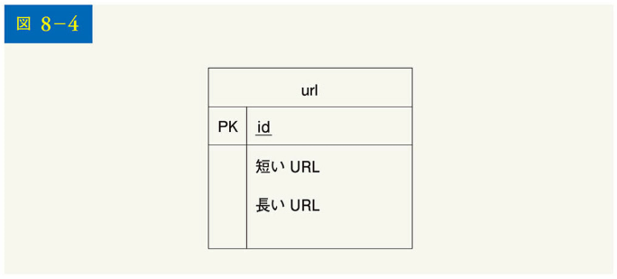

### 【ハッシュ関数】

ハッシュ関数は、長い URL を短い URL にハッシュ化するために使用され、ハッシュ値とも呼ばれます。

### 【ハッシュ値の長さ】

ハッシュ値は[0-9, a-z, A-Z]の文字から成り、10 + 26 + 26 = 62 文字の可能性があります。ハッシュ値の長さを求めるには、62^n ≧ 3650 億となる最小の n を求めればよいでしょう。システムは、おおざっぱな見積もりに基づいて、最大 3,650 億 URL をサポートする必要があります。表 8-1 にハッシュ値の長さと対応する URL の最大値を示します。

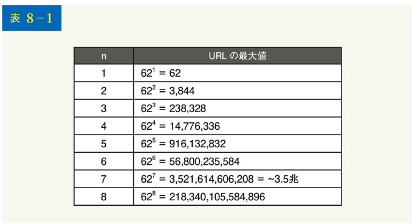

n = 7 の場合、62^7 = ～ 3.5 兆、3.5 兆は 3,650 億の URL を保持するのに十分であるため、ハッシュ値の長さは 7 です。

ここでは、URL 短縮のハッシュ関数として 2 種類のものを検討します。1 つは「ハッシュ＋衝突判定」、もう 1 つは「BASE62 変換」です。1 つずつ見ていきましょう。

### 【ハッシュ＋衝突判定】

長い URL を短縮するには、長い URL を 7 文字の文字列にハッシュ化するハッシュ関数を実装しなければなりません。CRC32、MD5、SHA-1 といった、よく知られたハッシュ関数を使うのが簡単な解決策です。次の表は、この URL（https://en.wikipedia.org/wiki/Systems_design）に対してさまざまなハッシュ関数を適用した後のハッシュ結果を比較したものです。

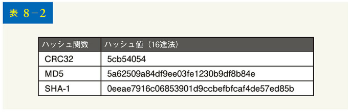

表 8-2 に示すように、最も短いハッシュ値（CRC32 による）でも長過ぎます（7 文字以上）。どうすれば短くできるでしょう。

最初のアプローチは、ハッシュ値の最初の 7 文字を集めることです。ただし、この方法はハッシュの衝突を引き起こす可能性があります。ハッシュの衝突を解消するには、衝突がなくなるまで新しい定義済み文字列を再帰的に追加していけばよいでしょう。この処理を図 8-5 に説明します。

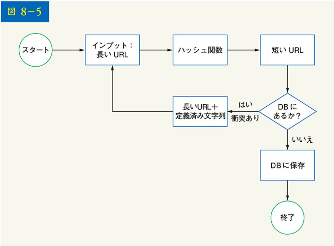

このアプローチでは衝突をなくすことはできますが、すべてのリクエストに対して短い URL が存在するかをデータベースに問い合わせる必要があり、コストがかかります。ブルームフィルタと呼ばれるテクニックを使えば、パフォーマンスを向上させられます。ブルームフィルタは、ある要素が集合のメンバーであるかをテストする上で、空間効率の良い確率的手法です。詳しくは、参考資料[2]を参照ください。

### 【BASE62 変換】

BASE 変換も URL 短縮ツールでよく使われる手法です。BASE 変換は、同じ数値を異なる記数法の間で変換する上で役立ちます。ハッシュ値には 62 種類の文字があるため、BASE62 変換が用いられます。この変換がどのように機能するかを、11157₁₀ を BASE62 によって変換する例で説明しましょう（11157₁₀ は、BASE10（10 進数）における 11157 を表す）。

- BASE62 はその名の通り、62 文字をエンコードに使用する方法である。マッピングは「0-0, ..., 9-9, 10-a, 11-b, ..., 35-z, 36-A, ..., 61-Z」となる。ここで、「a」は 10、「Z」は 61 などを表す

- 11157₁₀ = 2 × 62² + 55 × 62¹ + 59 × 62⁰ = [2, 55, 59] → 62 進法で[2, T, X]と表現される。図 8-6 に会諒処理を示す

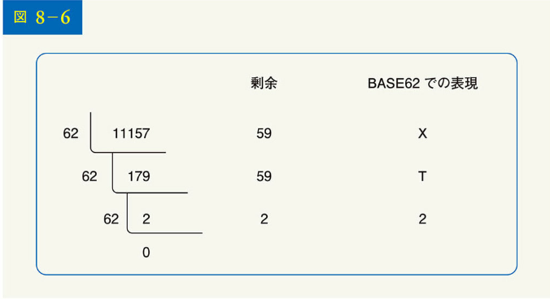

したがって、短い URL は https://tinyurl.com/2TX となる

【両アプローチの比較】
表 8-3 に、2 つのアプローチの相違点を示します。

[注釈：図 8-5 に示されている処理フロー]

1. インプット：長い URL
2. ハッシュ関数
3. 短い URL
4. DB にあるか？
   - はい → 終了
   - いいえ → 長い URL+定義済み文字列を追加 → ハッシュ関数に戻る
5. DB に保存
6. 終了

このアプローチでは衝突をなくすことはできますが、すべてのリクエストに対して短い URL が存在するかをデータベースに問い合わせる必要があり、コストがかかります。ブルームフィルタと呼ばれるテクニックを使えば、パフォーマンスを向上させられます。ブルームフィルタは、ある要素が集合のメンバーであるかをテストする上で、空間効率の良い確率的手法です。詳しくは、参考資料[2]を参照ください。

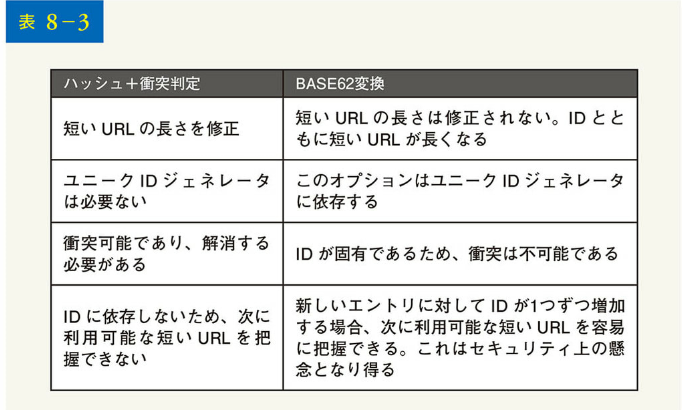

### 【URL 短縮の深掘り】

システムの核となる部分であるため、URL 短縮の流れは論理的にシンプルで機能的であることが望まれます。この設計では、BASE62 変換を使用しています。図 8-7 に、その流れを示しましょう。

1. 長い URL が入力（インプット）である
2. 長い URL がデータベースにあるかをチェックする
3. データベースに存在する場合、長い URL はすでに短い URL に変換されたことを意味する。この場合、データベースから短い URL を取得し、クライアントに返す
4. そうでない場合、長い URL は新しいものである。新しい固有 ID（主キー）が固有 ID ジェネレータによって生成される
5. ID を BASE62 で短い URL に変換する
6. ID、短い URL、長い URL を格納した、新しいデータベースの行を作成する

この流れを理解しやすくするため、具体例を見てみましょう：

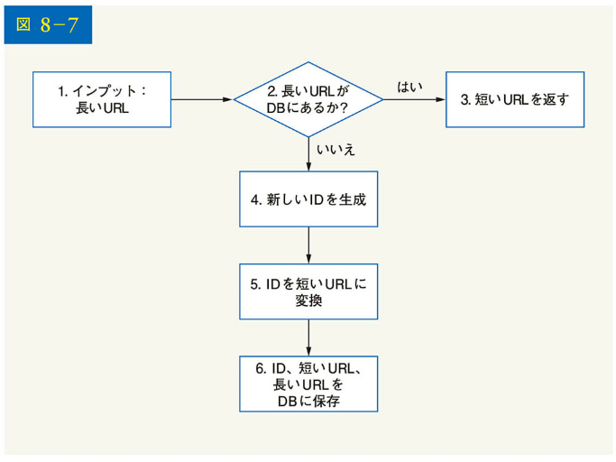

- 入力された長い URL が、https://en.wikipedia.org/wiki/ Systems_design であったとする
- 固有 ID ジェネレータが、2009215674938 という ID を返す

- この ID を BASE62 変換で短い URL に変換する。ID（2009215674938）は"zn9edcu"に変換される
- 表 8-4 に示すように、ID、短い URL、長い URL をデータベースに保存する

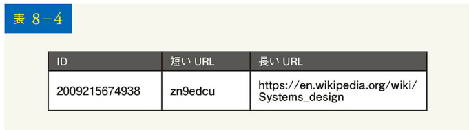

特筆すべきは、分散型のユニーク ID ジェネレータです。その主な機能は、短い URL を作成するために使用されるグローバルで固有の ID を生成することです。高度な分散環境では、ユニーク ID ジェネレータの実装は困難です。幸いなことに、「7 章」分散システムにおけるユニーク ID ジェネレータの設計で、いくつかの解決策を既に説明しています。記憶を呼び覚ますために、参照しましょう。

### 【URL リダイレクトの深掘り】

図 8-8 は、URL リダイレクトの設計の詳細について示したものです。書込みよりも読込みの方が多いので、＜短い URL、長い URL ＞のマッピングをキャッシュに保存して、パフォーマンスを向上させています。

URL リダイレクトの流れをまとめると以下のようになります：

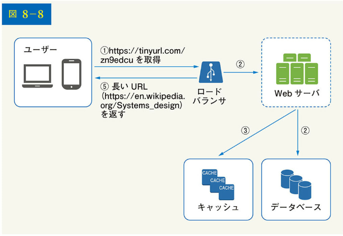

1. ユーザーが短い URL のリンク（https://tinyurl.com/zn9edcu）をクリックする
2. ロードバランサが Web サーバにリクエストを転送する
3. 短い URL がすでにキャッシュにある場合、長い URL を直接返す
4. 短い URL がキャッシュにない場合、長い URL をデータベースから取得する。データベース内にない場合は、ユーザーが無効な短い URL を入力した可能性がある
5. 長い URL がユーザーに返される

## 【ステップ 4】まとめ

この章では、API の設計、データモデル、ハッシュ関数、URL 短縮サービス、そして URL リダイレクトについて解説しました。
面接試験の最後に余分な時間があったときのために、追加の話題を以下にいくつか紹介します：

- レートリミッター：セキュリティ上の問題として、悪意のあるユーザーが大量の短縮 URL を送信してくることがあげられる。レートリミッターは、IP アドレスやその他のフィルタリングルールに基づいてリクエストをフィルタリングするのに役立つ。レートリミッターについて復習したければ、「4 章 レートリミッターの設計」を参照されたい
- Web サーバのスケーリング：Web 層はステートレスなので、Web サーバを追加したり削除したりすることで、簡単に Web 層を拡張できる
- データベースのスケーリング：データベースのレプリケーションとシャーディングが一般的な手法である
- アナリティクス：ビジネス成功のためにデータの重要性はますます高まっている。URL 短縮機能に分析ソリューションを統合すれば、何人がリンクをクリックしたか、いつクリックしたか、といった重要な質問に答えられる
- 可用性、一貫性、信頼性：これらのコンセプトは、大規模システム成功の

核心となるものである。1 章で詳しく説明したので、これらのトピックを思い出してほしい

ここまで来られた方、おめでとうございます。さあ、自分をほめてあげてください。よくやったと。

参考文献
[1] A RESTful Tutorial: https://www.restapitutorial.com/index.html
[2] Bloom filter: https://en.wikipedia.org/wiki/Bloom_filter
