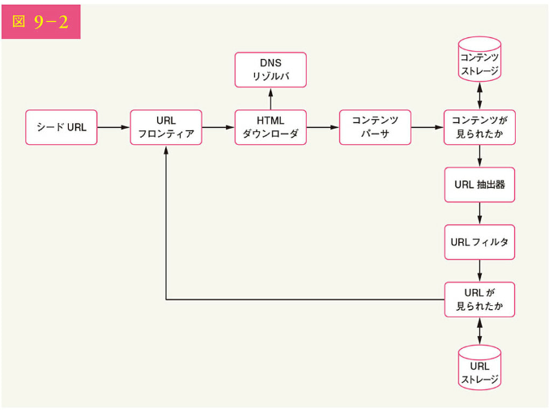
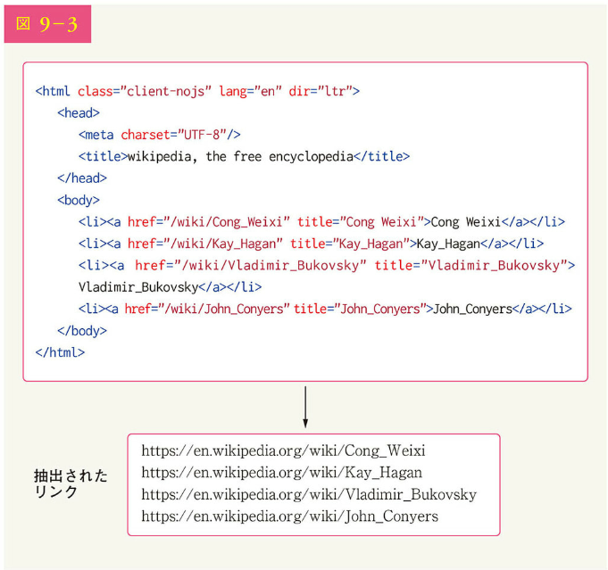
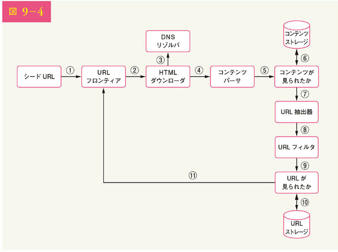
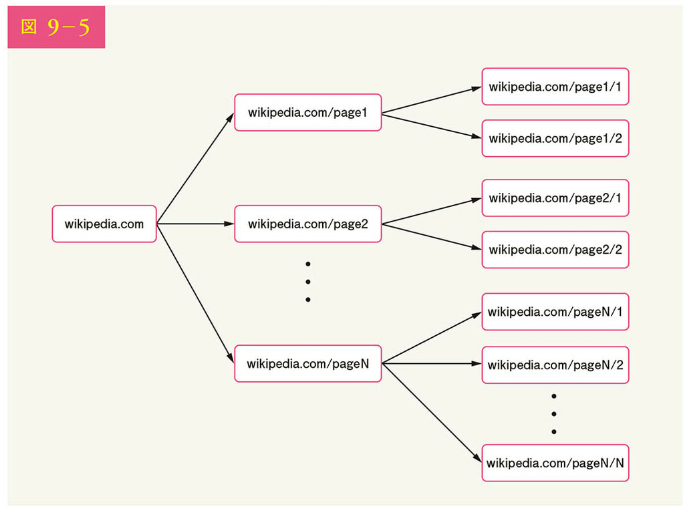
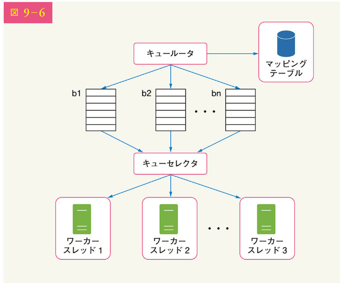
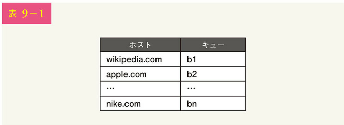
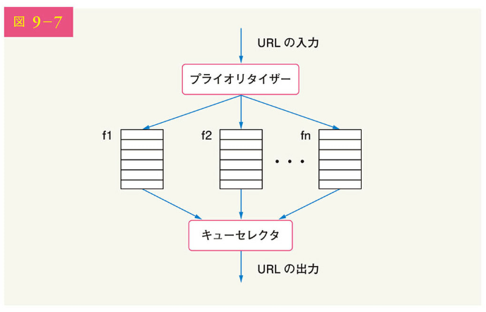
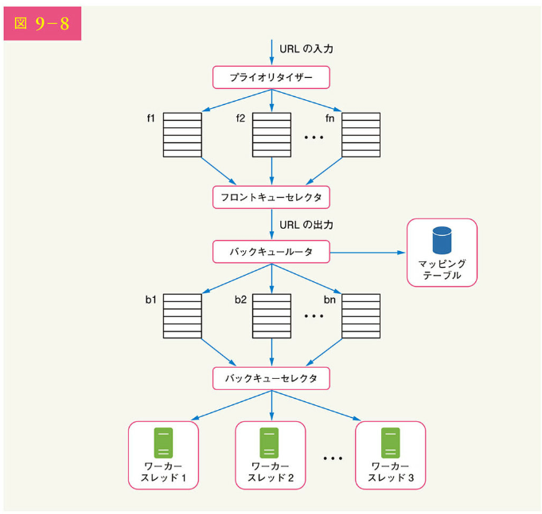
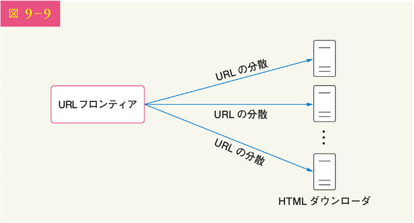
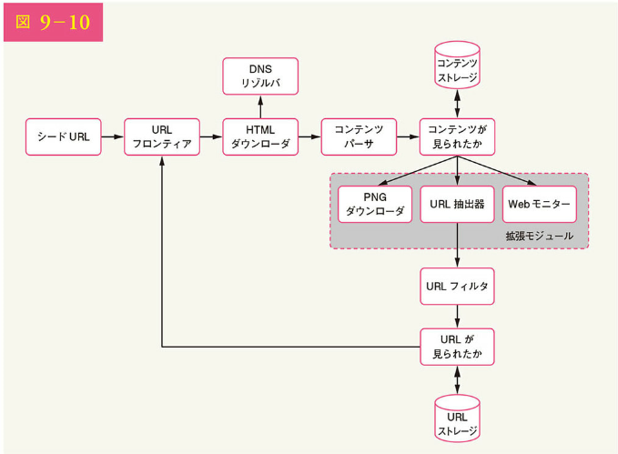

# 9 章 Web クローラの設計

この章では、興味深く、古典的なシステム設計の面接試験での質問を通じて、Web クローラの設計に焦点を当てます。

Web クローラは、Google ボットやスパイダーとして知られています。検索エンジンが Web 上の新しいコンテンツや更新されたコンテンツを発見するために広く使用されているのです。コンテンツは、Web ページ、画像、動画、PDF ファイルなどです。Web クローラは、まずいくつかの Web ページを収集し、それらページ上のリンクをたどって新しいコンテンツを収集します。図 9-1 は、クローリングの流れを視覚的な例として示しています。

クローラは、さまざまな目的で使用されます。

- 検索エンジンのインデックス作成：最も一般的な使用例である。クローラは、検索エンジンのローカル・インデックスを作成するために、Web ページを収集する。例えば、Googlebot は、Google の検索エンジンを支える Web クローラである

- Web アーカイビング：Web から情報を収集し、将来の利用を前提にデータを保存する。例えば、多くの国立図書館では、Web サイトをアーカイブするためにクローラを走らせている。米国議会図書館や EU Web アーカイブなどが代表例である

- Web マイニング：Web の爆発的な発展は、データマイニングにとって前例のない機会である。Web マイニングは、インターネットから有用な知識を発見するのに役立つ。例えば、一流の金融企業はクローラを使って株主総会や年次報告書をダウンロードし、会社の重要な取り組みを学んでいる

- Web モニタリング：クローラは、インターネット上の著作権や商標権の侵害を監視するのに役立っている。例えば、Digimarc 社は、海賊版の作品や報告書を発見するためにクローラを活用している

Web クローラ開発の規模さは、そのサポート規模に依存します。規模は、数時間で完成する学校の小さなプロジェクトであったり、専門のエンジニアリングチームによる継続的な改善活動を必要とする巨大なプロジェクトであったり、とさまざまです。そのため、以下ではサポートする規模や機能を探っていきましょう。

## ステップ 1 問題を理解し、設計範囲を明確にする

Web クローラの基本的なアルゴリズムはシンプルです。

1. URL のセットが与えられたら、指定されたすべての Web ページをダウンロードする
2. これらの Web ページから URL を抽出する
3. ダウンロードする URL のリストに新しい URL を追加する。この 3 ステップを繰り返す

Web クローラは、実際にこのような基本的なアルゴリズムで動いているのでしょうか。正確には、そうではありません。高度なスケーラビリティを持つ Web クローラを設計するのは、非常に複雑な作業なのです。面接時間内に巨大な Web クローラを設計できる人など、まずいないでしょう。設計に飛び込む前に、要件を理解し、設計範囲を確定するための質問をしなければなりません。

候補者：クローラの主要な目的は何ですか？ 検索エンジンのインデックス作成ですか、データマイニングですか、それとも他の目的ですか？
面接官：検索エンジンのインデックス作成です。

候補者：Web クローラは 1 ヶ月にどのくらいの Web ページを収集しますか？
面接官：10 億ページです。

候補者：どのような種類のコンテンツが含まれますか？ HTML だけですか、それとも PDF や画像など、他の種類のコンテンツも含まれますか？
面接官：HTML のみです。

候補者：新しく追加された、あるいは編集された Web ページを考慮するのでしょうか？
面接官：はい、新しく追加された、あるいは編集された Web ページを考慮するべきです。

候補者：Web からクロールした HTML ページを保存する必要がありますか？
面接官：はい、最長で 5 年間、保存する必要があります。

候補者：重複するコンテンツのある Web ページはどのように扱えばいいのでしょうか？
面接官：重複コンテンツがあるページは無視します。

上記は、面接官に訊く質問例の一部です。要件を理解し、意味を点を明確にすることが重要なのです。Web クローラのような単純な製品を設計するように依頼されても、あなたと面接官の前提が同じとは限りません。

また、機能面だけでなく、以下のような特徴もメモしておくと、より良い Web クローラになるでしょう。

・スケーラビリティ：Web は非常に巨大であり、何十億という Web ページが存在する。そのため、並列化によって効率的にクローリングを行う必要がある

・堅牢性：Web は罠に満ちている。不正な HTML、応答しないサーバ、クラッシュ、悪意のあるリンクなどは、どれもよくある。クローラはこれらの特別な問題を含む状況にすべて対処しなければならない

・ポライトネス：クローラは、短い時間内にあまり多くのリクエストをしないようにしなければならない

・拡張性：新しい種類のコンテンツに対応するために、最小限の変更で済むような柔軟なシステムであること。例えば、将来的に画像ファイルをクロールするようになったとしても、システム全体を再設計する必要はない

おおまかな見積もり

以下の試算は多くの仮定に基づいています。そのため、面接官とコミュニケーションを取り、同じ認識を持つことが重要です。

・毎月 10 億の Web ページがダウンロードされると仮定する
・QPS：1,000,000,000 / 30 日 / 24 時間 / 3600 秒 = ～ 400 ページ / 秒
・ピーク時の QPS = 2 × QPS = 800 ページ / 秒
・平均的な Web ページのサイズを 500k と仮定
・10 億ページ × 500k = 500 TB ストレージ/月。デジタルストレージの単位に不明な点があれば、2 章の「2 のべき乗」のセクションを再度確認
・仮に 5 年間データを保存すると仮定すると、500TB × 12 ヶ月 × 5 年= 30PB となる。5 年分のコンテンツを保存するには、30PB のストレージが必要である

## ステップ 2 高度な設計を提案し、賛同を得る

要件が明確になったら、次は高度な設計に移ります。Web クローリングに関する先行研究に触発されて、図 9-2 に示すような高度な設計を提案しましょう。

まず、それぞれの機能を理解するため、各構成要素を探索します。次に、クローラのワークフローを順に見ていきましょう。

### シード URL

Web クローラは、クロールの出発点としてシード URL を使用します。例えば、ある大学の Web サイトの全ページをクロールする場合、直感的にわかりやすいのは大学のドメイン名を使ったシード URL を選択することです。

一方、Web 全体をクロールする場合、シード URL の選定にも工夫が必要です。良いシード URL は、クローラができるだけ多くのリンクを巡回する上での良い出発点として機能します。一般的な戦略は、URL 空間全体をより小さな単位に分割することです。国によって人気のある Web サイトが異なるため、最初に考えられるのは地域性に基づく方法でしょう。そして、もう 1 つの方法はトピックに基づくシード URL の選択です。例えば、URL 空間は、ショッピング、スポーツ、ヘルスケアなどに分割できます。URL の選択は自由回答です。完璧な答えを期待されているわけではありません。ただ、考えていることを口に出してください。

### URL フロンティア

最近のほとんどの Web クローラは、クロールの状態を、ダウンロード予定とダウンロード済みの 2 つに分けています。ダウンロードされる URL を保存するコンポーネントは URL フロンティア、あるいは先入れ先出し（FIFO）キューと呼ばれます。URL フロンティアの詳細については、「ステップ 3：設計の深掘り」を参照ください。

###HTML ダウンローダ

HTML ダウンローダは、URL フロンティアから提供される URL に基づいて、インターネットから Web ページをダウンロードします。

### DNS リゾルバ

Web ページをダウンロードするには URL を IP アドレスに変換する必要があります。HTML ダウンローダは DNS リゾルバを呼び出して、URL に対応する IP アドレスを取得します。例えば、URL www.wikipedia.org は、2019 年 3 月現在、IP アドレス 198.35.26.96 に変換されます。

### コンテンツパーサ

ダウンロードされた Web ページは、解析して検証する必要があります。不正な Web ページは問題を引き起こし、ストレージ領域を浪費する可能性があるからです。クロールサーバにコンテンツパーサを実装すると、クロール処理の速度が低下します。そのため、コンテンツパーサは独立したコンポーネントになっているのです。

###コンテンツが見られたか

オンライン調査[6]によれば、Web ページの 29%が重複したコンテンツであり、同じコンテンツが複数回保存される可能性があることも判明しています。データの冗長性を排除し、処理時間を短縮するため、「コンテンツが見られたか（Content Seen?）」というデータ構造を導入しましょう。これは、過去に蓄積された新しいコンテンツを検出するのに役立ちます。2 つの HTML 文書の比較では、1 文字ずつの比較することも可能です。ただ、この方法では数十億の Web ページが含まれていれば、時間と手間がかかります。より効率的なのは、2 つの Web ページのハッシュ値を比較する方法でしょう[7]。

### コンテンツストレージ

HTML コンテンツを保存するためのストレージシステムです。ストレージシステムの選択は、データの種類、データサイズ、アクセス頻度、寿命などさまざまな要因に依存し、ディスクとメモリの両方が使用されます。

・データセットが大き過ぎてメモリに収まらないため、ほとんどのコンテンツはディスクに保存される
・人気のあるコンテンツは、レイテンシーを減らすためにメモリに保存される

### URL 抽出器

URL 抽出器は HTML ページからリンクを解析して抽出します。図 9-3 にリンク抽出処理の例を示します。相対パスは、"https://en.wikipedia.org"というURLプレフィックスを追加することで絶対URLに変換されます。

### URL フィルタ

URL フィルタは、特定のコンテンツタイプ、ファイル拡張子、エラーリンク、「ブラックリスト」に登録されたサイト URL を除外できます。

### URL が見られたか

「URL が見られたか（URL Seen?）」は、以前に訪問したことのある URL や、すでに URL フロンティアにある URL を記録するデータ構造です。「URL が見られたか」は、同じ URL を何度も追加することを避けることで役立ちます。同じ URL を何度も追加すると、サーバの負荷が高まり、無限ループを引き起こす可能性があるからです。

ブルームフィルタとハッシュテーブルは、「URL が見られたか」コンポーネントを実装するための一般的な技術です。ここでは、ブルームフィルタとハッシュテーブルの詳細や実装については説明しません。詳しくは参考資料[4][8]を参照ください。

### URL ストレージ

URL ストレージは既に訪問した URL を保存します。

以上が、システムの各構成要素についての説明です。次に、それらをまとめるワークフローを説明しましょう。

### Web クローラのワークフロー

ワークフローを段階的に説明するため、図 9-4 に示す設計図にシーケンス番号を付加します。

ステップ 1：URL フロンティアにシード URL を追加する
ステップ 2：HTML ダウンローダは URL フロンティアから URL のリストを取得する
ステップ 3：HTML ダウンローダが DNS リゾルバから URL の IP アドレスを取得し、ダウンロードを開始する
ステップ 4：コンテンツパーサは HTML ページを解析し、ページが不正であるかをチェックする
ステップ 5：コンテンツが解析され、検証された後、「コンテンツが見られたか」コンポーネントに渡される
ステップ 6：「コンテンツが見られたか」コンポーネントは、HTML ページがすでにストレージ内にあるかをチェックする
・ストレージ内にある場合、別の URL の同じコンテンツがすでに処理されていることを意味する。その場合、その HTML ページは破棄される
・ストレージ内にない場合、同じコンテンツを処理したことがないことを意味する。このコンテンツは、リンク抽出器に渡される
ステップ 7：URL 抽出器は、HTML ページからリンクを抽出する
ステップ 8：抽出されたリンクは、URL フィルタに渡される
ステップ 9：リンクはフィルタリングされた後、「URL が見られたか」コンポーネントに渡される
ステップ 10：「URL が見られたか」コンポーネントは、URL がすでにストレージにあるかをチェックする。「はい」の場合、その URL は事前に処理されているので、何もする必要はない
ステップ 11：URL が以前に処理されていない場合、その URL は URL フロンティアに追加される

## ステップ 3 設計の深掘り

ここまで、高度な設計について説明してきました。次に、最も重要な構成要素や技術について深く掘り下げて説明しましょう。

・深さ優先探索（DFS）vs 幅優先探索（BFS）
・URL フロンティア
・HTML ダウンローダ
・堅牢性
・拡張性
・問題のあるコンテンツの検出と回避

### DFS と BFS の比較

Web は、Web ページをノードとして HTML ページからリンクを抽出するハイパーリンク（URL）をエッジとする有向グラフと捉えることができます。クロールのプロセスは、ある Web ページから他の Web ページへと有向グラフを走査することと見なせるのです。グラフ探索のアルゴリズムとしては、DFS と BFS の 2 つが一般的です。しかし、DFS は非常に深くなることがあるため、通常、良い選択とは言えません。

BFS は Web クローラでよく使われ、先入れ先出し（FIFO）キューで実装されています。FIFO キューでは、URL はキューに入れられた順番にキューから出されます。しかし、この実装には 2 つの問題があります。

・同じ Web ページからのリンクのほとんどが、同じホストにリンクバックされる。図 9-5 では、wikipedia.com のすべてのリンクは内部リンクであり、クローラは同じホスト（wikipedia.com）からの URL を処理するのに忙しい。クローラが Web ページを並行してダウンロードしようとすると、Wikipedia のサーバはリクエストで溢れかえる。これは「不作法」であるとみなされるだろう

・標準的な BFS では、URL の優先順位は考慮されない。Web は巨大であり、すべてのページの品質や重要度が同じとは限らない。そのため、ページランク、Web トラフィック、更新頻度などに応じて、URL の優先順位を決めたい場合がある

### URL フロンティア

URL フロンティアは、これらの問題を解決するのに役立ちます。URL フロンティアは、ダウンロードする URL を格納するデータ構造です。URL フロンティアは、ポライトネス、URL の優先順位、フレッシュネスを確保するための重要な要素となります。URL フロンティアに関する注目すべき論文は、参考文献[5][9]にいくつかあげています。これらの論文から得られた知見は以下の通りです。

### ポライトネス

一般に、Web クローラは短時間に同じホスティングサーバにあまり多くのリクエストを送らないようにする必要があります。あまりに多くのリクエストを送ることは「不作法」とみなされ、サービス妨害（DOS）攻撃と見なされることもあるからです。例えば、何の制約もないと、クローラは同じ Web サイトに毎秒数千ものリクエストを送ることができます。これでは、Web サーバが圧倒されてしまうかもしれません。

ポライトネスの一般的な考え方は、同じホストから 1 度に 1 ページずつダウンロードすることです。2 つのダウンロードタスクの間には、遅延を加えられます。ポライトネスの制約は、Web サイトのホストごとからダウンロードするためのスレッドへのマッピングを維持することで実装されます。各ダウンロードスレッドは個別の FIFO キューを持ち、そのキューから取得した URL のみをダウンロードします。図 9-6 に、ポライトネスを管理する設計を示しました。

・キュールータ：各キュー（b1, b2, ... bn）が同一ホストからの URL のみが含まれることを保証する
・マッピングテーブル：各ホストを以下のようにキューに対応付ける

・FIFO キュー（b1, b2 ～ bn）：各キューは、同一ホストからの URL を含む
・キューセレクタ：各ワーカースレッドは FIFO キューにマップされ、そのキューからの URL のみをダウンロードする。キューの選択ロジックは、キューセレクタによって行われる
・ワーカースレッド（1 ～ N）：ワーカースレッドは、同じホストから Web ページを 1 つずつダウンロードする。2 つのダウンロードタスクの間に遅延を加えられる

### 優先順位

Apple 製品に関するディスカッションフォーラムにおけるランダムな投稿は、Apple のホームページにおける投稿とはまったく異なる重みを持ちます。たとえ両方とも「Apple」というキーワードがあっても、Apple のホームページを最初にクロールするのが賢明でしょう。

私たちは、ページランク[10]、Web サイトのトラフィック、更新頻度などによって測定できる有用性に基づいて、URL に優先順位を付けます。「プライオリタイザー（Prioritizer）」は、URL の優先順位付けを処理するコンポーネントです。この概念の詳細については、参考資料[5][10]を参照ください。図 9-7 に、URL の優先順位を管理する設計を示します。

・プライオリタイザー：URL を入力とし、優先順位を計算する
・キュー（f1 ～ fn）：各キューには優先度が設定されている。優先度の高いキューが高い確率で選択される
・キューセレクタ：優先度の高いキューに偏ったキューをランダムに選択する

図 9-8 に URL フロンティアの設計を示します。これには 2 つのモジュールが含まれます。

・フロントキュー：優先順位付けの管理
・バックキュー：ポライトネスの管理

### フレッシュネス

Web ページはつねに追加、削除、編集されています。Web クローラは、ダウンロードしたページを定期的に再クロールして、データセットのフレッシュネスを保つ必要があります。すべての URL の再クロールは、時間とリソースの浪費です。フレッシュネスの最適化に向けた戦略を以下にいくつかあげましょう。

・Web ページの更新履歴に基づき再クロールする
・URL に優先順位を付け、重要なページを最初に、そしてより頻繁に再クロールする

### URL フロンティアの保存

実際の検索エンジンのクロールでは、フロンティアに含まれる URL の数が数億に及ぶ可能性があります。すべてをメモリに格納することは、耐久性にも拡張性にも欠けるでしょう。また、ディスクにすべてを保存するのは、ディスクの処理速度が遅くなり、クロールのボトルネックになりやすいので好ましくありません。

私たちは、ハイブリッドなアプローチを採用しました。URL の大半はディスクに保存されているため、ストレージ領域の問題がありません。ディスクからの読込みとディスクへの書込みのコストを削減するため、エンキュー/デキュー操作のためのバッファをメモリに保持します。バッファ内のデータは定期的にディスクに書き込まれるのです。

### HTML ダウンローダ

HTML ダウンローダは、HTTP プロトコルを使ってインターネットから Web ページをダウンロードします。HTML ダウンローダについて説明する前に、まずロボット排除プロトコル（Robots Exclusion Protocol, REP）について見ていきます。

### Robots.txt

ロボット排除プロトコルと呼ばれる Robots.txt は、Web サイトがクローラと通信するための規格であり、クローラにダウンロードを許可するページを指定します。クローラは、ある Web サイトをクロールする前に、まず対応する robots.txt を確認し、その規則に従わなければなりません。

robots.txt ファイルの繰り返しダウンロードしないため、その結果をキャッシュしています。このファイルは定期的にダウンロードされ、キャッシュに保存されるのです。以下は、https://www.amazon.com/robots.txtから取得したrobots.txtファイルの一部です。creatorhubのようなディレクトリには、Googleボットによって許可されていないものもあります。

ユーザーエージェント：Googlebot
不許可：/creatorhub/_
不許可：/rss/people/_/reviews
不許可：/gp/pdp/rss/\*/reviews
不許可：/gp/cdp/member-reviews/
不許可：/gp/aw/cr/

robots.txt のほか、パフォーマンスの最適化も HTML ダウンローダにおける重要な概念です。

### パフォーマンスの最適化

以下は、HTML ダウンローダにおけるパフォーマンス最適化のリストです。

#### 1. 分散クロール

クロールを複数のサーバに分散して実行し、各サーバで複数のスレッドを実行することで、高いパフォーマンスを実現しています。URL 空間はより小さく分割され、各ダウンローダは URL 空間のサブセットを担当するのです。図 9-9 は分散クロールの例です。

#### 2. キャッシュ DNS リゾルバ

DNS リゾルバは、多くの DNS インターフェイスの同期性によって、しばしば DNS リクエストに時間がかかるため、クローラのボトルネックとなります。DNS の応答時間は 10ms から 200ms の範囲です。DNS へのリクエストがクローラのスレッドによって実行されると、最初のリクエストが完了するまで他のスレッドはブロックされます。DNS を頻繁に呼び出さないようにするために DNS キャッシュを維持することは、速度最適化に向けた有効な手法です。DNS キャッシュは、ドメイン名と IP アドレスの対応関係を保持し、cron ジョブによって定期的に更新されます。

#### 3. 地域性

クロールサーバを地理的に分散させます。クロールサーバが Web サイトのホストに近いと、クローラのダウンロード時間が速くなります。クロールサーバ、キャッシュ、キュー、ストレージなど、ほとんどのシステム構成要素に適用されます。

#### 4. 短いタイムアウト

Web サーバの中には、レスポンスが遅いものや、まったく応答しないものがあります。長い待ち時間を避けるため、最大待ち時間を設定しましょう。もし、この時間内にレスポンスがない場合、クローラはジョブを中断して、他のページをクロールします。

### 堅牢性

性能の最適化に加えて、堅牢性も重要な考慮事項です。ここでは、システムの堅牢性向上に向けたいくつかのアプローチを紹介します。

・コンシステントハッシュ：これはダウンローダ間の負荷を分散させるのに役立つ。新しいダウンローダサーバは、コンシステントハッシュを使用して追加または削除できる。詳しくは「5 章 コンシステントハッシュの設計」を参照

・クロール状態やデータの保存：障害に備え、クロールの状態とデータをストレージシステムに書き込む。クロールが中断した場合、保存された状態やデータを読み込むことで簡単にクロールを再開できる

・例外処理：大規模なシステムでは、エラーは避けられない。クローラはシステムをクラッシュさせることなく、例外を優雅に処理しなければならない

・データ検証：システムエラーを防ぐための重要な対策である

### 拡張性

ほとんどのシステムが進化していく中で、新しいタイプのコンテンツに対応できる柔軟なシステムを作ることは設計目標の 1 つです。クローラは、新しいモジュールをプラグインすることで拡張できます。図 9-10 は、新しいモジュールを追加する方法を示しています。

・PNG ファイルをダウンロードするための PNG ダウンローダモジュールがプラグインされている
・Web を監視し、著作権や商標権の侵害を防止するための Web モニターモジュールを追加した

### 問題のあるコンテンツの検出と回避

冗長なコンテンツ、無意味なコンテンツ、有害なコンテンツの検出と回避について説明します。

####1. 冗長なコンテンツ

前述のように、Web ページの 30%近くが重複しています。重複の検出には、ハッシュやチェックサムが有効です[11]。

#### 2. スパイダートラップ

スパイダートラップとは、クローラを無限ループに陥らせる Web ページです。例えば、以下のような無限に深いディレクトリ構造があげられるでしょう：

www.spidertrapexample.com/foo/bar/foo/bar/...

このようなスパイダートラップは、URL の最大長を設定することで回避できます。しかし、スパイダートラップを検出するための万能な解決策は存在しません。スパイダートラップを含む Web サイトは、Web サイト内の Web ページ数が異常に多いため、容易に特定できます。スパイダートラップを回避するための自動化アルゴリズムの開発は困難です。しかし、ユーザーが手動でスパイダートラップを検証・特定してクローラから除外したり、カスタマイズした URL フィルタを適用したりすることは可能なのです。

####3. データノイズ

広告、コードスニペット、スパム URL など、ほとんど価値のないコンテンツもあります。これらのコンテンツは、クローラにとって有用でないため、可能であれば除外します。

## ステップ 4 まとめ

この章ではまず、良いクローラの特徴として、スケーラビリティ、ポライトネス、拡張性、堅牢性について議論しました。そして、設計を提案し、主要な構成要素について議論しました。Web は巨大で罠に満ちているため、スケーラブルな Web クローラを作るのは簡単なことではありません。多くのトピックを取り上げたとはいえ、関連する多くの論点をまだ見逃しています。

・サーバーサイドレンダリング：多くの Web サイトでは、JavaScript や Ajax などのスクリプトを使用して、リンクをその場で生成している。

Web ページを直接ダウンロードして解析すると、動的に生成されたリンクを取得できない。この問題を解決するため、ページを解析する前に、まずサーバサイドレンダリング（ダイナミックレンダリングとも呼ばれる）を実行する[12]

・不要なページのフィルタリング：ストレージの容量やクロールのリソースに限りがある中で、アンチスパムコンポーネントは、低品質なページやスパムページをフィルタリングするのに有効である[13][14]

・データベースのレプリケーションとシャーディング：データベースのレプリケーションやシャーディングは、データレイヤの可用性、スケーラビリティ、信頼性を向上させるために使用される技術である

・水平方向のスケーリング：大規模なクローリングを行う場合、ダウンロードタスクを実行するために何百、何千ものサーバが必要となる。その際、サーバをステートレスにすることがポイントになる

・可用性、一貫性、信頼性：これらの概念は、あらゆる大規模システムの成功の核心となるものである。これらについては、1 章で詳しく説明した。記憶を呼び覚ましてほしい

・アナリティクス：データは微調整のための重要な材料であるため、データの収集と分析は、あらゆるシステムにおいて重要な部分である

ここまで来られた方、おめでとうございます。さあ、自分をほめてあげてください。よくやったよ。

参考文献
[1] US Library of Congress: https://www.loc.gov/websites/
[2] EU Web Archive: http://data.europa.eu/webarchive
[3] Digimarc: https://www.digimarc.com/products/digimarc-services/piracy-intelligence
[4] Heydon A., Najork M. Mercator: A scalable, extensible web crawler World Wide Web, 2 (4) (1999), pp. 219-229
[5] By Christopher Olston, Marc Najork: Web Crawling. http://infolab.stanford.edu/~olston/publications/crawling_survey.pdf
[6] 29% Of Sites Face Duplicate Content Issues: https://tinyurl.com/y6tmh55y
[7] Rabin M.O. et al., "Fingerprinting by random polynomials." Center for Research in Computing Techn., Aiken Computation Laboratory, Univ. (1981)
[8] B. H. Bloom, "Space/time trade-offs in hash coding with allowable errors," Communications of the ACM, vol. 13, no. 7, pp. 422-426, 1970.
[9] Donald J. Patterson, Web Crawling: https://www.ics.uci.edu/~lopes/teaching/cs221W12/slides/Lecture05.pdf
[10] L. Page, S. Brin, R. Motwani, and T. Winograd, "The PageRank citation ranking: Bringing order to the web," Technical Report, Stanford University.
[11] Burton Bloom. Space/time trade-offs in hash coding with allowable errors. Communications of the ACM, 13(7), pages 422--426, July 1970.
[12] Google Dynamic Rendering: https://developers.google.com/search/docs/guides/dynamic-rendering
[13] T. Urvoy, T. Lavergne, and P. Filoche, "Tracking web spam with hidden style similarity," in Proceedings of the 2nd International Workshop on Adversarial Information Retrieval on the Web, 2006.
[14] H.-T. Lee, D. Leonard, X. Wang, and D. Loguinov, "IRLbot: Scaling to 6 billion pages and beyond," in Proceedings of the 17th International World Wide Web Conference, 2008.
