# 第 10 章 通知システムの設計

通知システムは、近年、すでに多くのアプリケーションで非常に人気のある機能となっています。ニュース速報、製品アップデート、イベント、提供品などの重要な情報をユーザーに知らせる通知機能は、私たちの日常生活に欠かせないものとなっています。この章では、通知システムの設計が求められます。

通知は、モバイルプッシュ通知だけではありません。通知形式には、モバイルプッシュ通知、SMS メッセージ、e メールの 3 種類があります。それぞれの通知の例を図 10-1 に示します。

[図 10-1]
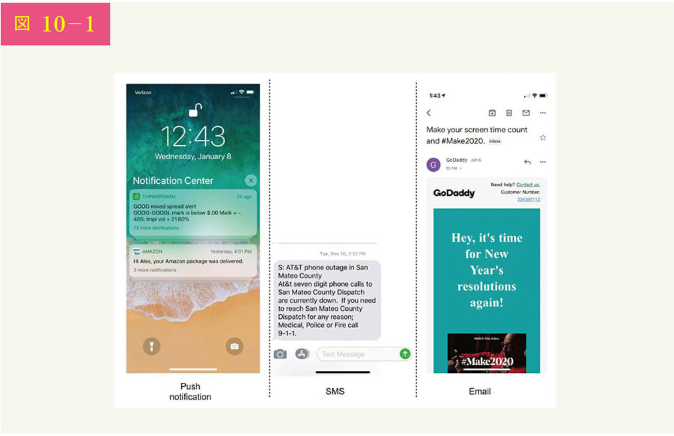

## ステップ 1 問題を理解し、設計範囲を明確にする

1 日に数百万件の通知を送信するスケーラブルなシステムを構築するのは、容易なことではありません。それには、通知のエコシステムを深く理解する必要があります。面接の質問は、意図的に制約が少なく、曖昧に設計されており、実件の明確化に向けて質問するのはあなたの責任です。

候補者：システムはどのような種類の通知をサポートしていますか？
面接官：プッシュ通知、SMS メッセージ、e メールです。

候補者：リアルタイムなシステムですか？
面接官：柔軟なリアルタイムシステムとしましょう。ユーザーにはできるだけ早く通知を受け取ってもらいたいのですが、負荷が高い場合は、多少遅れても構いません。

候補者：対応する端末は？
面接官：iOS 端末、Android 端末、ラップトップ/デスクトップ PC です。

候補者：何が通知のきっかけですか？
面接官：クライアントアプリケーションが通知のきっかけとなることもできます。また、サーバサイドでのスケジューリングも可能です。

候補者：ユーザーはオプトアウト（ユーザーが自ら許諾の意思を示す）できるのでしょうか？
面接官：はい、オプトアウトを選択したユーザーには、通知が届かなくなります。

候補者：1 日に何通くらいの通知が送られるのでしょう？
面接官：モバイルプッシュ通知 1000 万件、SMS メッセージ 1000 万件、e メール 500 万件です。

## ステップ 2 高度な設計を提案し、賛同を得る

このセクションでは、iOS 端末のプッシュ通知、Android 端末のプッシュ通知...

知、SMS メッセージ、および e メールという様々な通知の種類をサポートする高度な設計を紹介します。構成は以下の通りです。

• さまざまな種類の通知
• 連絡先収集フロー
• 通知の送受信フロー

### さまざまな種類の通知

まず、通知の種類ごとに、どのような仕組みになっているかを大まかに見ていきます。

### iOS 端末のプッシュ通知

[図 10-2]
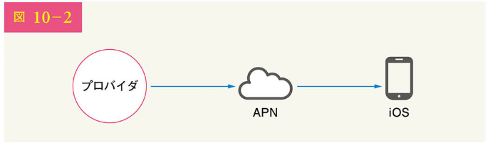

iOS 端末のプッシュ通知を送信するには、主に 3 つの構成要素が必要です。

• プロバイダ：プロバイダは、Apple Push Notification Service (APNS) に対して通知要求を作成し、送信する。プッシュ通知を作成するために、プロバイダは以下のデータを提供する
• デバイストークン：プッシュ通知の送信に使用される一意の識別子である
• ペイロード：通知のペイロードを含む JSON ディクショナリ。以下はその例である

```json
{
  "aps": {
    "alert": {
      "title": "game Request",
      "body": "Bob wants to play chess",
      "action-loc-key": "PLAY"
    },
    "badge": 5
  }
}
```

• APN：Apple が提供するリモートサービスで、iOS 端末にプッシュ通知を伝播させる
• iOS 端末：プッシュ通知を受け取るエンドクライアントである

### Android 端末のプッシュ通知

Android 端末も同様の通知フローを採用しています。APN の代わりに FCM (Firebase Cloud Messaging) が、Android 端末へのプッシュ通知の送信によく使われます。

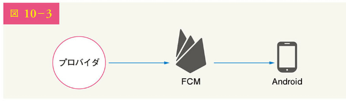

### SMS メッセージ

SMS メッセージでは、Twilio [1]、Nexmo [2] といったサードパーティの SMS サービスがよく使われます。これらの多くは商用サービスです。

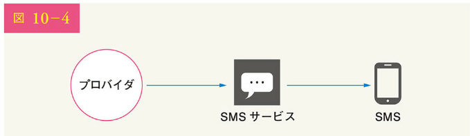

### e メール

自社でメールサーバを構築することもできますが、多くの企業は商用メールサービスを選択しています。Sendgrid [3] や Mailchimp [4] は最も人気のあるメールサービスであり、配信率やデータ分析に優れています。

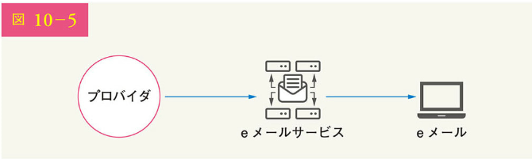

[図 10-6]は、すべてのサードパーティのサービスを含めた後の設計を示しています。

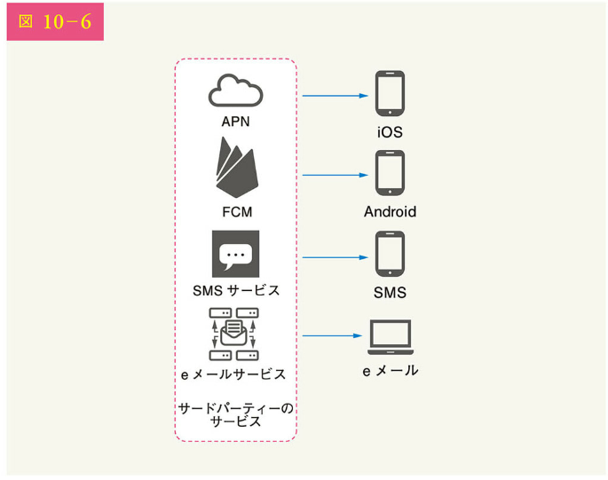

### 連絡先情報の収集フロー

通知を送信するには、モバイル端末のトークン、電話番号、またはメールアドレスを収集する必要があります。図 10-7 に示すように、ユーザーがアプリをインストール時や初めてのサインアップ時に、API サーバはユーザーの連絡先情報を収集してデータベースに保存するのです。

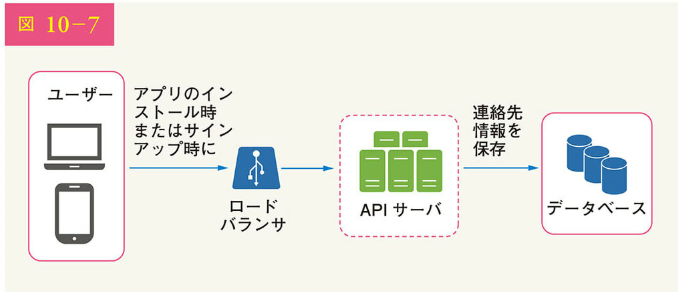

図 10-8 は、連絡先情報を格納するデータベースのテーブルを簡略化したものです。e メールアドレスと電話番号は user テーブルに、デバイストークンは device テーブルに格納されます。ユーザーは複数の端末を所有でき、プッシュ通知はすべてのユーザー端末に送信できることを示しています。

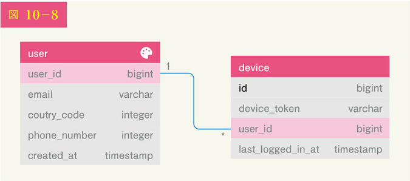

[図 10-8]のデータベース構造：
user テーブル:

- user_id (bigint)
- email (varchar)
- coutry_code (integer)
- phone_number (integer)

- created_at (timestamp)

device テーブル:

- id (bigint)
- device_token (varchar)
- user_id (bigint)
- last_logged_in_at (timestamp)

### 通知送受信のフロー

まず、初期設計を示し、その後、いくつかの最適化を提案します。

### 高度な設計

[図 10-9]に設計を示し、各システムの構成要素を説明します。

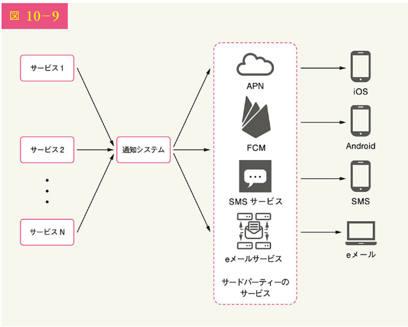

サービス 1 ～ N：個々のサービスは、マイクロサービス、cron ジョブ、または通知送信イベントを起動させる分散システムである。例えば、課金サービスは顧客に支払い期限を知らせる e メールを送信し、ショッピングサイトは顧客に明日の荷物到着を SMS メッセージで知らせる

通知システム：通知システムは、通知の送受信の中心となる。まずはシンプルに、通知サーバを 1 つだけ使用する。通知サーバは 1 から N までのサービスの API を提供し、サードパーティのサービス向けの通知ペイロードを構築する

サードパーティのサービス：サードパーティのサービスは、ユーザーに通知を配信する役割を担う。サードパーティのサービスを統合する際には、拡張性に特に注意を払う必要がある。優れた拡張性とは、サードパーティのサービスを簡単に扱え差し替えできる柔軟なシステムであることを意味する。もう 1 つ重要なのは、新しい市場あるいは将来的には、サードパーティのサービスが利用できなくなる可能性があることだ。例えば、FCM は中国では利用できない。そのため、中国では Jpush や PushY といった代替サードパーティのサービスが利用されている

iOS、Android、SMS、e メール：ユーザーは彼らの端末で通知を受ける

この設計については、3 つの問題点が指摘されています。

• 単一障害点（SPOF）：通知サーバが 1 つであるため、SPOF が発生する
• スケーリングの難しさ：通知システムは、プッシュ通知に関するすべてを 1 つのサーバで処理する。データベース、キャッシュ、通知処理コンポーネントを個別にスケーリングすることは困難である
• パフォーマンスのボトルネック：通知の処理と送信には多くのリソースを必要とする。例えば、HTML ページを作成したり、サードパーティのサービスからのレスポンスを待ったりするのに時間がかかる場合がある。1 つのシステムですべてを処理すると、特にピーク時にシステムが過負荷になる可能性がある

### 高度な設計（改善版）

初期設計の課題を列挙した上で、以下のように設計を改善します。

• データベースとキャッシュを通知サーバの外に移動する

• 通知サーバを増設し、水平方向の自動スケーリングを設定する
• システム構成要素を切り離すためにメッセージキューを導入する

改善された高度な設計を図 10-10 に示します。

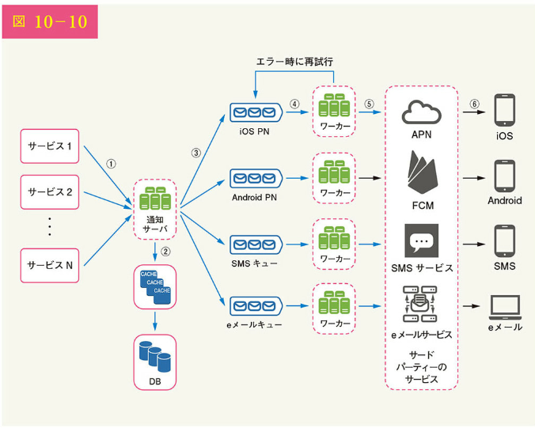

[図 10-10 の説明]
上の図を確認する上で一番良い方法は、左から右へと見ていくことです。

サービス 1 ～ N：サービス 1 ～ N は、通知サーバが提供する API を経由して、通知を送信する異なるサービスを表す

通知サーバ：通知サーバは、以下の機能を提供する
• 通知を送信するサービスのための API を提供する。スパムを防ぐため、これらの API には内部から、あるいは検証されたクライアントからのみアクセスできる
• e メールや電話番号などを確認するための基本的な検証を行う
• 通知のレンダリングに必要なデータを取得するために、データベースまたはキャッシュを照会する
• 通知データをメッセージキューに入れ、並列処理する

以下は、電子メールを送信するための API の例です。

```bash
POST https://api.example.com/v/sms/send
Request body
```

```json
{
  "to": [
    {
      "user_id": 123456
    }
  ],
  "from": {
    "email": "from_address@example.com"
  },
  "subject": "Hello, World!",
  "content": [
    {
      "type": "text/plain",
      "value": "Hello, World!"
    }
  ]
}
```

キャッシュ：ユーザー情報、デバイス情報、通知テンプレートがキャッシュされる

DB：ユーザー、通知、設定などのデータを格納する

メッセージキュー：コンポーネント間の依存関係を解消する。メッセージキューは、大量の通知を送信する際のバッファとして機能する。各通知タイプには個別のメッセージキューが割り当てられ、あるサードパーティのサービス停止が他の通知タイプに影響しないようにする

ワーカー：ワーカーとは、メッセージキューから通知イベントを取り出し、対応するサードパーティのサービスに送信するサーバのリストである

サードパーティのサービス：初期設計ですでに説明済み

iOS、Android、SMS、e メール：初期設計ですでに説明済み

次に、各コンポーネントがどのように連携して通知を送信するかを見てみましょう。

1. サービスは、通知サーバが提供する API を呼び出して通知を送信する
2. 通知サーバは、ユーザー情報、端末情報、通知設定などのメタデータをキャッシュやデータベースから取得する
3. 通知イベントは、対応するキューに送られ、処理される。例えば、iOS のプッシュ通知イベントは iOS の PN キューに送られる
4. ワーカーは、メッセージキューから通知イベントを取得する
5. ワーカーがサードパーティのサービスに通知を送信する
6. サードパーティのサービスは、ユーザーの端末に通知を送信する

## ステップ 3 設計の深掘り

高度な設計では、さまざまな種類の通知、連絡先情報の収集フロー、通知の送信/受信フローについて説明しました。設計の深掘りでは、以下の点を検討します。

• 信頼性知
• 追加コンポーネントと考慮事項：通知テンプレート、通知設定、レート制限、再試行メカニズム、プッシュ通知におけるセキュリティ、キューに入った通知とイベントのトラッキングの監視
• 設計の更新

### 信頼性

分散環境における通知システムを設計するときには、重要な信頼性についての質問にいくつか答えなければなりません。

どのようにデータ損失を防ぐのか

通知システムで最も重要な要件の 1 つは、データを失わないということです。通知は通常、遅れたり、再要求されたりすることがありますが、決して失われることはありません。この要件を満たすために、通知システムはデータベースに通知データを永続化し、再試行メカニズムを実装します。図 10-11 に示すように、通知ログデータベースはデータの永続化のために含まれているのです。

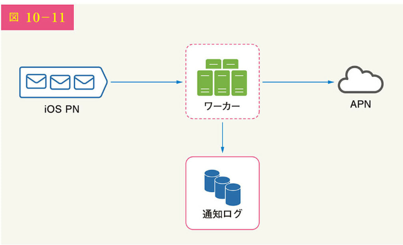

### 受信者は正確に一度だけ通知を受け取るのか

短い答えは「いいえ」です。ほとんどの場合、通知は正確に一度だけ配信されますが、分散システムの性質上、通知が重複してしまう可能性があります。重複の発生を減らすため、重複排除メカニズムを導入し、それぞれの際霧ケースを慎重に扱いましょう。以下は簡単な重複排除のロジックです。

ある通知イベントが最初に到着したとき、イベント ID をチェックして、それが以前に見たものであるかを調べます。もし、以前見たことがあれば、それは破棄され、そうでなければ通知を送るのです。なぜ一度だけしか配信できないかについては、参考資料[5]を参照ください。

### 追加コンポーネントと考慮事項

ユーザーのコンタクト情報を収集し、通知を送信し、受信する方法を議論してきました。通知システムというのは、それ以上のものです。ここでは、テンプレートの再利用、通知設定、イベントトラッキング、システム監視、レート制限などを含む追加のコンポーネントについて説明しましょう。

### 通知テンプレート

大規模な通知システムは 1 日に何百万もの通知を送信し、これらの通知の多くは似たようなフォーマットに従っています。通知テンプレートは、すべての通知をゼロから構築するのを避けるために導入されました。通知テンプレートは、パラメータ、スタイル、トラッキングリンクなどをカスタマイズすることによって、独自の通知を作成するためのプレフォーマットされた通知です。以下は、プッシュ通知のテンプレート例となります。

BODY：
あなたはそれを夢に見た。私たちはそれを実行した。[アイテム名]は、[日付]までの間だけ復活する。

CTA：
今すぐ注文する。または、私の[アイテム名]を保存する。

通知テンプレートを使用するメリットとしては、フォーマットの統一、マージエラーの低減、時間の短縮などがあげられます。

### 通知設定

一般に、ユーザーは毎日あまりにも多くの通知を受け取るため、すぐに圧倒されたと感じがちです。そのため、多くの Web サイトやアプリは、ユーザーが通知設定を細かく制御できるようになっています。これらの情報は、以下のフィールドとともに、通知設定テーブルに格納されます。

user_id bigint
channel varchar # プッシュ通知、電子メール、または SMS
opt_in boolean # オプトインで通知を受け取る

通知がユーザーに送られる前に、まずユーザーがこのタイプの通知を受け取ることを許諾しているかをチェックします。

### レート制限

多くの通知でユーザーを圧倒するのを避けるため、ユーザーが受け取れる通知の数を制限できます。これは重要です。なぜなら、あまり頻繁に通知を送信すると、受信者が通知を完全に停止してしまう可能性があるからです。

### 再試行の機能

サードパーティのサービスが通知の送信に失敗した場合、その通知は再通知のためにメッセージキューに追加されます。それでも問題が解決しない場合は、開発者にアラートが送られます。

### プッシュ通知におけるセキュリティ

iOS や Android のアプリでは、appKey と appSecret を使用してプッシュ通知の API を保護します[6]。認証済みまたは確認済みのクライアントのみが、API を使用してプッシュ通知を送信することが許可されます。興味のあるユーザーは、参考資料[16]を参照ください。

### キューに入った通知の監視

監視すべき重要な指標は、キューに入れられた通知の総数です。この数が多い場合、通知イベントはワーカーによる処理が十分に速くありません。通知配信の遅延を避けるため、より多くのワーカーが必要です。図 10-12（参考文献[7]）は、処理を待つキューイングされたメッセージの例です。

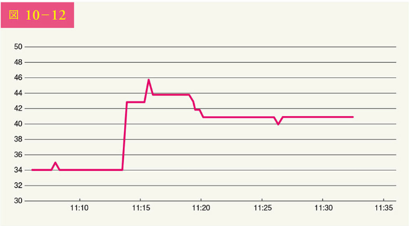

### イベントのトラッキング

開封率、クリック率、エンゲージメントなどの通知指標は、顧客の行動を理解する上で重要です。分析サービスは、イベントのトラッキングを実装しています。通常、通知システムと分析サービスの統合が必要でしょう。図 10-13 は、分析目的で追跡されたイベントの例です。

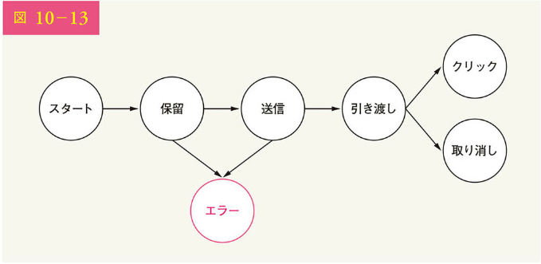

### 設計の更新

すべてをまとめて、図 10-14 に更新された通知システムの設計を示します。

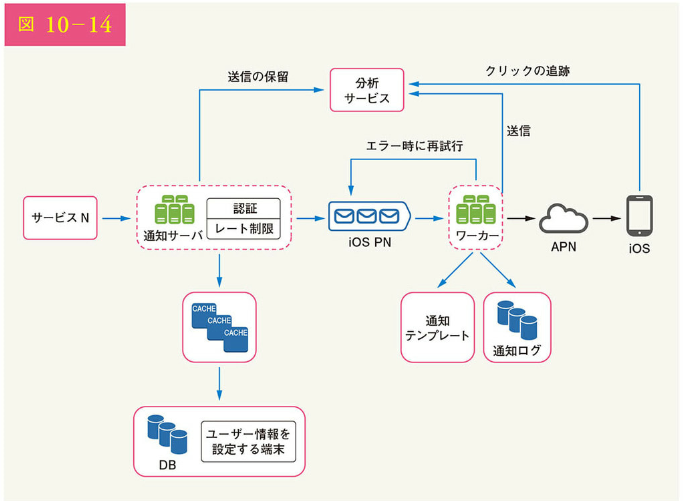

この設計では、以前の設計と比較して、多くの新たなコンポーネントが追加されています。

• 通知サーバは、認証とレート制限という 2 つの重要な機能を備えている
• また、通知の失敗を処理するために再通知の機構を追加している。システムが通知の送信に失敗した場合、メッセージキューに戻され、ワーカーはあらかじめ定義された回数だけ再試行する
• さらに、通知テンプレートは一貫した効率的な通知作成プロセスを提供する
• 最後に、システムの健全性チェックと将来の改善のために、監視と追跡のシステムが追加される

## ステップ 4 まとめ

重要な情報を知らせてくれる通知は、なくてはならないものです。Netflix でお気に入りの映画についてのプッシュ通知、新製品の割引についての e メール、オンラインショッピングの支払い確認のメッセージなどの通知です。

この章では、プッシュ通知、SMS メッセージ、e メールといった複数の通知形式をサポートするスケーラブルな通知システムの設計について解説しました。システムの構成要素を切り離すために、メッセージキューを採用したのです。

また、高度な設計に加え、より多くのコンポーネントと最適化について深く掘りしました。

• 信頼性：再通知の機構を導入することで、障害発生率を最小限に抑えた
• セキュリティ：AppKey と appSecret のペアを使用し、認証されたクライアントのみが通知を送信できるようにした
• トラッキングとモニタリング：通知フローのどの段階でも、重要な統計情報を取得するように実装されている
• ユーザー設定の尊重：ユーザーは通知の受信を拒否できる。通知を送る前に、まずユーザーの設定を確認する仕組みになっている
• レート制限：通知の受信回数の上限設定は、ユーザーに歓迎される

ここまで来られた方、おめでとうございます。さあ、自分をほめてあげてください。よくやったと。

参考文献
[1] Twilio SMS: https://www.twilio.com/sms
[2] Nexmo SMS: https://www.nexmo.com/products/sms
[3] Sendgrid: https://sendgrid.com/
[4] Mailchimp: https://mailchimp.com/
[5] You Cannot Have Exactly-Once Delivery: https://bravenewgeek.com/you-cannot-have-exactly-once-delivery/
[6] Security in Push Notifications: https://cloud.ibm.com/docs/services/mobilepush?topic=mobile-pushnotification-security-in-pushnotifications
[7] Key metrics for RabbitMQ monitoring: www.datadoghq.com/blog/rabbitmq-monitoring
