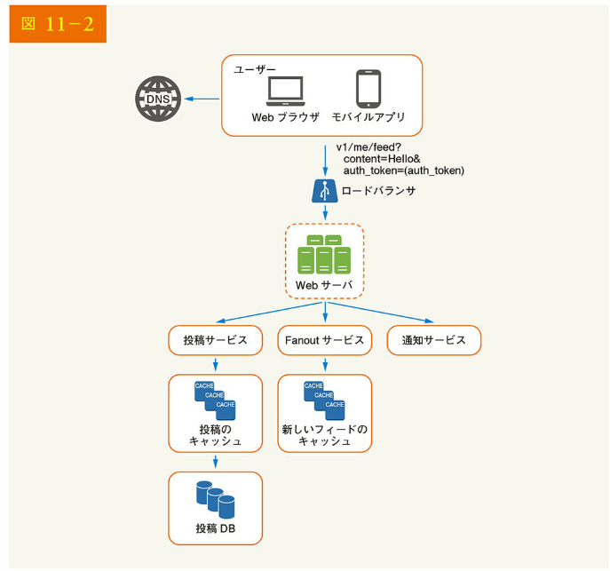
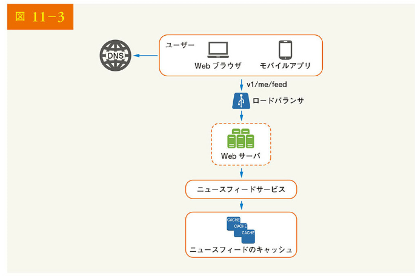
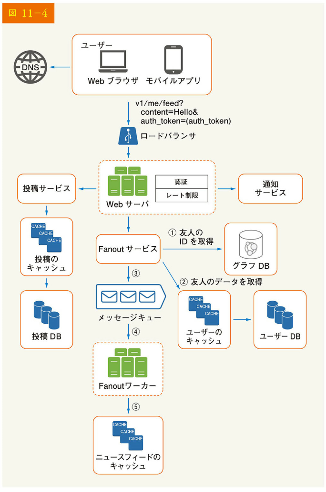
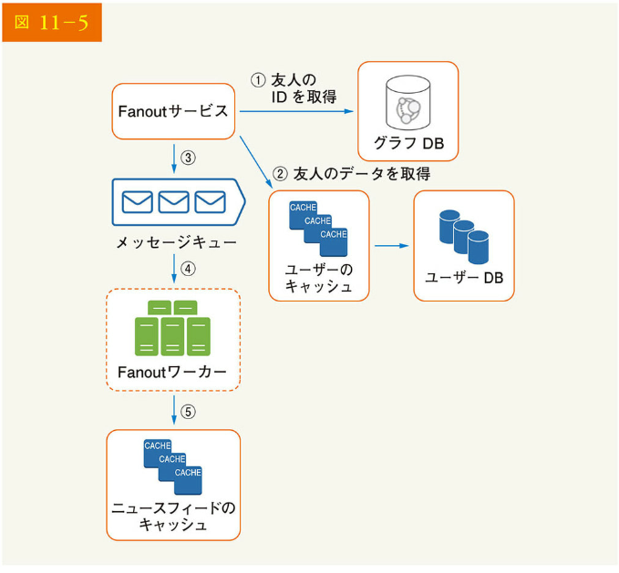
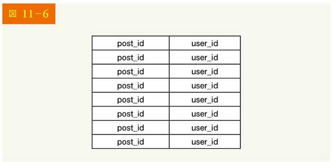
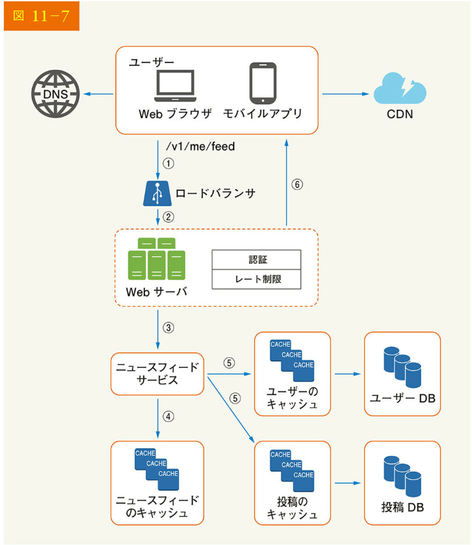
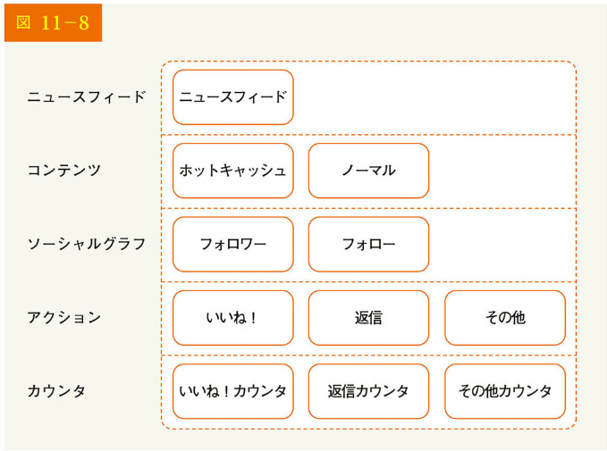

# 11 章 ニュースフィードシステムの設計

この章では、ニュースフィードシステムを設計しましょう。では、ニュースフィードとは何でしょう。Facebook のヘルプページには、「ニュースフィードは、ホームページ中央にある常に更新されるストーリーのリストです。ニュースフィードには、Facebook でフォローしている人、ページ、グループからのステータス更新、写真、ビデオ、リンク、アプリにおけるアクティビティ、「いいね！」が含まれます」とあります。これは、システム設計の面接試験でよく聞かれる質問です。同様に、Facebook のニュースフィード Instagram のフィード、Twitter のタイムラインなどの設計についても、面接でよく質問されます。

## ステップ 1 問題を理解し、設計範囲を明確にする

まず明確化に向けた一連の質問によって、ニュースフィードシステムの設計を依頼したときに面接官が何を考えているかを理解しましょう。少なくとも、どのような機能をサポートすればよいかを把握する必要があります。以下は、候補者と面接官のやりとりの例です。

候補者：これはモバイルアプリですか？ それとも Web アプリですか？それとも両方ですか？
面接官：両方です。

候補者：重要な機能は何ですか？
面接官：ユーザーは、投稿を公開し、ニュースフィードページで友人の投稿を確認できます。

候補者：ニュースフィードの並び順は、逆時系列なのでしょうか、それともトピックのスコアなど特定の順番なのでしょうか？ 例えば、親しい友人の投稿はスコアが高くするなど。
面接官：シンプルにするため、フィードは逆時系列でソートされていると仮定しましょう。

候補者：1 人のユーザーが保有できる友人の数はどのくらいですか？
面接官：5,000 人です。

候補者：トラフィック量はどのくらいでしょう？
面接官：1,000 万 DAU です。

候補者：フィードには、画像、動画、単なるテキストが含まれますか？
面接官：画像と動画の両方が入ったメディアファイルが含まれます。

これで要件がまとまったので、次はシステム設計に集中しましょう。

## ステップ 2 高度な設計を提案し、賛同を得る

設計は、フィードの公開とニュースフィードの構築という 2 つのフローに分けられます。

- フィードの公開：ユーザーが投稿を公開すると、対応するデータがキャッシュとデータベースに書き込まれ、該当ユーザーの友人のニュースフィードに投稿される
- ニュースフィードの構築：シンプルにするため、ニュースフィードは友人の投稿を逆時系列に集約して構築される

### ニュースフィードの API

ニュースフィードの API は、クライアントがサーバと通信する主要な方法です。これらの API は HTTP ベースで、クライアントがステータスの投稿、ニュースフィードの取得、友人の追加などのアクションを実行できるようにします。ここでは、最も重要な 2 つの API、フィード公開 API とニュースフィード取得 API について説明しましょう。

### フィード発行 API

フィードを公開するには、HTTP POST リクエストをサーバに送信します。その API を以下に示します。

POST /v1/me/feed

パラメータ

- content：コンテンツは、投稿のテキスト
- auth_token：API リクエストを認証するために使用される

### ニュースフィード取得 API

ニュースフィードを取得するための API は以下の通りです。

GET /v1/me/feed

パラメータ

- auth_token：API リクエストの認証に利用される

### フィードの公開

図 11-2 にフィード発行フローの高度な設計を示します。

[フィード発行フローの説明]

- ユーザー：ユーザーは、ブラウザやモバイルアプリでニュースフィードを閲覧できる。ユーザーは、API を通して「Hello」という内容の投稿を行う
  API：/v1/me/feed?content=Hello&auth_token={auth_token}
- ロードバランサ：トラフィックを Web サーバに振り分ける
- Web サーバ：トラフィックを内部の各サービスにリダイレクトする
- 投稿サービス：投稿をデータベースとキャッシュに格納する
- Fanout サービス：新しいコンテンツを友人のニュースフィードにプッシュする。ニュースフィードのデータはキャッシュに保存され、高速検索が可能
- 通知サービス：新しいコンテンツが利用可能になったことを友人に知らせ、プッシュ通知を送信する

### ニュースフィードの構築

このセクションでは、ニュースフィードが舞台裏でどのように構築されるかを説明しましょう。図 11-3 に高度な設計を示します。

- ユーザー：ユーザーは自分のニュースフィードを取得するためにリクエストを送信する。リクエストは、/v1/me/feed となる
- ロードバランサ：ロードバランサはトラフィックを Web サーバにリダイレクトする
- Web サーバ：Web サーバはリクエストをニュースフィード・サービスにルーティングする
- ニュースフィードサービス：ニュースフィードサービスはキャッシュからニュースフィードを取得する
- ニュースフィードのキャッシュ：ニュースフィードのキャッシュはニュースフィードをレンダリングするために必要なニュースフィード ID を保存する

## ステップ 3 設計の深掘り

高度な設計では、フィードの公開とニュースフィードの構築という 2 つのフローを簡単に説明しました。ここでは、これらのトピックをより深く掘り下げて解説しましょう。

### フィード公開の深掘り

図 11-4 に、フィードの公開に関する詳細設計の概要を示しました。高度な設計ではほとんどの構成要素について説明しましたが、ここでは Web サーバと Fanout サービスという 2 つの構成要素に焦点を当てます。

### Web サーバ

Web サーバは、クライアントとの通信のほか、認証とレート制限を行います。有効な auth_token でサインインしたユーザーのみが投稿を許可されます。また、一定期間内に投稿できる回数を制限することで、スパムや悪用を防止しているのです。

### Fanout サービス

Fanout とは、ある投稿を友人全員に配信することです。Fanout には、書込み時 Fanout（プッシュ型）と読込み時 Fanout（プル型）の 2 種類があり、どちらのモデルにも長所と短所があります。それぞれのワークフローを説明し、システムをサポートするための最適なアプローチを探るのです。

書込み時 Fanout：
このアプローチでは、ニュースフィードは書き込み時にあらかじめ計算される。新しい投稿は、公開された直後に友人のキャッシュに配信される。

長所：

- ニュースフィードはリアルタイムに生成され、すぐに友人にプッシュできる
- ニュースフィードは書込み時に事前計算されるため、ニュースフィードの取得が速い

短所：

- ユーザーに多くの友人がいる場合、友人リストを取得し、すべての友人に対してニュースフィードを生成するのは遅く、時間がかかる。これは、hotkey 問題と呼ばれる
- 非アクティブなユーザーやめったにログインしないユーザーの場合、ニュースフィードの事前計算が計算資源を浪費する

読込み時 Fanout：
ニュースフィードは、読込み時に生成される。これは、オンデマンド型である。ユーザーがホームページを読み込むと、最近の投稿が表示される。

長所：

- 非アクティブなユーザーやめったにログインしないユーザーには、計算資源を無駄にしない読込み時 Fanout が有効である
- データが友人にプッシュされないため、hotkey 問題が起きない

短所：

- ニュースフィードが事前に計算されないため、ニュースフィードの取得に時間がかかる

ここでは、両者の利点を生かしつつ、落とし穴を回避するため、ハイブリッドアプローチを採用します。ニュースフィードは迅速な取得が重要なため、大多数のユーザーにはプッシュ型モデルを使用します。一方、有名人や多くの友人・フォロワーを持つユーザーに対しては、システムの過負荷を避けるために、フォロワーにオンデマンドでニュースコンテンツを取得させるようにするのです。ハッシュ処理の一貫性は、リクエストやデータの より均等な分散が可能になるため、hotkey 問題を軽減する上で有効な技術です。

【図 11-5】に示した Fanout サービスを詳しく見てみましょう。
Fanout サービスは、以下のように動作します。

1. グラフデータベースから友人の ID を取得する。グラフデータベースは、友人関係や友人リコメンドの管理に向いている。この概念について詳しく知りたい方は、参考資料[2]を参照されたい

2. ユーザーキャッシュから友人情報を取得する。そして、ユーザーの設定に基づき、友人をフィルタリングする。例えば、ある人をミュートにすると、まだ友人であるにもかかわらず、その人の投稿はニュースフィードに表示されなくなる。また、特定の友人とだけ情報を共有したり、他人には知らせないようにしたりすることもできる

3. フレンドリストと新規投稿 ID をメッセージキューに送信する

4. Fanout ワーカーはメッセージキューからデータを取得し、ニュースフィードのデータをニュースフィードキャッシュに格納する。ニュースフィードキャッシュは、<post_id, user_id>のマッピングテーブルと捉えることができる。新しい投稿が行われるたびに、図 11-6 に示すようにニュースフィードテーブルに追記される。ユーザーや投稿オブジェクト全体をキャッシュに格納すると、メモリ消費量が非常に大きくなる可能性がある。そこで、ID のみを格納する。メモリサイズを小さくするため、設定可能な制限を設けている。ユーザーがニュースフィードの何千も投稿をスクロールして見る可能性は低い。ほとんどのユーザーは最新のコンテンツにしか興味がないため、キャッシュの見逃し率は低くなる

5. <post_id, user_id>をニュースフィードキャッシュに格納する。図 11-6 に、キャッシュに保存されたニュースフィードの例を示す

## ニュースフィード取得の深掘り

図 11-7 に、ニュースフィード検索の詳細設計を示します。
図 11-7 に示すように、メディアコンテンツ（画像、動画など）が CDN に格納されるため、すばやく取得できます。クライアントがどのようにニュースフィードを取得するかを見てみましょう。

1. ユーザは自分のニュースフィードを取得するためのリクエストを送信する。リクエストは、/v1/me/feed となる

2. ロードバランサはリクエストを Web サーバに再分配する

3. Web サーバはニュースフィードサービスを呼び出して、ニュースフィードを取得する

4. ニュースフィードサービスは、ニュースフィードのキャッシュから投稿 ID のリストを取得する

5. ユーザーのニュースフィードは、フィード ID のリストだけではない。ユーザー名、プロフィール画像、投稿内容、投稿画像などが含まれる。そのため、ニュースフィードサービスは、キャッシュ（ユーザーのキャッシュと投稿のキャッシュ）から完全なユーザーと投稿のオブジェクトを取得し、完全なニュースフィードを構築する

6. 完全なニュースフィードは、レンダリングのためにクライアントへ JSON フォーマットで返される

### キャッシュのアーキテクチャ

キャッシュはニュースフィードシステムにとって非常に重要です。図 11-8 に示すように、キャッシュ層を 5 つの層に分割しましょう。

- ニュースフィード：ニュースフィードの ID を格納する
- コンテンツ：すべての投稿データが格納される。人気コンテンツはホットキャッシュに格納される
- ソーシャルグラフ：ユーザーの関係データを格納する
- アクション：ユーザーが投稿に「いいね！」「返信」「その他のアクション」を行ったか、などの情報が格納される
- カウンタ：「いいね！」「返信」「フォロワー」「フォロー」などの反応が格納される

## ステップ 4 まとめ

この章では、ニュースフィードシステムを設計しました。設計には、フィードの公開とニュースフィードの取得という 2 つのフローがあります。

システム設計の面接の質問と同じように、システムの設計に完璧な方法はありません。どの企業も独自の制約があり、その制約に合うようにシステムを設計しなければなりません。設計と技術選択のトレードオフを理解することが重要です。時間があれば、スケーラビリティの問題についても話してください。議論の重複を避けるため、以下では高度な論点のみをリストアップしています。

データベースのスケーリング：

- 垂直方向のスケーリング vs 水平方向のスケーリング
- SQL と NoSQL の比較
- マスター/スレーブレプリケーション
- リードレプリカ
- 一貫性モデル
- データベースのシャーディング

その他のポイント：

- Web 層はステートレスに保つ
- できる限りデータをキャッシュする
- 複数のデータセンターをサポートする
- メッセージ・キューを持つコンポーネントをできるだけ少なくする
- 主要な指標を監視する。例えば、ピーク時の QPS や、ユーザーがニュースフィードを更新している間のレイテンシは、監視する上で興味深い

ここまで来られた方、おめでとうございます。さあ、自分をほめてあげてください。よくやったと。

参考文献
[1] How News Feed Works: https://www.facebook.com/help/327131014036297/
[2] Friend of Friend recommendations Neo4j and SQL Sever: http://geekswithblogs.net/brendonpage/archive/2015/10/26/friend-of-friend-recommendations-with-neo4j.aspx
