# 12 章 チャットシステムの設計

この章では、チャットシステムの設計を検討します。ほぼすべての人がチャットアプリを使用しています。図 12-1 に、最も人気のあるアプリをいくつか示しました。

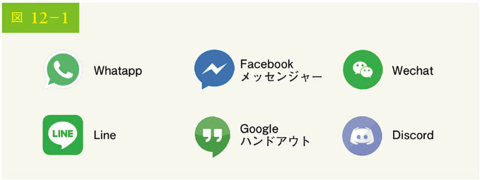

チャットアプリは、人によって異なる機能を発揮します。正確な要件の把握は非常に重要です。例えば、面接官が 1 対 1 のチャットを想定しているのに、グループチャットに特化したシステムを設計するのは避けたいでしょう。機能要件を探ることが重要なのです。

## ステップ 1 問題を理解し、設計範囲を明確にする

どのようなチャットアプリを設計するかについて、合意しておくことが肝要です。市場には、Facebook Messenger、WeChat、WhatsApp のような 1 対 1 のチャットアプリ、Slack のようなグループチャットに特化したオフィスチャットアプリ、Discord のように大人数での交流と音声チャットの低遅延に特化したゲームチャットアプリがあります。

最初の明確化に向けた質問では、面接官がチャットシステムの設計を依頼したときに、正確に何を念頭に置いているのかを明確にする必要があります。最低限、1 対 1 のチャットまたはグループチャットアプリに焦点を当てるべきかについては把握しましょう。質問としては、以下のようなものが考えられます：

候補者：どのようなチャットアプリを設計しますか？ 1 対 1 のチャットですか、グループチャットですか？
面接官：1 対 1 チャットとグループチャットの両方をサポートする必要があります。

候補者：これはモバイルアプリですか？ それとも Web アプリですか？それとも両方ですか？
面接官：両方です。

候補者：このアプリの規模はどのくらいでしょう？ スタートアップのアプリですか、それとも大規模なアプリですか？
面接官：5,000 万人のデイリーアクティブユーザー（DAU）をサポートする必要があります。

候補者：グループチャットの場合、グループメンバーの上限はどのくらいでしょう？
面接官：上限は最大 100 人です。

候補者：チャットアプリにおいて重要な機能は何ですか？ 添付ファイルをサポートしますか？
面接官：1 対 1 チャット、グループチャット、オンラインインジケーターです。そして、テキストメッセージのみをサポートします。

候補者：メッセージにはサイズ制限はありますか？
面接官：あります。テキストの長さは 10 万文字以下でなくてはなりません。

候補者：エンド・ツー・エンドの暗号化は必要ですか？
面接官：今のところ必要ありませんが、時間が許せば議論します。

候補者：チャットの履歴はどれくらいの期間保存するのでしょう？

面接官：永遠です。

この章では、Facebook メッセンジャーのようなチャットアプリの設計に焦点を当て、以下のような機能に重点を置いています：

• 配信遅延のない 1 対 1 のチャット
• 少人数制のグループチャット（最大 100 人）
• オンラインプレゼンス
• マルチデバイス対応。同一アカウントで複数アカウントの同時ログインが可能
• プッシュ通知

また、設計規模を合意しておくことも重要です。5,000 万 DAU に対応するシステムを設計します。

## ステップ 2 高度な設計を提案し、賛同を得る

質の高い設計をするには、クライアントとサーバがどのように通信するのかという基本的な知識を身に付ける必要があります。チャットシステムにおいて、クライアントはモバイルアプリケーションと Web アプリケーションのいずれかになります。クライアント同士は直接通信を行いません。そのかわり、各クライアントは、上記のすべての機能をサポートするチャットサービスに接続します。ここでは、基本的な操作に焦点を当てましょう。

チャットサービスは、以下の機能をサポートする必要があります：

• 他のクライアントからのメッセージを受信する
• それぞれのメッセージに適した受信者を探し、受信者にメッセージをリレーする
• 受信者がオンラインでない場合、その受信者がオンラインになるまで、その受信者向けのメッセージをサーバに保持する

図 12-2 は、クライアント（送信者と受信者）とチャットサービスの関係を示しています。

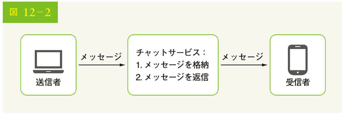

クライアントがチャットを始めようとすると、クライアントは 1 つ以上のネットワークプロトコルを使ってチャットサービスに接続します。チャットサービスにとって、ネットワークプロトコルの選択は重要です。面接官と議論しましょう。

ほとんどのクライアント/サーバアプリケーションでは、リクエストはクライアントによって開始されます。これは、チャットアプリケーションの送信者側にも当てはまります。図 12.2 において、送信者がチャットサービスを介して受信者側にメッセージを送信する場合、Web プロトコルの中で最も一般的な HTTP プロトコルを、時間をかけて検証した上で使用します。このシナリオでは、クライアントはチャットサービスとの HTTP 接続を開いてメッセージを送信し、受信者にメッセージを送信するようにサービスへ通知します。keep-alive ヘッダはクライアントとチャットサービスとの持続的な接続維持を可能にするため、keep-alive は効率的であり、TCP ハンドシェイクの数を減らします。HTTP は送信側においては良い選択肢であり、Facebook[1]のような多くの人気のチャットアプリケーションは、メッセージを送信するため、最初に HTTP を使用しています。

一方、受信者側はもう少し複雑です。HTTP はクライアント主導型であるため、サーバからメッセージを送信するのは簡単ではありません。長年にわたり、ポーリング、ロングポーリング、WebSocket など、サーバ主導の接続をシミュレートする多くの技術が使用されてきました。これらは、システム設計の面接試験などで広く使われる重要な技術です。ここでは、それぞれを検証しましょう。

### ポーリング

図 12-3 に示すように、ポーリングは、クライアントがサーバに定期的に利用可能なメッセージがあるかを問い合わせる手法です。頻度に依りますが、ポーリングはコストがかかるかもしれません。ほとんどの場合、「いいえ」という答えが返ってくる質問に答えるため、貴重なサーバのリソースを消費してしまうかもしれないからです。

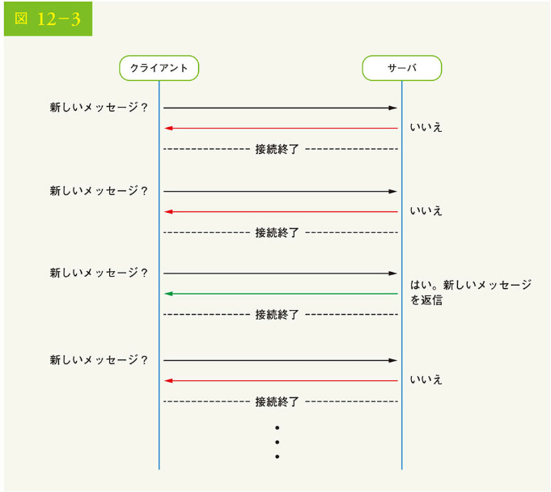

### ロングポーリング

ポーリングが非効率かもしれないため、さらに進化させたのがロングポーリングです（図 12-4）。

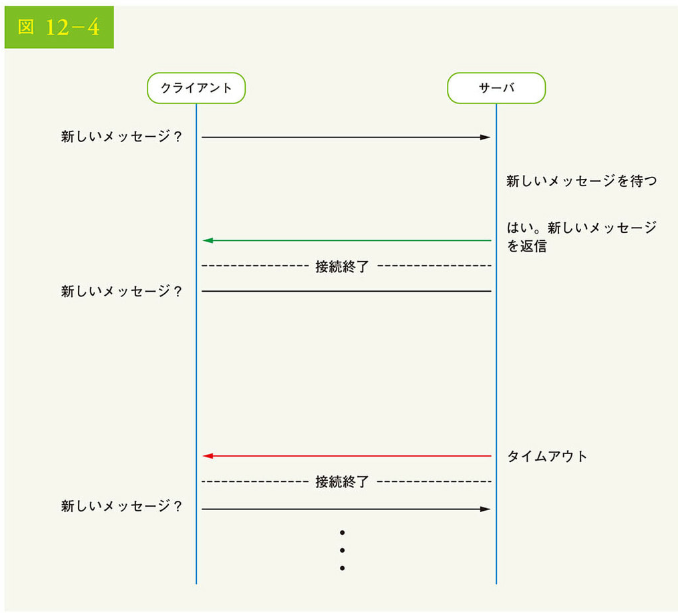

ロングポーリングでは、クライアントは実際に利用可能な新しいメッセージがある、あるいはタイムアウトの閾値に達するまで、接続状態を維持します。新しいメッセージを受信すると、クライアントはすぐにサーバに再リクエストを送り、処理を再開するのです。長いポーリングには、以下のようにいくつかの欠点があります。

• 送信者と受信者は、同じチャットサーバに接続しないかもしれない。HTTP ベースのサーバは、通常、ステートレスである。ロードバランシングのためにラウンドロビンを使用する場合、メッセージを受信するサーバは、メッセージを受信するクライアントとのロングポーリング接続していない可能性がある
• サーバはクライアントが切断されたかを判断する良い方法がない
• 非効率的である。ユーザーがあまりチャットをしない場合、ロングポーリングはタイムアウト後も定期的に接続を行う

### WebSocket

WebSocket は、サーバからクライアントへの非同期アップデートを送信する上で最も一般的なソリューションです。図 12-5 に、その仕組みを示しました。

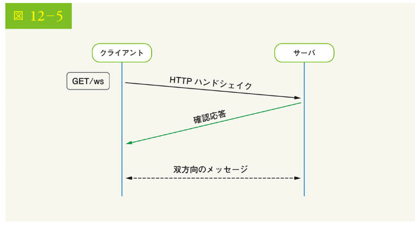

WebSocket 接続は、クライアントで開始され、双方向で持続的です。WebSocket 接続は、HTTP 接続として開始され、明確に定義されたハンドシェイクを通して WebSocket 接続に「アップグレード」される可能性があります。この特殊な接続を通して、サーバはクライアントにアップデートを送信するのです。WebSocket 接続は、一般にファイアウォールが設置されていても機能します。これは、HTTP/HTTPS 接続で使われるポート 80 やポート 443 を使用するためです。

以前、送信側では HTTP の使用が望ましいと言いましたが、WebSocket は双方向なので、送信側でも使用しない特別な技術的理由はありません。図 12-6 は、送信側と受信側の両方で WebSocket（ws）を使用する様子を示しています。

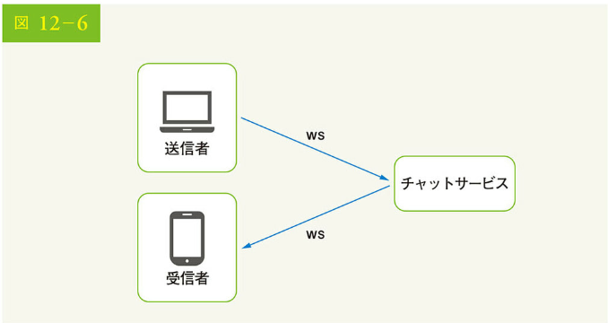

送信と受信の両方で WebSocket を使用することにより、設計が簡素化され、クライアントとサーバの両方でより単純明快な実装が可能になります。WebSocket 接続は持続的なため、サーバ側での効率的な接続管理が重要なのです。

### 高度な設計

先程、クライアント-サーバ間の通信プロトコルとして、双方向通信が可能な WebSocket が選ばれたと言いましたが、それ以外のものについては WebSocket である必要はないことに注意が必要です。実際、チャットアプリケーションのほとんどの機能（サインアップ、ログイン、ユーザープロファイルなど）には、HTTP 上の従来のリクエスト/レスポンスメソッドを使用できます。少し掘り下げて、システムの高度なコンポーネントを見てみましょう。

図 12-7 に示すように、チャットシステムは、ステートレスサービス、ステートフルサービス、サードパーティとの連携という 3 つの主要カテゴリに分割されます。

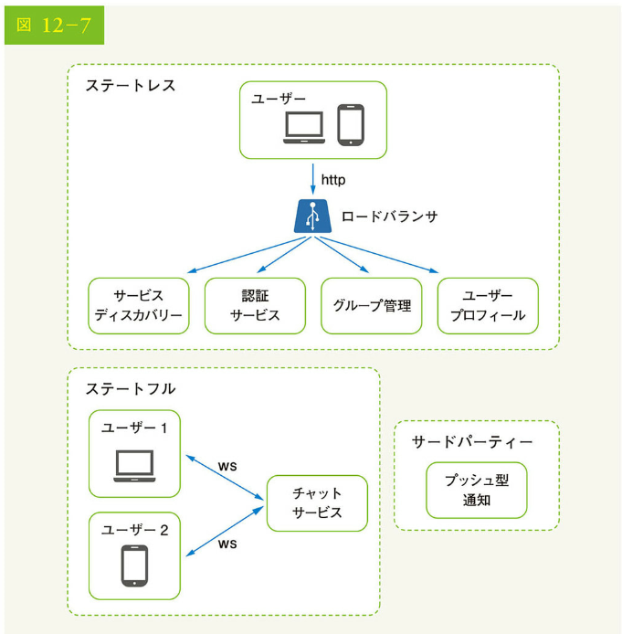

### ステートレスサービス

ステートレスサービスは、ログイン、サインアップ、ユーザー・プロファイルなどを管理するために使用される、従来の対外的なリクエスト/レスポンスサービスです。これらは、多くの Web サイトやアプリに共通する機能なのです。

ステートレスサービスは、ロードバランサの後ろに配置され、その仕事はリクエストパスに基づいて正しいサービスにリクエストをルーティングすることです。これらのサービスは、モノリシックでも、個別のマイクロサービスでも構いません。こうしたステートレスサービスの多くは、自分たちで構築する必要がないのです。なぜなら、簡単に統合できるサービスが市場に出回っているからです。「設計の深掘り」でさらに詳しく説明するサービスとして、サービスディスカバリーがあります。サービスディスカバリーの主な仕事は、クライアントが接続できるチャットサーバの DNS ホスト名のリストをクライアントに提供することです。

### ステートフルサービス

チャットサービスは、唯一のステートフルサービスです。チャットサービスは、各クライアントがチャットサーバへの持続的なネットワーク接続を維持するため、ステートフルなのです。チャットサービスでは、サーバが利用可能である限り、通常、クライアントが他のチャットサーバに切り替わることはありません。サービスの発見は、サーバの過負荷を避けるため、チャットサービスと密接に連携します。詳しくは、「設計の深掘り」で説明します。

### サードパーティとの連携

チャットアプリにとって、プッシュ型通知は最も重要なサードパーティとの連携です。プッシュ型通知は、アプリを起動していない時でも、新しいメッセージの到着をユーザーに知らせることができます。プッシュ通知の適切な統合は、非常に重要です。詳細は、「10 章 通知システムの設計」を参照ください。

### スケーラビリティ

小規模なものであれば、上記のサービスはすべて 1 台のサーバに収まるでしょう。私たちが設計した規模でも、理論上は 1 台の最新クラウドサーバ上にすべてのユーザー接続を収めることが可能です。サーバが処理できる同時接続数は、ほとんどの場合、制約条件になります。私たちのシナリオでは、同時接続ユーザー数が 1M の場合、各ユーザー接続がサーバ上で 10K のメモリが必要と仮定すると（これは非常に大まかな数字で、プログラミング言語の選択に大きく依存します）、1 台のボックスですべての接続を維持するには、約 10GB のメモリしか必要ありません。

もし、すべてが 1 台のサーバに収まるような設計を提案したら、面接官の心に大きな赤信号が灯るかもしれません。できるエンジニアは 1 台のサーバでそのような規模の設計をするわけがないからです。シングルサーバの設計は、多くの要因から破たんをきたします。中でも単一障害点は一番大きな要因です。

ただし、シングルサーバの設計から始めても、まったく問題ありません。ただ面接官には、これが出発点であることを理解してもらう必要があります。ここで述べたことをすべてまとめましょう。図 12-8 は調整済みの高度な設計です。

図 12-8 では、クライアントはリアルタイムにメッセージングするため、チャットサーバへの持続的な WebSocket 接続を維持します。

• チャットサーバはメッセージの送受信を容易にする
• プレゼンスサーバは、オンライン/オフラインのステータスを管理する
• API サーバは、ユーザーのログイン、サインアップ、プロファイルの変更など、すべてを処理する
• 通知サーバは、プッシュ通知を送信する
• 最後に、キーバリューストアは、チャット履歴を保存するために使用される。オフラインのユーザーがオンラインになると、以前のすべてのチャット履歴を見られる

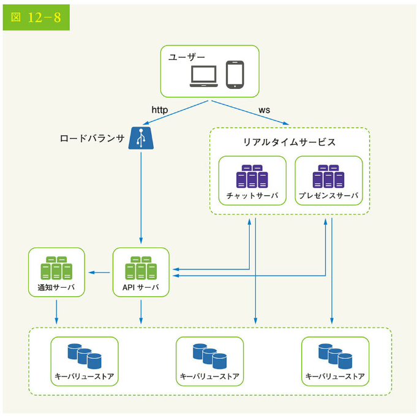

### ストレージ

この時点で、サーバの準備、サービスの立ち上げ、サードパーティの統合が完了しました。技術スタックをさらに掘り下げると、データ層があります。データ層は通常、正しく構築するために多大の努力を要します。リレーショナルデータベースと NoSQL データベース、いずれかのデータベースを使うのが正しいかといった重要な決断をしなければならないからです。十分な情報を得た上で決断するため、データの種類と読み取り/書き込みのパターンを調べましょう。

一般的なチャットシステムには、2 種類のデータが存在します。1 つは、ユーザープロファイル、設定、ユーザーフレンドリストといった一般的なデータです。これらのデータは、堅牢で信頼性の高いリレーショナルデータベースに格納されます。レプリケーションとシャーディングは、可用性とスケーラビリティの要件を満たすための重要な技術です。

もう 1 つは、チャットシステム特有のチャット履歴データです。これには、読み取り/書き込みのパターンを理解することが重要になります。

• チャットシステムのデータ量は膨大である。先行研究[2]によれば、Facebook メッセンジャーと Whatsapp は 1 日に 600 億通のメッセージを処理していることが明らかになっている
• 頻繁にアクセスされるのは、最近のチャットのみである。ユーザーは通常、古いチャットを検索することはない
• ほとんどの場合、ごく最近のチャット履歴が表示されるが、ユーザーは、検索、メンション表示、特定のメッセージへのジャンプなど、データのランダムアクセスを必要とする機能を使用する場合がある。これらについては、データアクセス層によってサポートされるべきである
• 1 対 1 のチャットアプリの場合、読み込みと書き込みの比率は 1:1 対 1 程度である

すべてのユースケースをサポートする正しいストレージシステムを選択するのは、非常に重要です。私たちは以下の理由からキーバリューストアを推奨します。

• キーバリューストアは、水平方向のスケーリングが容易である
• キーバリューストアは、データへのアクセスにかかるレイテンシーが非常に小さい
• リレーショナルデータベースはデータのロングテール[3]をうまく扱えない。インデックスが大きくなると、ランダムアクセスにコストがかかる
• キーバリューストアは、他の信頼性の高いチャットアプリで採用されている。例えば、Facebook メッセンジャーと Discord はキーバリューストアを使っている。Facebook メッセンジャーは HBase[4]を、Discord は Cassandra[5]を使用している

### データモデル

先程、ストレージ層としてのキーバリューストアの使用について話しました。しかし、最も重要なデータは、メッセージデータです。詳しく見ていきましょう。

### 1 対 1 チャットのメッセージテーブル

図 12-9 に 1 対 1 チャットのメッセージテーブルを示します。主キーは message_id で、メッセージの順序決定に役立ちます。同時に 2 つのメッセージが作成される可能性もあるため、メッセージの順序決定について、created_at には依存できません。

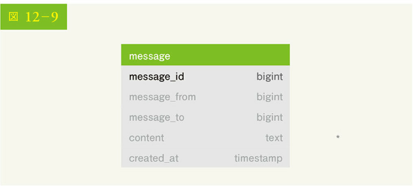

### グループチャットのメッセージテーブル

図 12-10 にグループチャットのメッセージテーブルを示します。複合プライマリキーは(channel_id, message_id)です。チャンネルとグループは同じ意味です。グループチャットではすべての問い合わせがチャンネルで行われるため、channel_id がパーティションキーとなります。

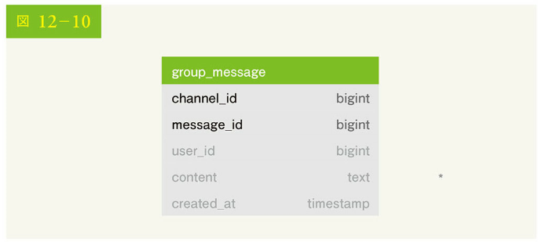

### メッセージ ID

message_id をどのように生成するかは、検討に値する興味深いテーマです。message_id はメッセージの順序を保証する役割を担っています。メッセージの順序を確認するため、message_id は以下の 2 つの要件を満たす必要があります。

• ID は一意でなくてはならない
• ID は時間軸でソート可能である。つまり、新しい行は古い行よりも ID が大きくなる

この 2 つを保証するにはどうすればいいでしょう。最初に思いつくのは、MySQL の"auto_increment"というキーワードです。しかし、NoSQL のデータベースは通常そのような機能を提供していません。

2 つ目のアプローチは、snowflake[6]のようなグローバルな 64 ビットのシーケンス番号ジェネレータを使用することです。これについては、「7 章 分散システムにおけるユニーク ID ジェネレータの設計」で説明しました。

最後のアプローチは、ローカルなシーケンス番号ジェネレータの使用です。ローカルとは、ID がグループ内でのみ固有であることを意味します。なぜローカル ID が有効かというと、1 対 1 のチャネルやグループチャネル内のメッセージの順序を維持すれば十分だからです。この方法は、グローバル ID の実装と比較して、実装が容易です。

## ステップ 3 設計の深掘り

システム設計の面接試験では、通常、上位設計のいくつかの構成要素について深く掘り下げることが求められます。チャットシステムの場合、サービスディスカバリー、メッセージングフロー、オンライン/オフラインの指標は深く掘り下げてみる価値があるでしょう。

### サービスディスカバリー

サービスディスカバリーの主な役割は、地理的な場所やサーバの容量などの基準に基づいて、クライアントに最適なチャットサーバを推薦することです。Apache Zookeeper[7]は、サービスディスカバリーのための有名なオープンソースソリューションです。Apache Zookeeper は、すべての利用可能なチャットサーバを登録し、事前に定義された基準に基づいて、クライアントのために最適なチャットサーバを選択します。

図 12-11 は、サービスディスカバリー（Zookeeper）の仕組みを示しています。

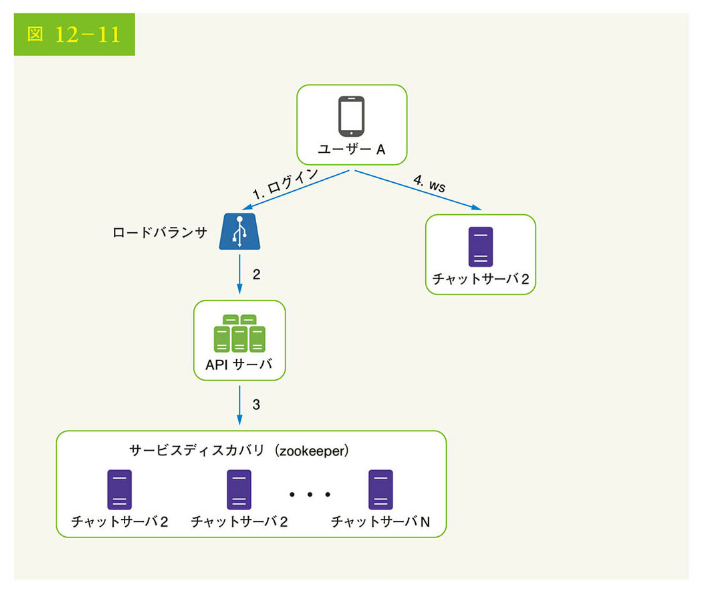

[図 12-11 の説明]

1. ユーザー A がアプリにログインしようとする
2. ロードバランサが API サーバにログインリクエストを送信する
3. バックエンドがユーザーを認証した後、サービスディスカバリーがユーザー A にとって最適なチャットサーバを見つける。この例では、サーバ 2 が選択され、サーバ情報がユーザー A に返される
4. ユーザー A は、WebSocket を通じて、チャットサーバ 2 に接続する

### メッセージフロー

チャットシステムにおけるエンド・ツー・エンドフローを理解するのは興味深いでしょう。このセクションでは、1 対 1 のチャットフロー、複数デバイス間のメッセージ同期、グループチャットのフローを探ります。

### 1 対 1 チャットのフロー

図 12-12 は、ユーザー A がユーザー B にメッセージを送信する様子を説明したものです。

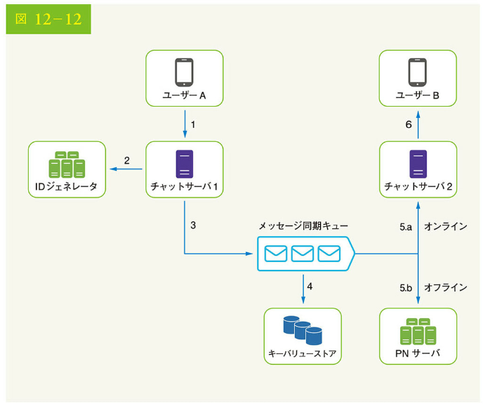

[図 12-12 の説明]

1. ユーザー A がチャットサーバ 1 にチャットメッセージを送信する
2. チャットサーバ 1 は、ID ジェネレータからメッセージ ID を取得する
3. チャットサーバ 1 はメッセージ同期キューにメッセージを送信する
4. メッセージがキーバリューストアに格納される
5. a. ユーザー B がオンラインの場合、メッセージはユーザー B が接続しているチャットサーバ 2 に転送される
   b. ユーザー B がオフラインの場合、プッシュ通知（PN）サーバからプッシュ通知が送信される
6. チャットサーバ 2 がユーザー B にメッセージを転送する。ユーザー B とチャットサーバ 2 の間には、持続的な WebSocket 接続が存在する

### 複数デバイス間のメッセージ同期

多くのユーザーは複数のデバイスを持っています。複数のデバイス間でメッセージを同期させる方法について説明しましょう。図 12-13 にメッセージ同期の例を示しました。

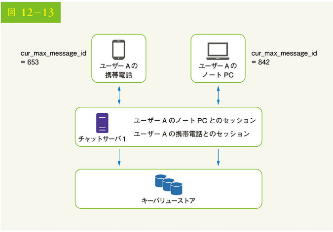

図 12-13 において、ユーザー A は携帯電話とノート PC という 2 つのデバイスを持っています。ユーザー A がスマホでチャットアプリにログインすると、チャットサーバ 1 との間で WebSocket 接続が確立されます。同様に、ノート PC とチャットサーバ 1 も接続されます。

各デバイスは、cur_max_message_id という変数を保持しており、デバイス上の最新のメッセージ ID を記録しており、以下 2 つの条件を満たすメッセージをニュースメッセージと見なします：

• 受信者 ID が現在ログインしているユーザー ID に等しい
• キーバリューストアのメッセージ ID は cur_max_message_id より大きい

各デバイスに個別の cur_max_message_id があれば、個々のデバイスはキーバリューストアから新しいメッセージを取得できるため、メッセージの同期が容易になります。

### 少人数チャットのフロー

1 対 1 のチャットと比較して、グループチャットのロジックはより複雑です。図 12-14 と図 12-15 でそのフローを説明しましょう。

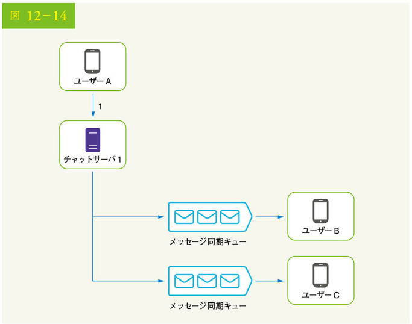

図 12-14 は、ユーザー A がグループチャットでメッセージを送信したときの様子を説明したものです。グループには 3 人のメンバー（ユーザー A、ユーザー B、ユーザー C）がいると仮定します。まずユーザー A からのメッセージは、各グループメンバーのメッセージシンク・キューにコピーされます。
この設計は、以下の理由で少人数のグループチャットに適しています：

• 各クライアントは、新しいメッセージを取得する上で自分の受信箱をチェックするだけでよいため、メッセージの同期フローを簡素化できる
• グループ人数が少ない場合、各受信者の受信箱へのコピーの保存は、あまりコストがかからない

WeChat は同様のアプローチを採用しており、1 つのグループのメンバーを 500 人に制限しています[8]。しかし、多くのユーザーが所属するグループにとって、メンバーごとにメッセージのコピーを保存するのは受け入れられません。

受信者側では、1 人の受信者が複数のユーザーからのメッセージを受信できます。各受信者は、異なる送信者からのメッセージを格納する受信箱（メッセージ同期キュー）を持っています。図 12-15 に、その設計を示しましょう。

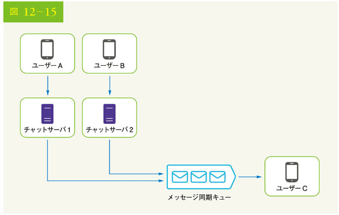

### オンラインのプレゼンス

オンラインのプレゼンスインジケータは、多くのチャットアプリケーションに不可欠な機能です。通常、ユーザーのプロフィール画像またはユーザー名の横に緑色の点が表示されます。このセクションでは、舞台裏で何が起こっているかを説明しましょう。

高度な設計では、プレゼンスサーバはオンラインのステータスを管理し、WebSocket を介してクライアントと通信する責任を負います。オンラインのステータス変更のトリガーとなるフローがいくつかあります。それぞれについて説明します。

### ユーザーログイン

ユーザーログインのフローは、「サービスディスカバリー」のセクションで説明した通りです。クライアントとリアルタイムサービスの間で WebSocket 接続が確立されると、ユーザー A のオンラインステータスと last_active_at のタイムスタンプがキーバリューストアに保存されます。プレゼンスインジケータは、ユーザーがログインした後、オンラインであることを示します。

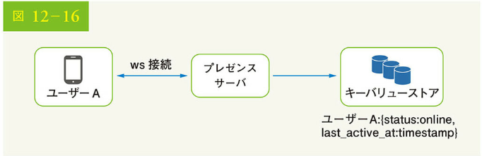

### ユーザーのログアウト

ユーザーがログアウトする場合、図 12-17 に示すようなユーザーログアウトフローを経由します。キーバリューストアのオンラインステータスはオフラインに変更され、プレゼンスインジケータはユーザがオフラインであることを示します。

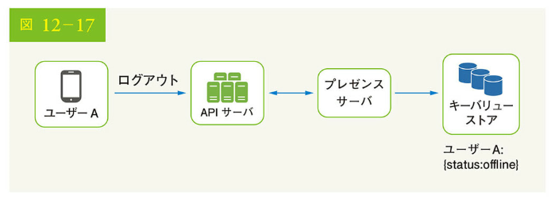

### ユーザーによる切断

私たちは常、インターネット接続が安定して信頼できるものであることを望んでいます。しかし、つねにそうであるとは限りません。したがって、設計においてこの問題に対処する必要があります。ユーザーがインターネットへの接続を切断すると、クライアント-サーバ間の持続的な接続が失われます。ユーザーの切断を処理する素朴な方法は、ユーザーをオフラインとしてマークし、接続が再確立したときにオンラインにステータス変更することです。ただし、この方法には大きな欠点があります。ユーザーはしばしば、短時間に頻繁にインターネット接続を切断し、再接続します。例えば、ユーザーがトンネルを通過している間、ネットワーク接続がオンになったりオフになったりするでしょう。切断・再接続のたびにオンラインステータスを更新すると、プレゼンスインジケータが頻繁に変化し、結果としてユーザー体験が低下します。

この問題を解決するために、ハートビート機構を導入しましょう。オンラインクライアントは、定期的にハートビートイベントをプレゼンスサーバに送信します。プレゼンスサーバは、クライアントから一定時間内、例えば x 秒以内にハートビートイベントを受信した場合、ユーザはオンラインとみなされます。そうでなければ、オフラインです。

図 12-18 では、クライアントは 5 秒ごとにサーバにハートビートイベントを送信しています。ハートビートイベントを 3 つ送信した後、クライアントは切断され、x = 30 秒以内には再接続されません（この数はロジックを示すために任意に選択されています）。そのオンラインステータスはオフラインに変更されるのです。

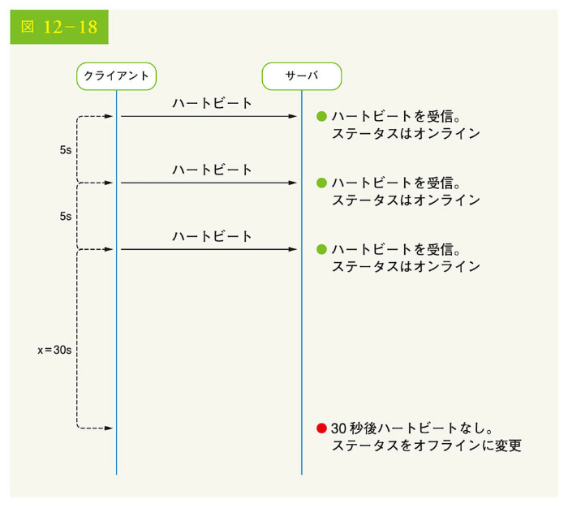

### オンラインステータスの Fanout

ユーザー A の友人は、どのようにしてステータスの変化を知ることができるのでしょうか。図 12-19 でその仕組みを説明します。プレゼンスサーバは、各友人ペアがチャネルを維持する Pub/Sub メッセージングモデルを使用します。ユーザー A のオンラインステータスが変更されると、チャネル A-B、チャネル A-C、チャネル A-D という 3 つのチャネルにイベントが公開されます。この 3 つのチャネルは、それぞれユーザー B、C、D によってサブスクライブされています。そのため、友人がオンラインステータスのアップデートを取得するのは容易です。クライアント・サーバ間の通信は、リアルタイムの WebSocket 接続を介して行われます。

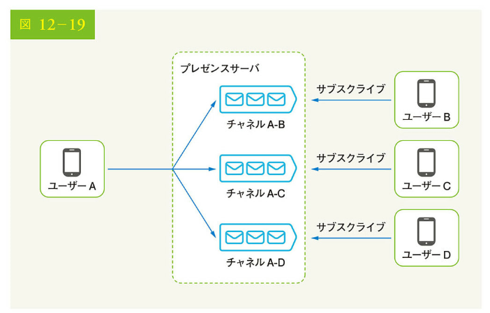

上記の設計は、少人数のユーザーグループに対して有効です。例えば、WeChat はユーザーグループの上限を 500 としているため、同じような方法を採用しています。しかし、大規模なグループにおいて、すべてのメンバーへのオンラインステータスの通知はコストと時間のかかる作業です。例えば、あるグループに 10 万人のメンバーがいると仮定します。ステータスが変更されるたびに、10 万件のイベントが発生するのです。パフォーマンスのボトルネックを解決するには、ユーザーがグループに入ったとき、または友人リストを手動で更新したときにのみ、オンラインステータスを取得する方法が考えられます。

## ステップ 4 まとめ

この章では、1 対 1 のチャットと少人数のグループチャットの両方をサポートするチャットシステムのアーキテクチャを紹介しました。クライアント-サーバ間のリアルタイム通信には、WebSocket 接続を使用します。チャットシステムには、リアルタイムメッセージング用のチャットサーバ、オンラインプレゼンスを管理するためのプレゼンスサーバ、プッシュ通知を送信するためのプッシュ通知サーバ、チャット履歴を保持するためのキーバリューストア、その他の機能用の API サーバといったコンポーネントが含まれます。

インタビューの最後に時間が余ったときのために、追加の話題を以下にいくつか紹介します：

• チャットアプリを拡張して、写真やビデオなどのメディアファイルをサポートする。メディアファイルのサイズは、テキストよりもかなり大きい。通信、クラウドストレージ、サムネイルは、興味深いトピックである
• エンドツーエンドの暗号化。Whatsapp はメッセージのエンドツーエンド暗号化をサポートしている。送信者と受信者のみがメッセージを読める。興味がある読者は、参考文献[9]を参照されたい
• クライアント側でメッセージをキャッシュすることは、クライアント-サーバ間のデータ転送を減らす上で有効である
• ロードタイムを改善する。Slack は地理的に分散したネットワークを構築し、ユーザーのデータやチャンネルなどをキャッシュしてロードタイムを改善している[10]
• エラーの処理
• チャットサーバのエラー。チャットサーバには、何十万あるいはそれ以上の持続的な接続があるかもしれない。チャットサーバがオフラインになった場合、サービスディスカバリー（Zookeeper）は、クライアントが新しい接続を確立できるように新しいチャットサーバをプロビジョニングする
• メッセージ再送メカニズム。メッセージ再送の一般的な技術として、リトライとキューイングがある

ここまで来て、おめでとうございます。自身をほめてあげましょう。よくやったと。

参考文献

[1] Erlang at Facebook: https://www.erlang-factory.com/upload/presentations/31/ EugeneLetuchy-ErlangAtFacebook.pdf

[2] Messenger and WhatsApp process 60 billion messages a day: https://www.theverge.com/2016/4/12/11415198/facebook-messenger-whatsapp-number-messages-vs-sms-18-2016

[3] Long tail: https://en.wikipedia.org/wiki/Long_tail

[4] The Underlying Technology of Messages: https://www.facebook.com/notes/facebook-engineering/the-underlying-technology-of-messages/454991608919/

[5] How Discord Stores Billions of Messages: https://blog.discordapp.com/how-discord-stores-billions-of-messages-7fa6ec7ee4c7

[6] Announcing Snowflake: https://blog.twitter.com/engineering/en_us/a/2010/announcing-snowflake.html

[7] Apache ZooKeeper: https://zookeeper.apache.org/

[8] From nothing: the evolution of WeChat backend system (Article in Chinese): https://www.infoq.cn/article/the-road-of-the-growth-weixin-background

[9] End-to-end encryption: https://faq.whatsapp.com/en/android/28030015/

[10] Flannel: An Application-Level Edge Cache to Make Slack Scale: https://slack.engineering/flannel-an-application-level-edge-cache-to-make-slack-scale-b3a6400e2f6b
