# 13 章 検索オートコンプリートシステムの設計

Google で検索したり、Amazon で買い物をしたりするとき、検索ボックスに入力すると、検索語に一致するものが 1 つ以上表示されます。この機能は、オートコンプリート、タイプアヘッド、サーチアズユータイプ、またはインクリメンタルサーチと呼ばれます。図 13-1 は、Google 検索で検索ボックスに"dinner"と入力したときに表示される、オートコンプリートの結果一覧の例です。検索のオートコンプリートは、多くの製品にとって重要な機能です。そのため、面接試験の質問では、「トップレベルの設計」や「最も検索されたクエリの設計」とも呼ばれる、検索オートコンプリートシステムの設計が問われるのです。

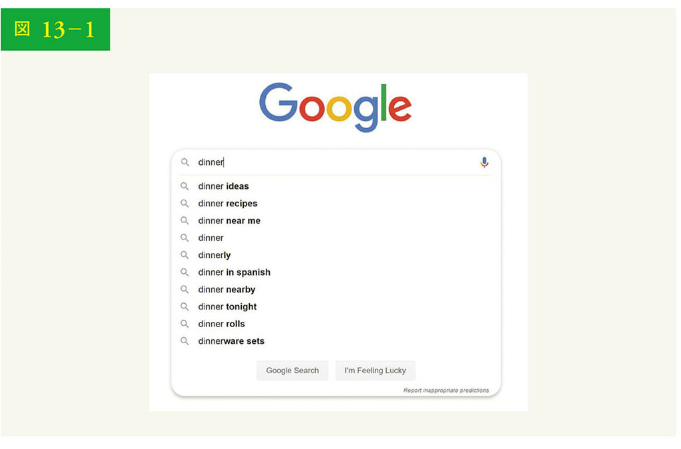

## ステップ 1：問題を理解し、設計範囲を明確にする

システム設計の面接問題に取り組む最初のステップは、要件を明確にするために十分に質問することです。以下は、候補者と面接官とのやりとりの例です。

候補者：マッチングは検索クエリの最初のみをサポートするのですか、それとも途中もサポートするのですか？
面接官：検索クエリの最初だけです。

候補者：いくつのオートコンプリート候補を返さなくてはなりませんか？
面接官：5 つです。

候補者：どの 5 つの候補を返すか、システムはどのように判断するのですか？
面接官：過去のクエリ頻度で決まる人気度によって判断します。

候補者：システムはスペルチェックをサポートしていますか？
面接官：いいえ、スペルチェックやオートコレクトはサポートされません。

候補者：検索クエリは英語ですか？
面接官：はい、そうです。最後に時間が許せば、多言語対応について議論しましょう。

候補者：大文字や特殊文字の使用は可能ですか？
面接官：いいえ、すべての検索クエリに小文字のアルファベットを想定しています。

候補者：何人くらいのユーザーが使うのですか？
面接官：1,000 万 DAU です。

### 要求事項

要求事項はおよそ以下の通りです。

・高速レスポンス：ユーザーが検索クエリを入力すると、オートコンプリート候補が十分な速さで表示される必要がある。Facebook のオートコンプリートシステムに関する記事[1]によれば、システムは 100 ミリ秒以内に結果を返す必要があることがわかっている。そうでなければ、スムーズに言葉が出ない状況を引き起こすことになるからだ

・関連性：オートコンプリートの候補は、検索語に関連している必要がある
・ソート：システムが返す結果は、人気度や他のランキングモデルによってソートされる必要がある
・スケーラブル：大量のトラフィックを処理できるシステムである
・高可用性：システムの一部がオフラインになったり、速度が低下したり、予期せぬネットワークエラーが発生したりした場合でも、システムが利用可能であり、アクセス可能であり続ける

### おおまかな見積もり

・1,000 万人のデイリーアクティブユーザー（DAU）がいると仮定する
・平均的な人は 1 日に 10 回検索する
・1 つのクエリ文字列につき 20 バイトのデータ
・ASCII コードを使用すると仮定。1 文字=1 バイト
・クエリには 4 つの単語が含まれ、各単語には平均して 5 文字が含まれると仮定
・つまり、1 つのクエリあたり、4×5 ＝ 20 バイトとなる
・検索ボックスに文字が入力されるたびに、クライアントはオートコンプリート候補のリクエストをバックエンドに送る。平均して、各検索クエリに対して 20 リクエストが送信される。例えば、"dinner"と入力し終わるまでに、以下の 6 つのリクエストがバックエンドに送信される

search?q=d
search?q=di
search?q=din
search?q=dinn
search?q=dinne
search?q=dinner

・1 秒間に 24,000 クエリ（QPS）＝ 1,000 万ユーザー ×10 クエリ／1 日 ×20 キャラクター／24 時間／3,600 秒
・ピーク時の QPS ＝ QPS×2 ＝～ 48,000
・1 日のクエリのうち 20%が新規クエリであると仮定する。1,000 万 ×10 クエリ／日 ×20 バイト／クエリ ×20%＝ 0.4GB。つまり、毎日 0.4GB の新しいデータがストレージに追加されることになる

## ステップ 2：高度な設計を提案し、賛同を得る

高度な設計では、システムを 2 つに分割します。

・データ収集サービス：ユーザーが入力した検索クエリを収集し、リアルタイムに集計する。リアルタイム処理は、大規模なデータセットでは現実的ではないが、出発点としては良い方法である。より現実的な解決策は、「設計の深掘り」で検討する
・クエリサービス：検索クエリや接頭辞を指定すると、よく検索される 5 つの単語を返す

### データ収集サービス

データ収集サービスがどのように機能するか、簡単な例で見てみましょう。図 13-2 に示されたように、クエリ文字列とその頻度を格納する頻度テーブルがあるとします。当初、頻度表は空です。その後、ユーザーは"twitch"、"twitter"、"twitter"、"twillo"と順次クエリを入力していきます。図 13-2 は頻度表がどのように更新されるかを示しています。

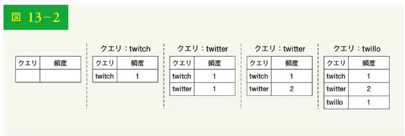

### クエリサービス

表 13-1 に示したように、頻度表があるとします。これには、以下の 2 つのフィールドがあります：

・クエリ：クエリ文字列が格納される

・頻度：あるクエリが検索された回数を表す

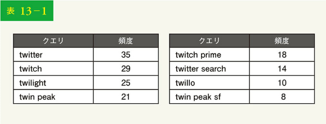

| クエリ    | 頻度 | クエリ         | 頻度 |
| --------- | ---- | -------------- | ---- |
| twitter   | 35   | twitch prime   | 18   |
| twitch    | 29   | twitter search | 14   |
| twilight  | 25   | twillo         | 10   |
| twin peak | 21   | twin peak sf   | 8    |

ユーザーが検索ボックスに"tw"と入力すると、表 13-1 に基づく頻度表を前提とした、以下の検索上位クエリが 5 つ表示されます（図 13-3）：

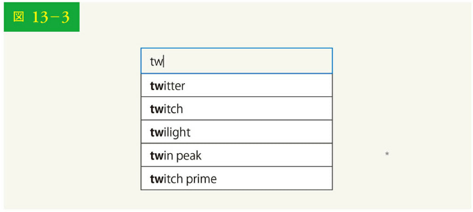

よく検索されるクエリの上位 5 つを取得するには、以下の SQL クエリを実行します：

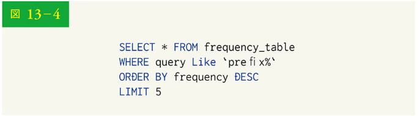

```sql
SELECT * FROM frequency_table
WHERE query LIKE 'prefix%'
ORDER BY frequency DESC
LIMIT 5

```

これは、データセットが小さい場合には許容できる解決策です。データセットが大きくなると、データベースへのアクセスがボトルネックとなります。「設計の深掘り」で、最適化を検討しましょう。

## ステップ 3：設計の深掘り

高度な設計では、データ収集サービスとクエリサービスについて説明しました。この設計は最適とは言えませんが、良い出発点にはなります。このセクションでは、いくつかの構成要素を深く掘り下げ、以下のように最適化を検討します。

・トライデータ構造
・データ収集サービス
・クエリサービス
・ストレージのスケールアップ
・トライオペレーション

### トライデータ構造

高度な設計では、ストレージにリレーショナルデータベースを使用します。しかし、リレーショナルデータベースから検索クエリのトップ 5 を取り出すのは非効率的です。この問題を解決するため、トライ（接頭辞木）というデータ構造を用います。トライデータ構造はシステムにとって重要であるため、カスタマイズされたトライの設計にかなりの時間を割く予定です。なお、アイデアの一部は参考文献[2][3]から引用しています。

トライデータ構造の基本的な理解は、システム設計の面接試験には欠かせません。しかし、問われるのはシステム設計についての質問というより、データ構造についての質問です。また、多くのオンラインドキュメントで、この概念は説明されています。この章では、トライデータ構造の概要のみを説明し、基本的なトライをどのように最適化すればレスポンスが改善されるかに焦点を当てましょう。

トライとは、文字列をコンパクトに格納できるツリー状のデータ構造です。名前の由来は「retrieval = 検索」で、文字列の検索操作のために設計されています。トライの主要な考え方は以下で構成されます：

・トライは木構造（tree-like data structure）である
・ルートは空文字列を表す
・各ノードには文字が格納され、可能性のある文字ごとに 1 つずつ、計 26 の子を持つ。スペースを節約するため、空のリンクは描かない
・各木のノードは、1 つの単語または接頭辞文字列を表す

図 13-5 は、検索クエリ"tree"、"try"、"true"、"toy"、"wish"、"win"を含むトライを示したものです。検索クエリは太い枠で強調されています。

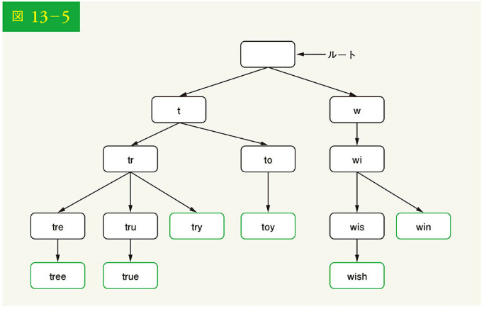

基本的なトライデータ構造は、ノードに文字を格納します。頻度によるソートをサポートするため、頻度情報をノードに含める必要があるのです。以下のような頻度表があるとしましょう。

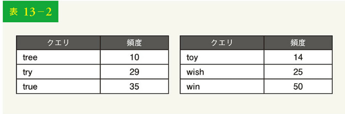

| クエリ | 頻度 | クエリ | 頻度 |
| ------ | ---- | ------ | ---- |
| tree   | 10   | toy    | 14   |
| try    | 29   | wish   | 25   |
| true   | 35   | win    | 50   |

ノードに頻度情報を追加すると、図 13-6 に示すようなトライデータ構造に更新されます。

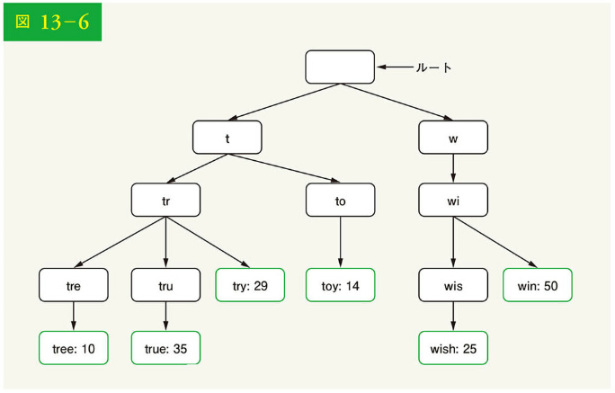

オートコンプリートは、トライにおいてどのように動作するのでしょう。
アルゴリズムに入る前に、いくつかの用語を定義しておきます：

・p：接頭辞の長さ
・n：トライのノードの総数
・c：あるノードの子ノードの数

最も検索された上位 k 個のクエリを取得するための手順を以下に示します。

1. 接頭辞を見つける。時間計算量：O(p)
2. 接頭辞ノードからサブツリーを走査し、有効な子ノードをすべて取得する。子ノードが有効なクエリ文字列を形成できる場合、その子ノードは有効である。時間計算量：O(c)
3. 子をソートし、上位 k 位を取得する。時間計算量：O(clogc)

図 13-7 に示す例を用いて、アルゴリズムを説明しましょう。k が 2 であり、ユーザーが検索ボックスに"tr"と入力したと仮定すると、アルゴリズムは以下のように動作します。

・ステップ 1：接頭辞ノード"tr"を見つける
・ステップ 2：サブツリーを走査して、有効な子ノードをすべて取得する。この場合、[tree: 10]、[true: 35]、[try: 29]が有効である
・ステップ 3：子ノードをソートし、上位 2 つを取得する。[true: 35]と[try: 29]が接頭辞"tr"を持つ上位 2 つのクエリである

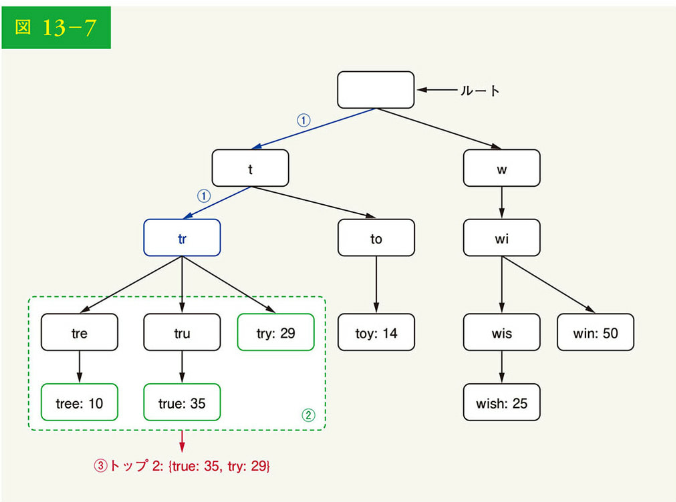

このアルゴリズムの時間計算量は、上記の各ステップに費やされる時間の合計、すなわち O(p) + O(c) + O(clogc)です。

上記のアルゴリズムは簡単です。しかし、最悪の場合、上位 k 個の結果を得るためにトライ全体を走査する必要があるため、遅すぎるのです。以下に、2 つの最適化策を紹介します。

1. 接頭辞の最大長を制限する
2. 各ノードで上位の検索クエリをキャッシュする

これらの最適化を 1 つずつ見ていきましょう。

### 接頭辞の最大長を制限する

ユーザーは長い検索クエリを検索ボックスに入力することはほとんどありません。したがって、p は 50 など、小さな整数値でよいでしょう。接頭辞の長さを制限すれば、「接頭辞を探す」ための時間計算量は、O(p)から O(small constant)、別名 O(1)に縮約できます。

### 各ノードで上位の検索クエリをキャッシュする

トライ全体を走査するのを避けるため、各ノードにおいて最もよく使われる上位 k 個の検索クエリを保存します。ユーザーは 5 ～ 10 個のオートコンプリート候補で十分なので、k は比較的小さな数です。特定のケースでは、上位 5 つの検索クエリのみがキャッシュされます。

各ノードで上位の検索クエリをキャッシュすることで、上位 5 つのクエリを取得するための時間を大幅に短縮できます。しかし、各ノードで上位クエリを保存するため、多くのスペースが必要になります。高速レスポンスは非常に重要なため、スペースと時間を交換する価値は十分にあるでしょう。

図 13-8 は更新されたトライデータ構造を示しています。トップ 5 のクエリは各ノードに保存されています。例えば、接頭辞が"be"のノードには[best: 35, bet: 29, bee: 20, be: 15, beer: 10]が格納されているわけです。

これら 2 つの最適化を適用した後のアルゴリズムの時間計算量を再検討しましょう。

1. 前置ノードを見つける。時間計算量：O(1)
2. トップ 5 のクエリを返す。上位 k 個のクエリはキャッシュされるため、このステップの時間計算量は O(1)である

各ステップの時間計算量は O(1)に減少します。つまり、アルゴリズムは上位 k 個のクエリを提示するのに O(1)しかかからないのです。

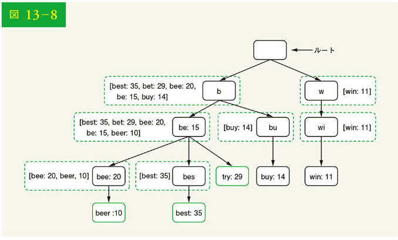

### データ収集サービス

従来の設計では、ユーザーが検索クエリを入力するたびに、データがリアルタイムに更新されていました。しかし、この方法は以下の 2 つの理由で、実用的ではありません。

・ユーザーは一日に何十億ものクエリを入力する可能性がある。クエリのたびにトライを更新すると、クエリサービスが著しく遅くなる
・トップサジェスチョンが一度構築されると、あまり変化しない可能性がある。そのため、トライを頻繁に更新する必要はない

スケーラブルなデータ収集サービスを設計するため、データがどこから来るのか、どのように使われるのかを検討します。Twitter のようなリアルタイムアプリケーションは、最新のオートコンプリート候補を必要とします。しかし、多くの Google キーワードのオートコンプリート候補は、日常的にはあまり変化しないかもしれません。

ユースケースの違いにもかかわらず、トライを構築するためのデータは通常、分析サービスやロギングサービスから得られるため、データ収集サービスの基本的な基盤は変わりません。

図 13-9 は、再設計されたデータ収集サービスを示しています。各コンポーネントを 1 つずつ検証しましょう。

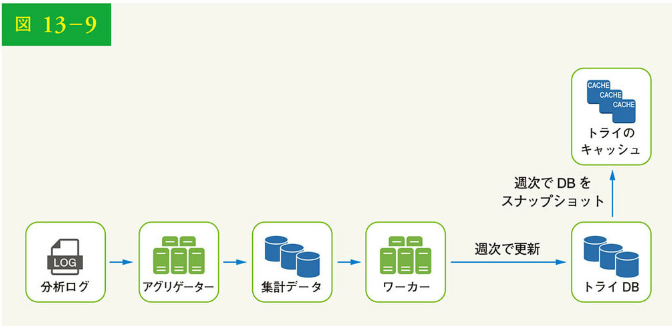

分析ログ：検索クエリに関する生データを保存している。ログは追記のみで、インデックスは作成されない。表 13-3 にログファイルの例を示す

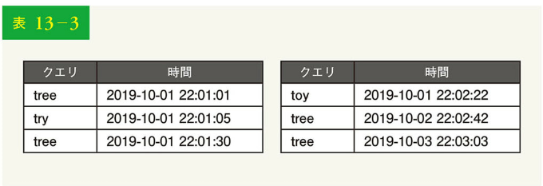

| クエリ | 時間                | クエリ | 時間                |
| ------ | ------------------- | ------ | ------------------- |
| tree   | 2019-10-01 22:01:01 | toy    | 2019-10-01 22:02:22 |
| try    | 2019-10-01 22:01:05 | tree   | 2019-10-02 22:02:42 |
| tree   | 2019-10-01 22:01:30 | tree   | 2019-10-03 22:03:03 |

アグリゲーター：分析ログのサイズは通常、非常に大きく、データは適切な形式ではない。データを集約して、システムで簡単に処理できるようにする必要がある

ユースケースに応じて、異なる方法でデータを集計することもあります。Twitter のようなリアルタイムアプリケーションでは、リアルタイム結果が重要であるため、より短い時間間隔でデータを集計します。一方で、週 1 回など、あまり頻繁に集計しなくても、多くのケースでは十分です。面接試験を通して、リアルタイムの結果が重要かを検証しましょう。ここでは、トライは毎週、再構築されると仮定します。

### 集計データ

表 13-4 は、週次データの集計例です。「時間」フィールドは週の開始時刻を表し、「頻度」フィールドは各週に対応するクエリ出現回数の合計です。

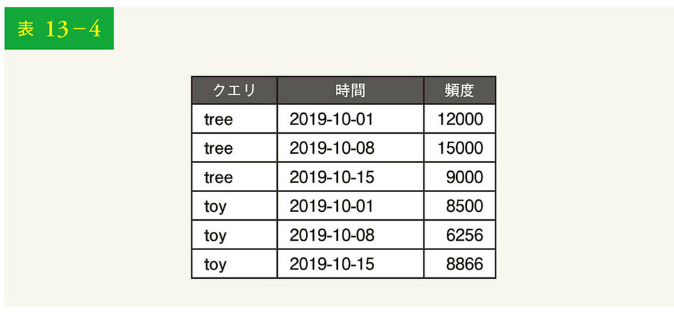
| クエリ | 時間 | 頻度 |
|--------|------------|--------|
| tree | 2019-10-01 | 12000 |
| tree | 2019-10-08 | 15000 |
| tree | 2019-10-15 | 9000 |
| toy | 2019-10-01 | 8500 |
| toy | 2019-10-08 | 6256 |
| toy | 2019-10-15 | 8866 |

ワーカー：ワーカーは、一定の間隔で非同期ジョブを実行するサーバの集合体である。トライデータ構造を構築し、トライデータベースに保存する

トライのキャッシュ：トライのキャッシュは、トライを高速に読み出すためにメモリ上に保持する分散キャッシュシステムである。トライのキャッシュは、データベースのスナップショットを毎週取る

トライデータベース：トライデータベースは永続的なストレージである。データを保存するために 2 つのオプションが用意されている

1. ドキュメントストア：新しいトライは毎週構築されるので、定期的にスナップショットを取り、シリアライズし、シリアライズしたデータをデータベースに格納できる。MongoDB [4] のようなドキュメントストアは、シリアライズされたデータには適している
2. キーバリューストア：トライは以下のような論理でハッシュテーブル形式[4]で表現される
   ・トライの各プレフィックスは、ハッシュテーブルのキーに対応付けられる
   ・各トライのノード上のデータは、ハッシュテーブルのバリューに対応付けられる

図 13-10 は、トライとハッシュテーブルの対応を示しています。

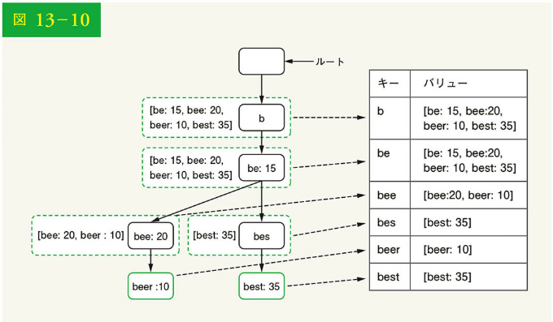

図 13-10 では、左側の各トライノードが右側の＜キー、バリュー＞ペアに対応付けられています。キーバリューストアがどのように機能するのかわからなければ、「6 章 キーバリューストアの設計」を参照ください。

### クエリサービス

高度な設計では、クエリサービスはデータベースを直接呼び出してトップ 5 の結果を提えます。図 13-11 は、以前の設計が非効率的であったため、改善された設計を示しています。

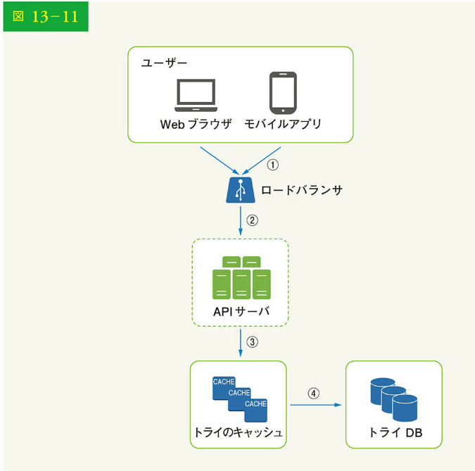

1. 検索クエリはロードバランサに送信される
2. ロードバランサはリクエストを API サーバにルーティングする
3. API サーバはトライキャッシュからトライデータを取得し、クライアントにオートコンプリートの候補を表示する
4. トライキャッシュにデータがない場合、データをキャッシュに補充する。このようにして、同じ接頭辞に対する以降のリクエストはすべてキャッシュから返される。キャッシュミスは、キャッシュサーバがメモリ不足またはオフラインの場合に発生する

クエリサービスには超高速性が求められます。そのため、以下の最適化を提案しましょう。

・AJAX リクエスト：Web アプリケーションでは、ブラウザは通常、オートコンプリートの結果を取得するために AJAX リクエストを送信する。AJAX の主な利点は、リクエスト/レスポンスの送受信によって、Web ページ全体が更新されないことである

・ブラウザのキャッシュ：多くのアプリケーションでは、オートコンプリート検索候補は短時間であまり変化しないかもしれない。したがって、オートコンプリート候補をブラウザのキャッシュに保存して、その後のリクエストではキャッシュから直接結果を取得可能にできる。Google 検索エンジンも同じキャッシュ機構を使用している。図 13-12 に、Google の検索エンジンで「system design interview」と入力したときのレスポンスヘッダを示した。見てわかるように、Google は結果を 1 時間ブラウザにキャッシュしている。ただし、キャッシュ制御の"private"は、結果が単一のユーザー向けであり、共有キャッシュによってキャッシュされてはならないことを意味する。"max-age=3600"は、キャッシュが 3600 秒間、つまり 1 時間有効であることに注意されたい

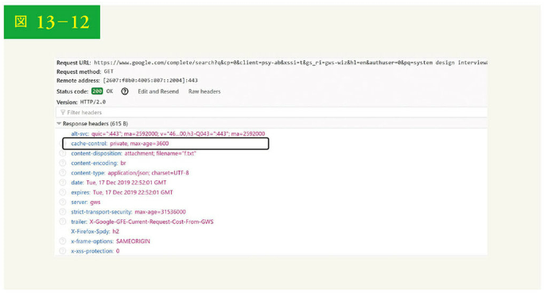

・データのサンプリング：大規模なシステムでは、すべての検索クエリをログに記録することは、多くの処理能力とストレージを必要とする。データのサンプリングは重要である。例えば、N 個のリクエストのうち 1 個だけがシステムによってログに記録される

### トライの操作

トライはオートコンプリートシステムの中核となる構成要素です。ここでは、トライの操作（作成、更新、削除）がどのように行われるかを見てみましょう。

### 作成

トライは、集計されたデータを使ってワーカーが作成します。データソースは分析ログ DB です。

### 更新

トライの更新には、2 つの方法があります。

オプション 1：トライを毎週更新する。新しいトライが作成されると、古いトライは新しいトライに置き換わる

オプション 2：個々のトライノードを直接更新する。この操作は遅いので避けるようにする。ただし、トライのサイズが小さい場合、許容できる。トライノードを更新する場合、ルートまでのすべての祖先を更新する必要がある。なぜなら、祖先にはその下のトップクエリが格納されているからだ。図 13-13 は、更新操作の動作例を示している。左側では、検索クエリ"beer"の元のバリューは 10 であり、右側では、30 に更新されている。このように、このノードとその祖先は"beer"のバリューが 30 に更新されている

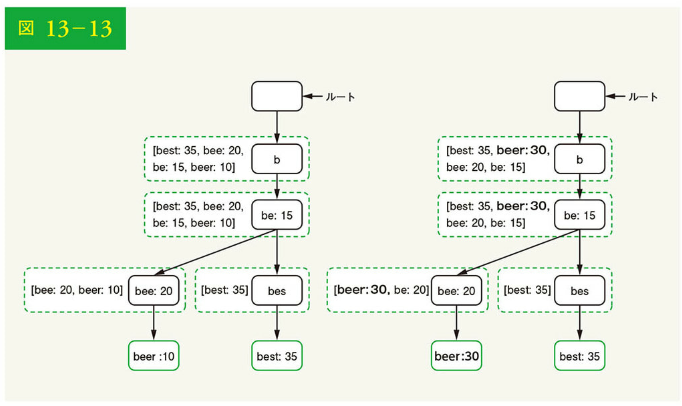

### 削除

慎しみに欠けた、暴力的な、性的に露骨な、あるいは危険なオートコンプリート候補は削除する必要があります。トライキャッシュの前にフィルター層（図 13-14）を追加して、不要なサジェストをフィルターにかけます。フィルター層があることで、さまざまなフィルター規則に基づいて結果を柔軟に削除できます。不要なサジェストは非同期にデータベースから物理的に削除されるため、次の更新サイクルでは正しいデータセットがトライの構築に使用されるのです。

### ストレージをスケーリングする

オートコンプリートクエリをユーザーに提供するシステムを開発したので、次はトライが大きくなりすぎて 1 台のサーバに収まらない場合のスケーラビリティの問題を解決する番です。

サポートされている言語は英語だけなので、最初の文字に基づいてシャードするのが単純な方法です。以下はその例となります。

・ストレージに 2 台のサーバが必要な場合、最初のサーバに'a'から'm'で始まるクエリを格納し、2 番目のサーバに'n'から'z'を格納する
・3 台のサーバが必要な場合、クエリを'a'から'i'、'j'から'r'、's'から'z'に分割する

英語にはアルファベット文字が 26 個あるので、26 台のサーバにクエリを分割できます。ここで、1 文字目を基準にした水平分割を第 1 階層水平分割と定義しましょう。26 台以上のデータを格納する場合は、第 2 レベル、あるいは第 3 レベルで水平分割できます。例えば、'a'で始まるデータのクエリは、'aa-ag'、'ah-an'、'ao-au'、'av-az'という 4 つのサーバに分割できるわけです。

一見、この方法は合理的に思えますが、それも's'よりも'c'で始まる単語の方が多いことに気づくまでです。これでは、分布に偏りが生じてしまうのです。

データの不均衡問題を軽減するため、図 13-15 のように、過去のデータ分散パターンを分析し、よりもスマートな水平分割のロジックを適用しましょう。シャードマップマネージャーは、行をどこに格納すべきかを特定するためのルックアップデータベースを保持しています。例えば、's'に対する履歴クエリと'u'、'v'、'w'、'x'、'y'、'z'を合わせたものが同程度ある場合、's'用と'u'～'z'用という 2 つの水平分割を保持できるのです。

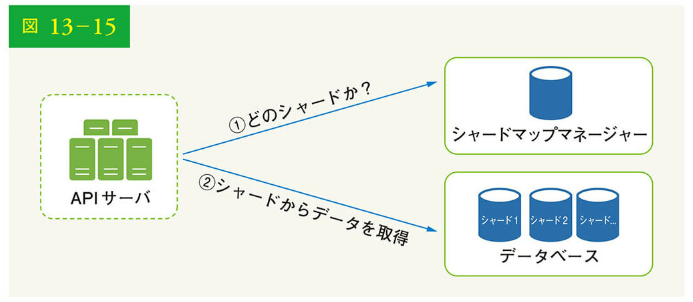

## ステップ 4：まとめ

設計の深掘りを終えたら、面接官がいくつかフォローアップの質問をするかもしれません。

面接官：多言語をサポートするため、どのように設計を拡張しますか？

英語以外のクエリをサポートするには、トライノードに Unicode 文字を格納します。Unicode に馴染みがなければ、「エンコーディングの標準は、古今東西の文字体系に対応するすべての文字をカバーする」[5]が Unicode の定義です。

面接官：ある国の検索クエリ上位が、他の国と異なる場合はどうしますか？

この場合、国ごとに異なるトライを構築することになるでしょう。レスポンスタイムを改善するには、トライを CDN に保存します。

面接官：トレンド(リアルタイム)検索クエリには、どのように対応しますか？

あるニュースイベントが発生し、ある検索クエリが突然人気を博した場合を想定しています。オリジナルの設計は、以下の理由でうまく機能しません。

・オフラインワーカーは、週単位でスケジューリングされているため、トライの更新がまだ行われていない
・たとえスケジューリングされていたとしても、トライを構築するのに時間がかかりすぎる

リアルタイム検索オートコンプリートの構築は複雑であり、本書の範囲を超えているため、アイデアのみをいくつか紹介します。

・水平分割によって作業データセットを削減する
・ランキングモデルを変更し、最近の検索クエリに重きを置く
・データはストリームとして送られてくるので、一度にすべてのデータにアクセスできるわけではない。ストリーミングデータとは、データが連続的に生成されることを意味する。ストリーム処理には、異なるシステムのセットが必要である。Apache Hadoop MapReduce [6]、Apache Spark Streaming [7]、Apache Storm [8]、Apache Kafka [9]などだ。これらのトピックはすべて特定ドメインの知識を必要とするため、ここでは詳細を説明しない

ここまで来られた方、おめでとうございます。さあ、自分をほめてあげてください。よくやったと。

参考文献：
[1] The Life of a Typeahead Query: https://www.facebook.com/notes/facebook-engineering/the-life-of-a-typeahead-query/389105248919/
[2] How We Built Prefix: A Scalable Prefix Search Service for Powering Autocomplete: https://medium.com/@firstlookmedia/how-we-built-prefix-a-scalable-prefix-search-service-for-powering-autocomplete-c20198e2ef1
[3] Prefix Hash Tree An Indexing Data Structure over Distributed Hash Tables: https://people.eecs.berkeley.edu/~sylvia/papers/pht.pdf
[4] MongoDB wikipedia: https://en.wikipedia.org/wiki/MongoDB
[5] Unicode frequently asked questions: https://www.unicode.org/faq/basic_q.html
[6] Apache hadoop: https://hadoop.apache.org/
[7] Spark streaming: https://spark.apache.org/streaming/ [8] Apache storm: https://storm.apache.org/
[9] Apache kafka: https://kafka.apache.org/documentation/
