# 14 章 YouTube の設計

この章では、YouTube の設計が求められます。この問いに対する解答は、Netflix や Hulu のような動画共有プラットフォームの設計など、他の面接試験における質問にも応用できます。図 14-1 に YouTube のトップページを示しましょう。

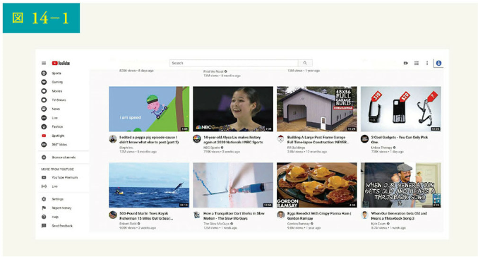

Youtube は、コンテンツ制作者が動画をアップロードし、視聴者が再生ボタンをクリックするというシンプルな仕組みに見えます。本当にシンプルなのでしょうか。いいえ、そうでもありません。シンプルさの裏には、たくさんの複雑な技術が隠されているのです。2020 年に置ける Youtube の興味深い統計データや人口統計データ、そして楽しい真実を見てみましょう。

• 月間アクティブユーザー総数：20 億人
• 1 日に視聴される動画の数：50 億本
• 米国の成人の 73%が YouTube を利用
• YouTube のクリエイターは 5,000 万人
• YouTube の広告収入は 2019 年通年で 151 億ドル、2018 年から 36%増
• YouTube はモバイルインターネットトラフィック全体の 37%を占める
• YouTube は 80 の言語で提供されている

これらの統計データから、YouTube が巨大であり、グローバルに展開し、多くのお金を稼いでいることがわかるでしょう。

## 【ステップ 1】問題を理解し、設計範囲を明確にする

図 14-1 に示すように、YouTube では、動画を見るだけでなく、さまざまなことができます。例えば、動画のコメント、共有、いいね！、動画のプレイリストへの保存、チャンネル登録などです。45 分や 60 分の面接試験の中で、すべてを設計するのは不可能です。したがって、範囲を絞り込むための質問が重要となります。

候補者：どのような機能が重要ですか？
面接官：動画をアップロードし、動画を見る機能です。

候補者：どのようなクライアントに対応する必要がありますか？
面接官：モバイルアプリ、Web ブラウザ、スマートテレビです。

候補者：デイリーアクティブユーザーは何人ですか？
面接官：500 万人です。

候補者：1 日の平均利用時間はどのくらいですか？
面接官：30 分です。

候補者：海外ユーザーへの対応は必要でしょうか？
面接官：はい、ユーザーの多くは海外ユーザーです。

候補者：どのようなビデオ解像度に対応しますか？

面接官：ほとんどのビデオ解像度とフォーマットに対応します。

候補者：暗号化は必要ですか？
面接官：はい。

候補者：動画のファイルサイズに条件はありますか？
面接官：私たちのプラットフォームは、小中規模の動画に焦点を当てています。動画の最大サイズは 1GB です。

候補者：Amazon や Google、Microsoft が提供する既存のクラウドインフラの利用は可能ですか？
面接官：それはいい質問ですね。すべてをゼロから構築することは、ほとんどの企業にとって非現実的です。既存クラウドサービスのいくつかの活用が推奨されます。

この章では、以下のような特徴を持つ動画ストリーミングサービスの設計に焦点を当てましょう。

• 高速動画アップロードが可能
• スムーズな動画配信
• 動画の品質を変更可能
• 低いインフラコスト
• 高い可用性、スケーラビリティ、および信頼性の要件
• 対応クライアント：モバイルアプリ、Web ブラウザ、スマートテレビ

### おおまかな見積もり

以下の試算は多くの仮定に基づくため、面接官とコミュニケーションを取りながら確認することが重要です。

• デイリーアクティブユーザー（DAU）を 500 万人と仮定
• ユーザーは 1 日あたり 5 本の動画を視聴
• 10%のユーザーが 1 日 1 本の動画をアップロード
• 平均的な動画サイズは 300MB と仮定

• 1 日に必要な総ストレージ容量：500 万 × 10% × 300MB = 150TB

CDN コスト
• クラウド CDN が動画を配信する際、CDN から転送されるデータに対して課金
• Amazon の CDN CloudFront を使用してコストを試算（図 14-2）。トラフィックの 100%が米国から提供されていると仮定すると、1GB あたりの平均コストは 0.02 ドル。簡略化のため、動画ストリーミングコストのみを計算
• 500 万 × 5 本の動画 × 0.3GB × 0.02 ドル = 1 日あたり 15 万ドル

大まかなコスト試算から、CDN から動画を配信するには多大なコストがかかるとわかります。大口顧客には、クラウド事業者が CDN コストを大幅に下げてくれるとはいえ、そのコストは相当なものです。CDN コストを削減する方法については、「設計の深掘り」で説明しましょう。

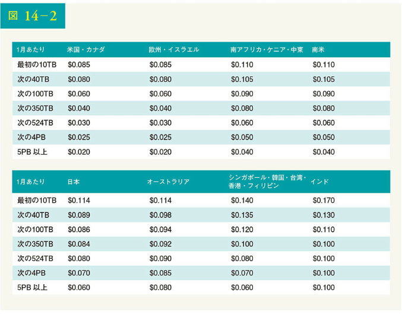

## 【ステップ 2】高度な設計を提案し、賛同を得る

前述のように、面接官はすべてをゼロから構築するのではなく、既存のクラウドサービスを活用することを勧めています。CDN や Blob ストレージが、利用するクラウドサービスです。なぜ、すべてを自分たちで構築しないのかと疑問に思う読者もいるかもしれません。その理由は、以下の通りです。

• システム設計の面接試験は、ゼロからすべてを構築するためのものではない。限られた時間内で、正しく仕事をするために正しい技術を選択することは、その技術の仕組みを詳しく説明することよりも重要である。例えば、ソース動画を保存するための Blob ストレージについて言及するだけでも、面接では十分である。Blob ストレージの詳細設計について語るのは、やりすぎかもしれない

• スケーラブルな Blob ストレージや CDN の構築は、非常に複雑でコストがかかる。Netflix や Facebook のような大企業でさえ、すべてを自前で構築しているわけではない。Netflix は Amazon のクラウドサービスを利用し、Facebook は Akamai の CDN を利用している

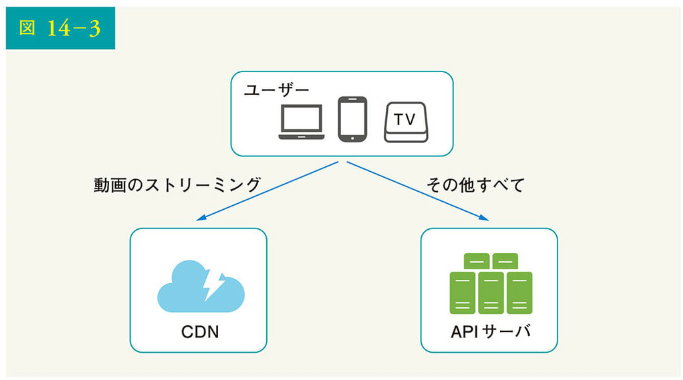

高度な設計において、システムは 3 つのコンポーネントで構成されています（図 14-3）。

クライアント：PC、携帯電話、スマートテレビで YouTube を視聴できる
CDN：動画は CDN に保存される。再生ボタンを押すと、CDN から動画がストリーミング配信される
API サーバ：動画配信以外のすべては API サーバを経由する。フィードの推薦、動画アップロード URL の生成、メタデータのデータベースやキャッシュの更新、ユーザーのサインアップなど

質疑応答では、面接官は以下の 2 つのフローに興味を示しました。

• 動画アップロードのフロー
• 動画ストリーミングのフロー

それぞれについて、高度な設計を探っていきましょう。

### 動画アップロードの流れ

図 14-4 に、動画アップロードの高度な設計を示します。

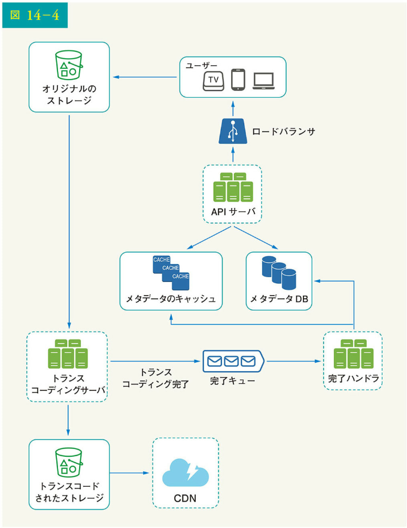

このシステムは、以下のコンポーネントで構成されます。

• ユーザー：PC、携帯電話、スマートテレビなどのデバイスで YouTube を視聴するユーザー

• ロードバランサ：ロードバランサは、API サーバ間でリクエストを均等に分散させる

• API サーバ：動画配信以外のすべてのユーザーリクエストは API サーバを経由する

• メタデータ DB：映像のメタデータはメタデータ DB に格納される。パフォーマンスと高可用性を両立させるため、水平分割され、複製されている

• メタデータのキャッシュ：パフォーマンス向上のため、動画のメタデータとユーザーオブジェクトをキャッシュしている

• オリジナルのストレージ：オリジナル動画の保存には、Blob ストレージシステムが使用される。Wikipedia の Blob ストレージに関する引用を見ると、「BLOB（Binary Large Object）とは、データベース管理システムにおいて単一のエンティティとして保存されるバイナリデータの集合体である」と書かれている

• トランスコーディングサーバ：動画のトランスコーディングは、動画のエンコーディングとも呼ばれる。これは、動画フォーマットを他のフォーマット（MPEG、HLS など）に変換するプロセスであり、異なるデバイスや帯域幅の能力に対して可能な限り最高の動画ストリームを提供する

• トランスコードされたストレージ：トランスコードされた動画ファイルを保存する Blob ストレージである

• CDN：動画は CDN にキャッシュされる。再生ボタンをクリックすると、CDN から動画がストリーミング配信される

• 完了キュー：動画のトランスコード完了イベントに関する情報を格納するメッセージキューである

• 完了ハンドラ：完了キューからイベントデータを取得し、メタデータキャッシュとデータベースを更新するワーカーのリストで構成されている

各構成要素を個別に理解したところで、動画アップロードのフローがどのように機能するかを見てみましょう。このフローは、並行して実行される 2 つのプロセスに分解されます。

a. 実際の動画をアップロードする
b. 動画のメタデータを更新する。メタデータには、動画の URL、サイズ、解像度、フォーマット、ユーザー情報などの情報が含まれる

### 【フロー a：実際の動画をアップロードする】

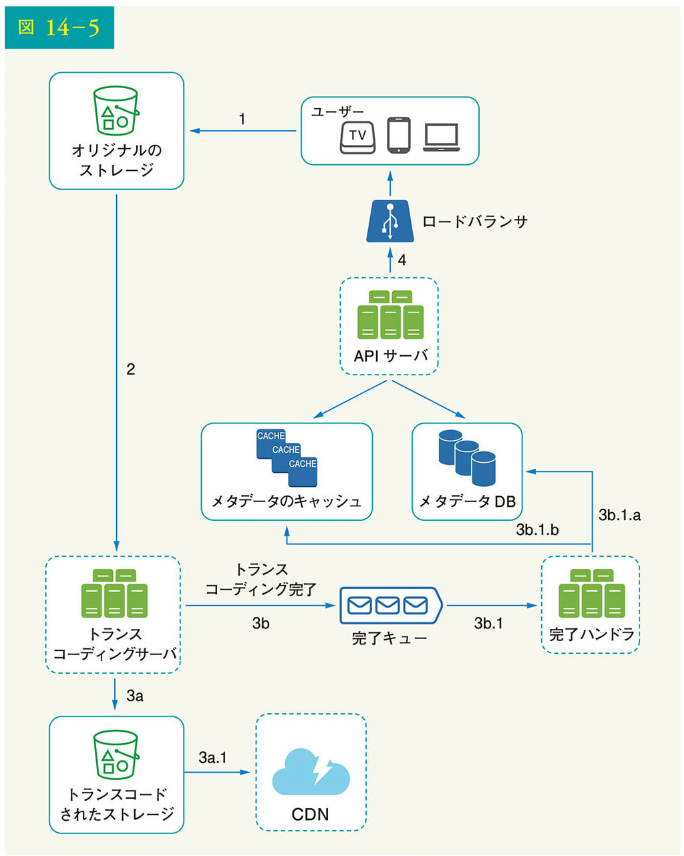

図 14-5 は、実際の動画をアップロードする方法を示しています。その説明は以下の通りです。

1. 動画はオリジナルストレージにアップロードされる
2. トランスコードサーバがオリジナルストレージから動画を取得し、トランスコーディングを開始する
3. トランスコーディングが完了すると、次の 2 ステップが並行して実行される
   3a. トランスコードされた動画は、トランスコードストレージに送信される
   3b. トランスコード完了イベントは、完了キューにキューイングされる
   3a.1. トランスコードされた動画が CDN に配信される
   3b.1. 完了ハンドラには、キューからイベントデータを継続的に取得するワーカーの束が含まれる
   3b.1.a. と 3b.1.b. の完了ハンドラは、動画のトランスコーディングが完了すると、メタデータデータベースとキャッシュを更新する
4. API サーバは、動画のアップロードに成功し、ストリーミングできるようになったことをクライアントに通知する

### 【フロー b：メタデータを更新する】

図 14-6 に示すように、ファイルが元のストレージにアップロードされている間、並行してクライアントが動画メタデータの更新リクエストを送信します。このリクエストには、ファイル名、サイズ、フォーマットなどの動画メタデータが含まれます。API サーバはメタデータのキャッシュとデータベースを更新するのです。

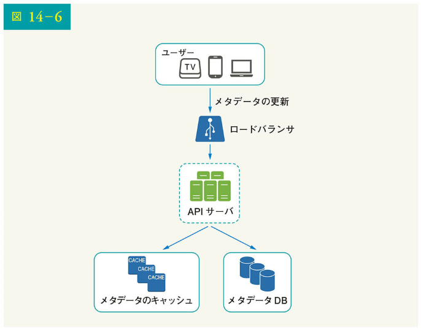

### 動画ストリーミングの流れ

YouTube で動画を見るときは、通常、すぐにストリーミングが始まり、動画がすべてダウンロードされるまで待つことはありません。ダウンロードとはすべての動画がデバイスにコピーされることを、ストリーミングとはデバイスが遠隔地のソース動画から動画ストリームを継続的に受信することを意味します。ストリーミング動画を見るとき、クライアントは一度に少しずつデータをロードするため、すぐに継続的に動画を見られるのです。

動画ストリーミングの流れを説明する前に、重要な概念であるストリーミングプロトコルを見てみましょう。これは、動画ストリーミングのデータ転送を制御する標準的な方法です。一般的なストリーミングプロトコルは以下の通りとなります。

• MPEG-DASH：MPEG は"Moving Picture Experts Group"の略で、DASH は"Dynamic Adaptive Streaming over HTTP"の略である
• Apple HLS：HLS は、"HTTP Live Streaming"の略である
• Microsoft Smooth Streaming
• Adobe HTTP Dynamic Streaming (HDS)

これらのストリーミングプロトコル名は、特定ドメインの知識を必要とする低レベルの詳細であるため、完全に理解する必要はありません。覚えておく必要もありません。重要なのは、ストリーミングプロトコルによって、サポートする動画エンコーディングや再生プレーヤーが異なることへの理解です。動画ストリーミングサービスを設計する場合、ユースケースをサポートする適切なストリーミングプロトコルを選択する必要があります。ストリーミングプロトコルの詳細については、参考文献[7]の記事を参照してください。

動画は、CDN から直接ストリーミングされ、一番近いエッジサーバが映像を配信します。したがって、遅延はほとんどありません。図 14-7 は、動画ストリーミングサービスの高度な設計を示したものです。

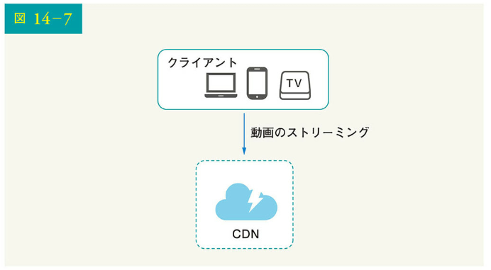

## 【ステップ 3】設計の深掘り

高度な設計では、システム全体が動画アップロードのフローと動画ストリーミングのフローの 2 つに分解されます。このセクションでは、重要な最適化によって両方のフローを改良し、エラーハンドリングメカニズムを導入します。

### 動画のトランスコーディング

動画を録画する場合、デバイス（通常は電話やカメラ）は動画ファイルに特定フォーマットを与えます。他のデバイスで動画をスムーズに再生するには、動画を互換性のあるビットレートとフォーマットにエンコードする必要があるのです。ビットレートとは、ビットが時間と共に処理される割合です。一般にビットレートが高いほど、動画品質が高いことを意味します。高ビットレートのストリームには、より高い処理能力と高速インターネットが必要です。

動画のトランスコーディングは、以下の理由で重要です。

• raw 動画は大量の記憶領域を消費する。60 フレーム/秒で記録された 1 時間の高解像度動画は、数百 GB の容量を消費することがある
• 多くのデバイスやブラウザは、特定の動画フォーマットしかサポートしていない。互換性を確保するため、さまざまなフォーマットに動画をエンコードすることが重要である
• スムーズな再生を維持しながら高品質の動画を視聴させるには、ネットワーク帯域幅が広いユーザーには高解像度の動画を、帯域幅が狭いユーザーには低解像度の動画を配信するとよい
• 特にモバイル端末では、ネットワークの状況が変化することがある。動画を継続的に再生するには、ネットワークの状況に応じて動画の品質を自動または手動で切り替えることが、スムーズなユーザー体験には欠かせない

エンコードのフォーマットはさまざまですが、その多くは 2 つの要素で構成されます。

• コンテナ：コンテナは映像ファイル、音声、メタデータを入れる箱のようなもの。コンテナのフォーマットは、.avi、.mov、.mp4 などのファイル拡張子によって識別可能
• コーデック：圧縮と解凍のアルゴリズムで、動画の品質を維持したままサイズを小さくすることを目的としている。最もよく使われる動画コーデックは、H.264、VP9、HEVC である

### 有向非巡回グラフ（DAG、Directed Acyclic Graph）モデル

動画のトランスコーディングは計算量が多く、時間がかかります。また、コンテンツ制作者によっては、映像処理に対する要求が異なることもあります。例えば、動画の上に透かしを入れる必要があるコンテンツ制作者、サムネイル画像自体を提供するコンテンツ制作者、高解像度の動画をアップロードするコンテンツ制作者もいれば、そうでないコンテンツ制作者もいます。

異なる動画処理ルートをサポートし、高い並列性を維持するには、あるレベルの抽象化を加え、クライアントのプログラマが実行するタスクを定義できるようにすることが重要です。たとえば、Facebook のストリーミング動画エンジンは、DAG プログラミングモデルを採用しており、段階的にタスクを定義することで、順次または並列で動画処理できるようになっています。私たちの設計でも、同様の DAG モデルを採用し、柔軟性や並列性を実現しています。図 14-8 は、動画トランスコードの DAG を表しています。

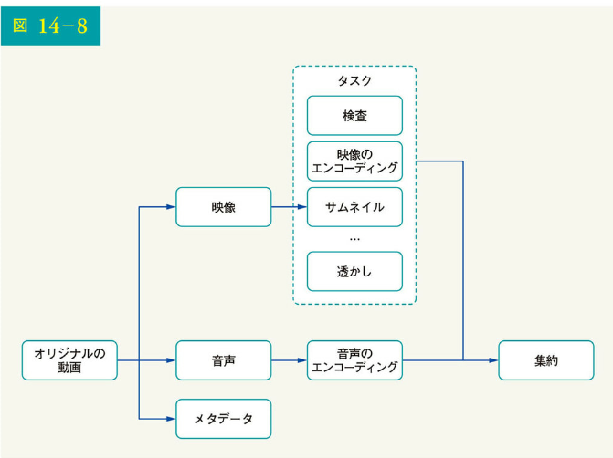

図 14-8 では、オリジナルの動画が映像、音声、メタデータに分割されています。以下は、映像ファイルに適用可能なタスクの一部です。

• 検査：動画の品質が良く、不正でないことを確認する
• 映像のエンコーディング：映像は、異なる解像度、コーデック、ビットレートなどをサポートするように変換される。図 14-9 は、映像エンコードファイルの例を示している
• サムネイル：サムネイルは、ユーザーによってアップロードされるか、システムによって自動的に生成されるかのいずれかである
• 透かし：映像上に表示される画像で、映像の識別情報を含む

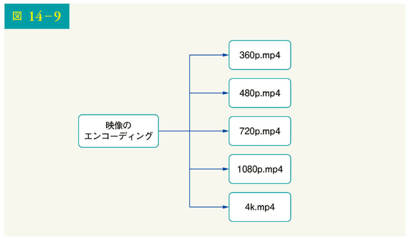

### 動画トランスコーディングのアーキテクチャ

図 14-10 に、クラウドサービスを活用した動画トランスコーディングのアーキテクチャを提案しました。

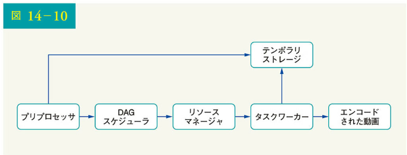

このアーキテクチャは、プリプロセッサ、DAG スケジューラ、リソースマネージャ、タスクワーカー、テンポラリストレージ、出力であるエンコードされた動画という 6 つの主要コンポーネントで構成されます。各コンポーネントを詳しく見ていきましょう。

### プリプロセッサ

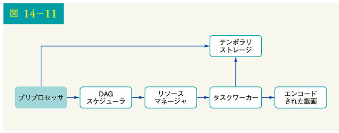

プリプロセッサは、4 つの役割を担います。

1. 動画分割：動画ストリームは、より小さな GOP（Group of Pictures）アライメントに分割またはさらに分割される。GOP は、特定の順序で配置されたフレームのグループ/塊である。各チャンクは独立して再生可能な単位であり、通常は数秒の長さである

2. 一部の古いモバイルデバイスやブラウザは、動画の分割をサポートしていない場合がある。プリプロセッサは、古いクライアントのために、GOP アライメントによって動画を分割する

3. DAG 生成：プロセッサは、クライアントのプログラマが記述した設定ファイルに基づいて、DAG を生成する。図 14-12 は、2 つのノードと 1 つのエッジを持つ簡略化された DAG 表現である

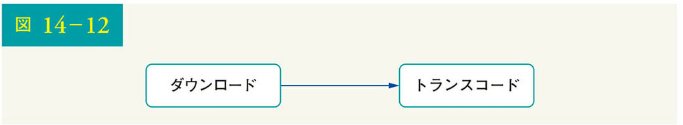

この DAG 表現は以下の 2 つの設定ファイルから生成されます（図 14-13）。

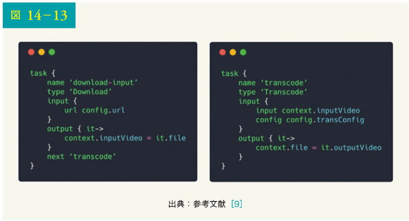

4. キャッシュデータ：プリプロセッサは、セグメント化された動画のキャッシュである。信頼性を高めるため、プリプロセッサは GOP とメタデータを一時記憶している。動画エンコードに失敗した場合、システムは再試行のために永続化データを使用できるだろう

### DAG スケジューラ

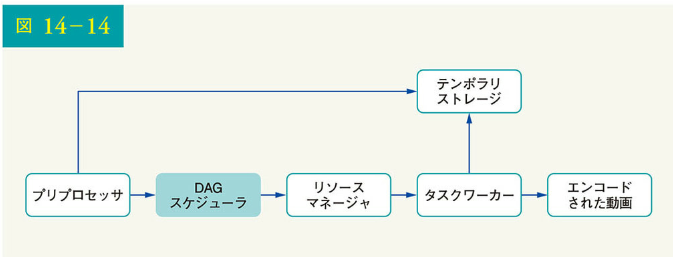

DAG スケジューラは、DAG グラフをタスクのステージに分割し、リソースマネージャ内のタスクキューに入れます。図 14-15 に DAG スケジューラの動作の例を示します。

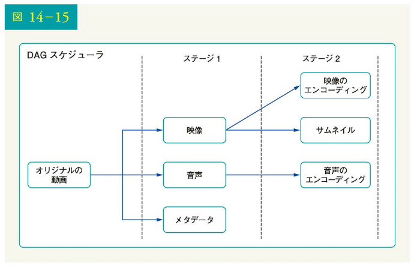

図 14-15 に示すように、元の動画は 2 つのステージで分割されます。すなわちステージ 1 では、映像、音声、メタデータに分割され、さらにステージ 2 では、映像ファイルが映像のエンコーディングとサムネイルという 2 つのタスクに分割されます。音声ファイルは、ステージ 2 のタスクの一部として、音声エンコーディングが必要となります。

### リソースマネージャ

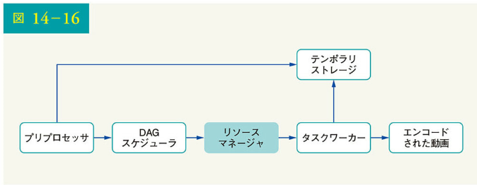

リソースマネージャは、リソース割り当ての効率性を管理する役割を担っており、図 14-17 に示すように、3 つのキューとタスクスケジューラから構成されます。

• タスクキュー：実行すべきタスクが格納された優先度付きキューである
• ワーカキュー：ワーカーの利用状況を格納する優先度付きキューである
• ランニングキュー：現在実行中のタスクと、そのタスクを実行しているワーカーの情報が格納される
• タスクスケジューラ：最適なタスク/ワーカーを選択し、選択されたタスクワーカーにジョブの実行を指示する

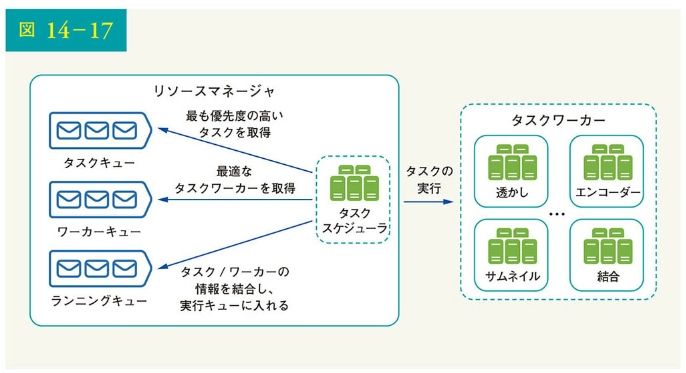

リソースマネージャは次のように動作します。

• タスクスケジューラは、タスクキューから最も優先度の高いタスクを取得する
• タスクスケジューラは、ワーカキューからそのタスクを実行する最適なタスクワーカーを取得する
• タスクスケジューラは、選択されたタスクワーカーにタスクの実行を指示する
• タスクスケジューラは、タスク/ワーカーの情報を結合し、ランニングキューに入れる
• タスクスケジューラは、ジョブが終了すると、そのジョブをランニングキューから削除する

### タスクワーカー

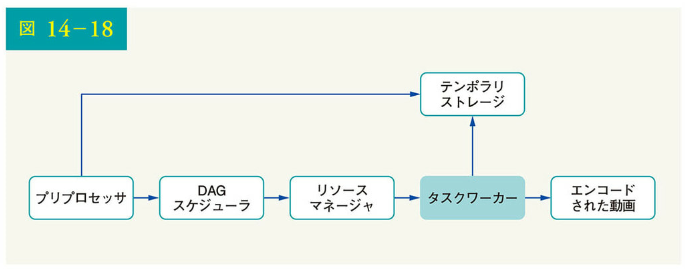

タスクワーカーは、DAG に定義されたタスクを実行します。図 14-19 に示すように、異なるタスクワーカーは異なるタスクを実行する可能性があります。

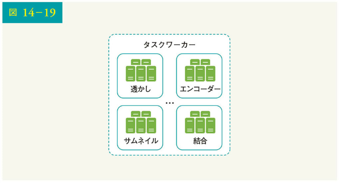

### テンポラリストレージ

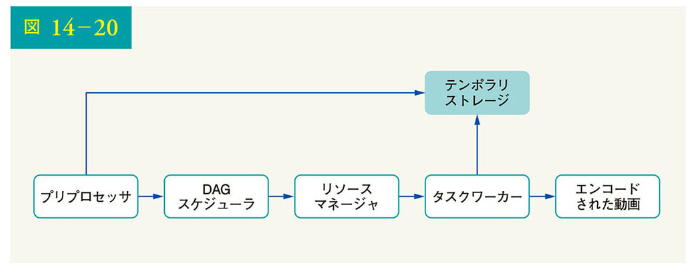

ここでは、複数のストレージシステムが使用されます。ストレージシステムの選択は、データの種類、データサイズ、アクセス頻度、データ寿命などの要因に依存します。例えば、メタデータは一般に、作業者が頻繁にアクセスし、データサイズも小さくなります。したがって、メタデータをメモリにキャッシュするのは良いアイデアでしょう。映像や音声のデータについては、Blob ストレージに置きます。一時保存のデータは、対応する映像処理が完了した時点で解放されるのです。

### エンコードされた動画

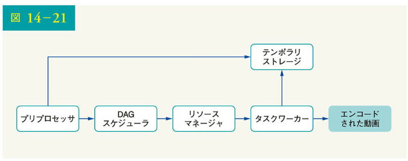

エンコードされた動画は、エンコードのルートの最終出力です。ここでは、出力例として funny_720p.mp4 をあげておきます。

### システムの最適化

ここまでで、動画アップロードの流れ、動画ストリーミングの流れ、動画のトランスコーディングについて理解できたと思います。次に、スピード、セキュリティ、コスト削減などの最適化によってシステムを改良していきます。

### スピードの最適化：動画アップロードの並列化

1 つの動画を 1 単位としてアップロードするのは非効率的です。図 14-22 に示すように、GOP アライメントによって、動画は小さな塊に分割できるからです。

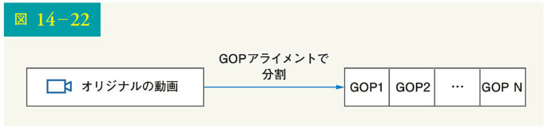

これにより、アップロードが失敗した場合に、すぐにアップロードを再開できるようになります。動画ファイルを GOP で分割する作業は、図 14-23 に示すように、クライアント側で実装することによりアップロードのスピードを向上させられます。

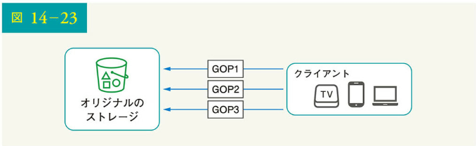

### スピードの最適化：ユーザーの近くにアップロードセンターを配置

アップロードのスピードを向上させるもう 1 つの方法は、世界中に複数のアップロードセンターを設置することです（図 14-24）。米国人は北米のアップロードセンターに、中国人はアジアのアップロードセンターに動画をアップロードできるのです。これを実現するため、CDN をアップロードセンターとして利用しましょう。

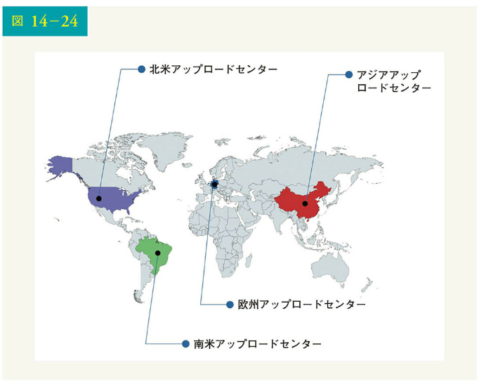

### スピードの最適化：あらゆる場所で並列化

低遅延を実現するには、本格的な取り組みが必要です。疎結合のシステムを構築し、高い並列性を実現することもまた、最適化の 1 つでしょう。

私たちの設計では、高い並列性を実現するためにいくつかの工夫が必要です。動画がオリジナルのストレージから CDN に転送されるフローを拡大して見てみましょう。図 14-25 に示すように、出力は前のステップの入力に依存することがわかります。この依存性が並列化を難しくしているのです。

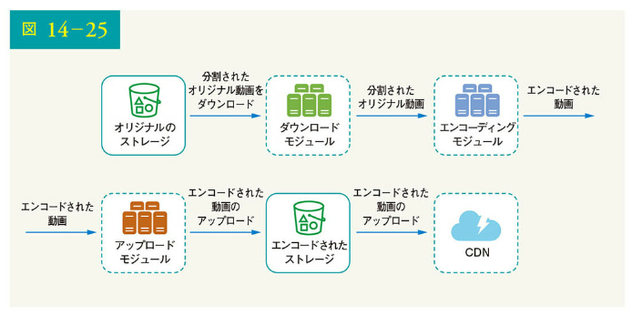

システムをより疎結合にするために、図 14-26 に示すようにメッセージキューを導入しました。メッセージキューがどのようにシステムを疎結合にするのか、例をあげて説明しましょう。

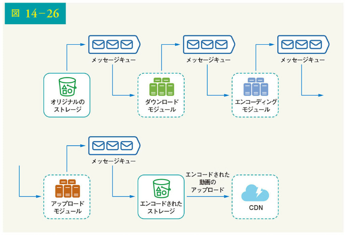

• メッセージキューを導入する前に、エンコーディングモジュールはダウンロードモジュールの出力を待つ必要がある
• メッセージキューが導入されると、エンコーディングモジュールはダウンロードモジュールの出力を待つ必要がなくなる。メッセージキューにイベントがあれば、エンコードモジュールはそれらのジョブを並列で実行できる

### セキュリティの最適化：事前署名付きアップロード URL

セキュリティは、あらゆる製品において最も重要な側面の 1 つです。許可されたユーザーだけが正しい場所に動画をアップロードできるようにするため、図 14-27 に示すように事前署名付き URL を導入します。

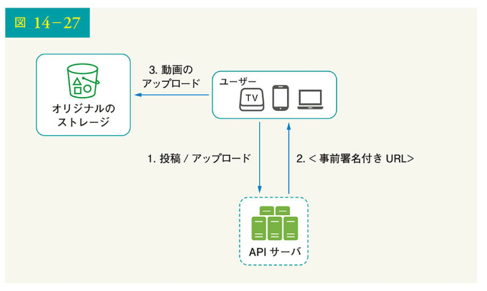

アップロードのフローは以下のように更新されます。

1. クライアントは API サーバに HTTP リクエストを行い、URL で特定されるオブジェクトへのアクセス許可を与える事前署名付き URL（Presigned URL）を取得する。事前署名付き URL という用語は、Amazon S3 へのファイルのアップロードで使用される。他のクラウドサービスプロバイダーは、別の名称を使用する場合がある。たとえば、Microsoft Azure の Blob ストレージは同じ機能をサポートしているが、これは「共有アクセス署名（Shared Access Signature, SAS）」と呼ばれる [10]

1. CDN から最も人気のある動画のみを配信し、その他の動画は大容量ストレージの動画サーバから配信する（図 14-28）
1. API サーバは、事前署名付き URL でレスポンスする
1. クライアントがレスポンスを受け取ると、事前署名付き URL を使用して、動画をアップロードする

### セキュリティの最適化：動画の保護

多くのコンテンツ製作者は、オリジナル動画が盗用されるのを恐れて、動画をオンラインに投稿することに躊躇しています。著作権で守られた動画を保護するため、以下 3 つの安全対策のいずれかの採用が可能です。

・デジタル著作権管理（DRM）システム: Apple FairPlay、Google Widevine、Microsoft PlayReady の 3 つが主要な DRM システムである
・AES 暗号化：動画を暗号化し、暗号化ポリシーを設定できる。暗号化された動画は、再生時に復号化される。これにより、許可されたユーザーのみが暗号化された動画を視聴できる
・視覚的な電子透かし：電子透かしは、動画の識別情報を含む動画上の画像オーバーレイである。会社のロゴや社名などを入れられる

### コスト削減の最適化

CDN は、システムの重要な構成要素であり、世界規模での高速な動画配信を実現します。しかし、計算上、CDN はコストが高く、特にデータサイズが大きい場合には、高いことがわかっています。どうすればコストを削減できるのでしょう。

これまでの研究から、YouTube の動画ストリーミングはロングテール分布に従うことがわかっています [11] [12]。これは、少数の人気動画は頻繁にアクセスされるものの、他の多くの動画はほとんど、あるいはまったく視聴者がいないことを意味します。この観察に基づいて、いくつかの最適化を実施しましょう。

1. CDN から最も人気のある動画のみを配信し、その他の動画は大容量ストレージの動画サーバから配信する（図 14-28）

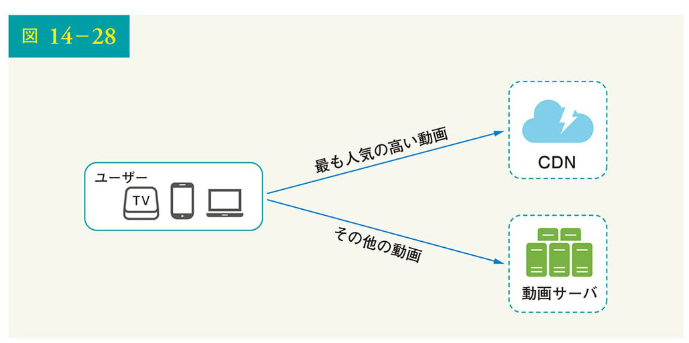

2. 人気のないコンテンツについては、エンコード済み動画のバージョンの多くを保存する必要がないこともある。短い動画はオンデマンドでエンコードできるからだ
3. 特定の地域でのみ人気のある動画がある。これらの動画を他の地域に配信する必要はない
4. Netflix のように自社で CDN を構築し、インターネットサービスプロバイダ（ISP）と提携する。CDN を構築するのは巨大プロジェクトだが、大規模なストリーミング配信企業にとっては意味のあることだろう。Comcast、AT&T、Verizon など、ISP は世界中にあり、ユーザーの近くに位置する。ISP と提携することで、視聴体験の向上と帯域幅コストの削減が可能になるのだ

これらの最適化はすべて、コンテンツの人気度、ユーザーのアクセスパターン、動画のサイズなどに基づいて行われます。最適化を行う前に、過去の視聴パターンを分析することが重要です。このトピックに関する興味深い記事をいくつか紹介します [12] [13]。

### エラー処理

大規模なシステムにおいて、システムエラーは避けられません。耐故障性の高いシステムを構築するには、エラーを優雅に処理し、すばやくリカバリする必要があります。エラーには 2 種類あります。

・回復可能なエラー：動画セグメントがトランスコードに失敗するなど、回復可能なエラーの場合、一般的な考え方は操作を数回再試行することである。タスクの失敗が続き、システムがリカバリ不能と判断した場合、クライアントに適切なエラーコードを返す

・回復不能なエラー：動画形式の不正など回復不能なエラーの場合、システムは動画に関連する実行中のタスクを停止し、クライアントに適切なエラーコードを返す

各システム構成要素の典型的なエラーは、以下の作戦表でカバーされます。

・アップロードのエラー：数回再試行する
・動画分割のエラー：古いバージョンのクライアントで GOP アライメントによる動画を分割できない場合、動画全体がサーバに渡される。動画分割はサーバ側で行われる
・トランスコーディングのエラー：再試行する
・プリプロセッサのエラー：DAG ダイアグラムを再生成する
・DAG スケジューラのエラー：タスクを再スケジュールする
・リソースマネージャキューのダウン：複製を使用する
・タスクワーカーのダウン：新しいワーカーでタスクを再試行する
・API サーバのダウン：API サーバはステートレスなので、リクエストは別の API サーバに誘導される
・メタデータキャッシュサーバのダウン：データは複数回複製される。1 つのノードがダウンしても、他のノードにアクセスしてデータを取得できる。新しいキャッシュサーバを立ち上げて、落ちたキャッシュサーバの置き換え可能
・メタデータ DB サーバのダウン：
• マスターがダウン。マスターがダウンした場合、新しいマスターとして動作するようにスレーブのいずれかを昇格させる
• スレーブがダウン。スレーブがダウンした場合、読み取り用に別のスレーブを使用することで、ダウンしたスレーブの代わりに別のデータベースサーバを立ち上げられる

## ステップ 4 まとめ

この章では、YouTube のような動画配信サービスの構造設計を紹介しました。インタビューの最後に時間が余ったときのために、追加のポイントをいくつか紹介しましょう。

・API 層のスケーリング：API サーバはステートレスなので、API 層を水平スケーリングするのは容易である
・データベースのスケーリング：データベースの複製や水平分割について会話可能である
・ライブストリーミング：動画を録画してリアルタイムで配信する方法。システムはライブストリーミングに特化して設計されていないが、ライブストリーミングと非ライブストリーミングは、アップロード、エンコード、ストリーミングを必要とするという点で共通点がある。顕著な違いは以下の通りである
• ライブストリーミングは、より高いレイテンシーを必要とするため、異なるストリーミングプロトコルが必要になる場合がある
• ライブストリーミングは、小さなデータの遅延するごにリアルタイム処理されているため、並列処理に対する要求が低い
• ライブストリーミングは、異なるエラー処理を必要とする
・動画の削除：著作権、ポルノ、その他の違法行為に違反する動画は削除されるべきである。アップロードの過程でシステムが発見できるものもあれば、ユーザーのフラグ立てによって発見される場合もある
ここまで来られた方、おめでとうございます。さあ、自分をほめてあげてください。よくやった。

参考文献
[1] YouTube by the numbers: https://www.omnicoreagency.com/ youtube-statistics/
[2] 2019 YouTube Demographics: https://blog.hubspot.com/marketing/youtube-demographics
[3] Cloudfront Pricing: https://aws.amazon.com/cloudfront/pricing/
[4] Netflix on AWS: https://aws.amazon.com/solutions/case-studies/netflix/
[5] Akamai homepage: https://www.akamai.com/
[6] Binary large object: https://en.wikipedia.org/wiki/Binary_large_object
[7] Here's What You Need to Know About Streaming Protocols: https://www.dacast.com/blog/streaming-protocols/
[8] SVE: Distributed Video Processing at Facebook Scale: https://www.cs.princeton.edu/~wlloyd/papers/sve-sosp17.pdf
[9] Weibo video processing architecture (in Chinese): https://www.upyun.com/opentalk/399.html
[10] Delegate access with a shared access signature: https://docs.microsoft.com/en-us/rest/api/storageservices/delegate-access-with-shared-access-signature
[11] YouTube scalability talk by early YouTube employee: https://www.youtube.com/watch?v=w5WVu624fY8
[12] Understanding the characteristics of internet short video sharing: A youtube-based measurement study. https://arxiv.org/pdf/0707.3670.pdf
[13] Content Popularity for Open Connect: https://netflixtechblog.com/content-popularity-for-open-connect-b86d56f613b
