# 15 Google ドライブの設計

近年、Google ドライブ、Dropbox、Microsoft OneDrive、Apple iCloud などのクラウドストレージサービスが人気を博しています。この章では、Google ドライブを設計しましょう。

設計に入る前に、Google ドライブについての理解を少し深めておきましょう。Google ドライブは、ドキュメント、写真、動画、その他のファイルをクラウドに保存するためのファイルストレージおよび同期サービスです。どのコンピュータ、スマートフォン、タブレットからもファイルにアクセスできます。それらのファイルは、友人、家族、同僚と簡単に共有できます。

図 15-1 と図 15-2 は、それぞれブラウザやモバイルアプリケーションにおいて Google ドライブがどのように見えるかを示しています。

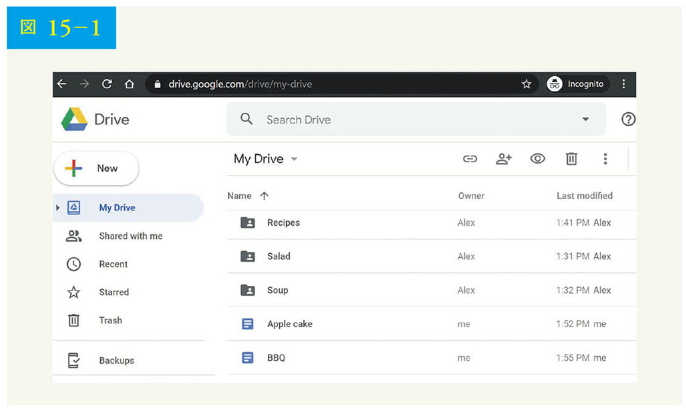

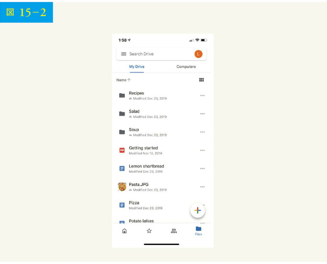

## 【ステップ 1】問題を理解し、設計範囲を明確にする

Google ドライブの設計は大きなプロジェクトなので、範囲を絞り込むための質問が重要です。

候補者：最も重要な機能は何ですか？
面接官：ファイルのアップロードとダウンロード、ファイルの同期、通知機能です。

候補者：これはモバイルアプリですか、Web アプリですか、それとも両方ですか？
面接官：両方です。

候補者：サポートしているファイル形式は何ですか？
面接官：あらゆるファイル形式です。

候補者：ファイルは暗号化される必要がありますか？
面接官：はい、ストレージ内のファイルは暗号化されている必要があります。

候補者：ファイルサイズに制限はありますか？
面接官：はい、ファイルは 10GB 以下である必要があります。

候補者：製品のユーザー数はどのくらいですか？
面接官：DAU が 1,000 万です。

この章では、以下の機能を中心に説明します。

• ファイルの追加：ファイルを追加する最も簡単な方法は、Google ドライブにファイルをドラッグ＆ドロップすることである
• ファイルのダウンロード
• 複数デバイス間でのファイルの同期：あるデバイスにファイルを追加すると、他のデバイスにも自動的に同期される複数
• ファイルのリビジョンの確認
• ファイルの友人、家族、同僚との共有
• ファイルの編集・削除・共有時における通知の送信

この章で説明しない機能は以下の通りです。

• Google Docs の編集・共同作業。Google Docs では、複数の人が同じドキュメントを同時に編集できる。これは設計の範囲外である

要件の明確化のほか、非機能要件の理解が重要です。

• 信頼性：ストレージシステムにとって、信頼性は非常に重要である。データの損失は許されない
• 遅い同期：ファイル同期に時間がかかりすぎると、ユーザーはしびれを切らせてそのプロダクトを捨ててしまう
• 帯域幅の使用：プロダクトが不必要に多くのネットワーク帯域幅を使用する場合、ユーザーは不満に思うだろう。特にモバイルデータプランを使用している場合はなおさらである
• スケーラビリティ：大量のトラフィックを処理できるシステムでなければならない
• 高可用性：一部のサーバがオフラインになったり、速度が低下したり、予期せぬネットワークエラーが発生した場合でも、ユーザーはシステムを使用できる必要がある

### おおまかな見積もり

• アプリケーションの登録ユーザー数が 5,000 万人、DAU が 1,000 万人と仮定する
• ユーザーには 10GB の空き容量がある
• ユーザーは 1 日あたり 2 つのファイルをアップロードすると仮定する。平均ファイルサイズは 500KB である
• 読込みと書込みの比率は 1：1
• 割り当てられたスペースの合計：5,000 万 × 10GB = 500 ペタバイト
• アップロード API の QPS：1,000 万 × 2 アップロード / 24 時間 / 3,600 秒 = 〜240
• ピーク時の QPS = QPS × 2 = 480

## 【ステップ 2】高度な設計を提案し、賛同を得る

最初から高度の設計図を示すのではなく、少し異なるアプローチを使いましょう。まずはシンプルに、1 台のサーバにすべてを構築することから始めます。そして、徐々に規模を拡大し、数百万人のユーザーをサポートするようにするのです。この演習によって、本書で扱ったいくつかの重要なトピックについて、記憶を呼び覚せます。

まずは、以下のような単一サーバのセットアップから始めましょう。

• ファイルのアップロードとダウンロードを行う Web サーバ
• ユーザーデータ、ログイン情報、ファイル情報などのメタデータを追跡するためのデータベース
• ファイルを保存するためのストレージシステム。ファイルを保存するために、1TB のストレージスペースを確保する

Apache Web サーバ、MySql データベース、そしてアップロードファイルを保存するルートディレクトリとして drive/ディレクトリを数時間かけてセットアップします。drive/ディレクトリの下には、名前空間と呼ばれるディレクトリのリストがあります。各名前空間には、そのユーザーのアップロードファイルがすべて格納されます。サーバ上のファイル名は、元のファイル名と同じになります。各ファイルやフォルダは、名前空間と相対パスを結合することで一意に識別できるのです。

図 15-3 の左側に/drive ディレクトリの表示例を、右側に/drive ディレクトリの展開表示例を示します。

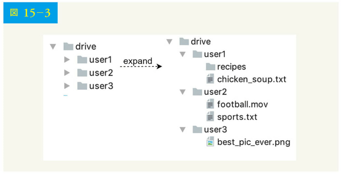

### API

API はどのようなものでしょう。ここでは主に、ファイルのアップロード、ファイルのダウンロード、ファイルのリビジョン取得という 3 つの API が必要です。

### 📍1. Google ドライブへファイルをアップロード

2 種類のアップロードに対応しています。

• シンプルアップロード：ファイルサイズが小さい場合は、このタイプを使用する
• 再開可能なアップロード：ファイルサイズが大きく、ネットワークが遮断される可能性が高い場合、このアップロード形式を使用する

以下は、再開可能なアップロード API の例です。
https://api.example.com/files/upload?uploadType=resumable

パラメータ
• アップロードの形式 = 再開可能なアップロード
• データ：アップロードされるローカルファイル

再開可能なアップロードは、以下の 3 つのステップで実現されます。

• 再開可能な URL を取得するための最初のリクエストを送信する
• データをアップロードし、アップロードの状態を監視する
• アップロードが中断された場合、アップロードを再開する

### 📍2. Google ドライブからファイルをダウンロード

API の例：https://api.example.com/files/download

パラメータ
• パス：ダウンロードファイルのパス

```json
{
  "path": "/recipes/soup/best_soup.txt"
}
```

### 📍3. ファイルのリビジョンを取得

API の例：https://api.example.com/files/list_revisions

パラメータ
• パス：リビジョン履歴を取得したいファイルへのパス
• リミット：返すリビジョンの最大数
Example params:
|
"path": "/recipes/soup/best_soup.txt",
"limit": 20
|

すべての API は、ユーザー認証を必要とし、HTTPS を使用しています。SSL(Secure Sockets Layer)は、クライアント-バックエンドサーバ間のデータ転送を保護します。

### 単一サーバからの移行

より多くのファイルがアップロードされると、最終的には図 15-4 に示すように容量一杯の警告が表示されます。

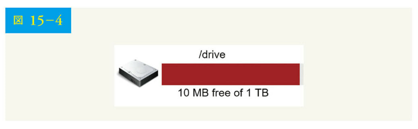

ストレージの空き容量が 10MB しかないのは、ユーザーがファイルをアップロードできなくなる緊急事態です。最初に思いつく解決策は、データを水平分割して、複数のストレージサーバに保存することです。図 15-5 は user_id に基づいて水平分割を行った例です。

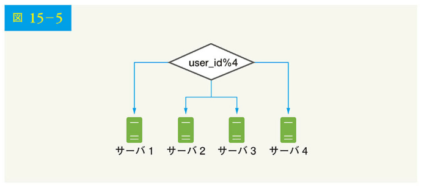

徹夜でデータベースの水平分割をセットアップし、注意深く監視します。すべてが再びスムーズに動作するようになりました。次は止めたもの、ストレージサーバが停止した場合の潜在的なデータ損失がまだ心配です。バックエンドの第一人者である友人のフランクが、Netflix や Airbnb のような大手事業者はストレージに Amazon S3 を使用している、「Amazon Simple Storage Service(Amazon S3)は、業界をリードするスケーラビリティ、データ可用性、セキュリティ、パフォーマンスを提供するオブジェクトストレージサービスです」と教えてくれました。そこで、このサービスが適しているかを調査することにしたのです。

多くを調べて、S3 ストレージシステムについてよく理解し、S3 にファイルを保存することに決めました。Amazon S3 は、同一リージョンとクロスリージョンにおける複製をサポートします。リージョンとは、Amazon Web サービス（AWS）がデータセンターを持つ地理的なエリアです。図 15-6 に示すように、データは同一リージョン（左側）とクロスリージョン（右側）で複製できるのです。冗長化されたファイルを複数のリージョンに保存することで、データ損失を防ぎ、可用性を確保します。バケットはファイルシステムでいうところのフォルダのようなものです。

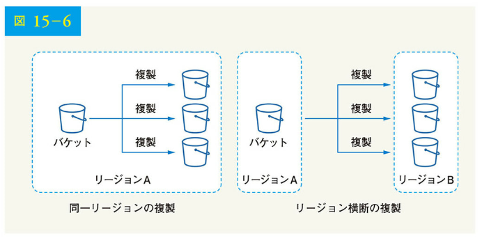

S3 にファイルを置いてから、ようやくデータ損失の心配をせずにぐっすり眠れるようになりました。今後、同じような問題が起こらないようにするため、改善できる点についてさらに調査することにしました。以下は、見つけたいくつかの領域です。

• ロードバランサ：ロードバランサを追加して、ネットワークトラフィックを分散させる。ロードバランサは、トラフィックを均等に分散し、Web サーバがダウンした場合、トラフィックを再分配できる
• Web サーバ：ロードバランサを追加した後、トラフィックの負荷に応じて、簡単に Web サーバを追加・削除できる
• メタデータデータベース：単一障害点を避けるために、データベースをサーバの外に移動する。一方、データの複製と水平分割を設定し、可用性とスケーラビリティの要件を満たす
• ファイルストレージ：ファイルストレージには、Amazon S3 を使用する。可用性と耐久性を確保するため、ファイルは地理的に離れた 2 つの地域に複製される

以上の改善により、Web サーバ、メタデータデータベース、ファイルストレージを 1 台のサーバから切り離すことに成功しました。更新された設計は図 15-7 に示す通りです。

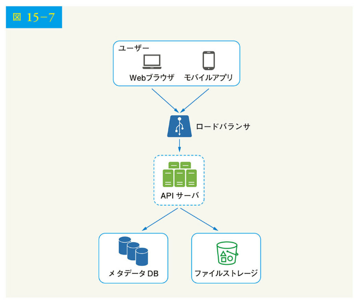

### 同期の競合

Google ドライブのような大規模ストレージでは、同期の競合が時々発生します。2 人のユーザーが同時に同じファイルやフォルダを変更すると、競合が起こるのです。競合はどのように解決すればいいのでしょう。ここでは、最初に処理されたバージョンが勝ち、後で処理されたバージョンが競合を受けとれるという戦略を採っています。図 15-8 に、同期競合の例を示します。

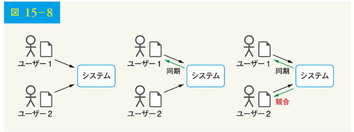

図 15-8 では、ユーザー 1 とユーザー 2 が同時に同じファイルを更新しようとしていますが、ユーザー 1 のファイルが先にシステムによって処理されます。ユーザー 1 の更新操作は成功しましたが、ユーザー 2 が同期の競合に陥りました。どうすればユーザー 2 の競合を解決できるのでしょう。このシステムは、同じファイルの両方のコピー、すなわちユーザー 2 のローカルコピーとサーバからの最新バージョンを提示します（図 15-9）。ユーザー 2 には、両方のファイルをマージするか、一方のバージョンを他方のバージョンで上書きするかという選択肢があります。

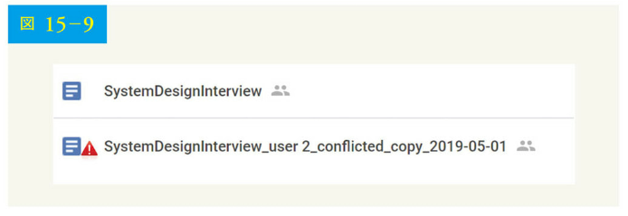

複数のユーザーが同じドキュメントを同時に編集している場合、文書の同期を保つのは困難です。興味のある読者は、参考文献[4][5]を参照してください。

### 高度な設計

図 15-10 に、提案する高度な設計を示します。システムの各構成要素を見ていきましょう。

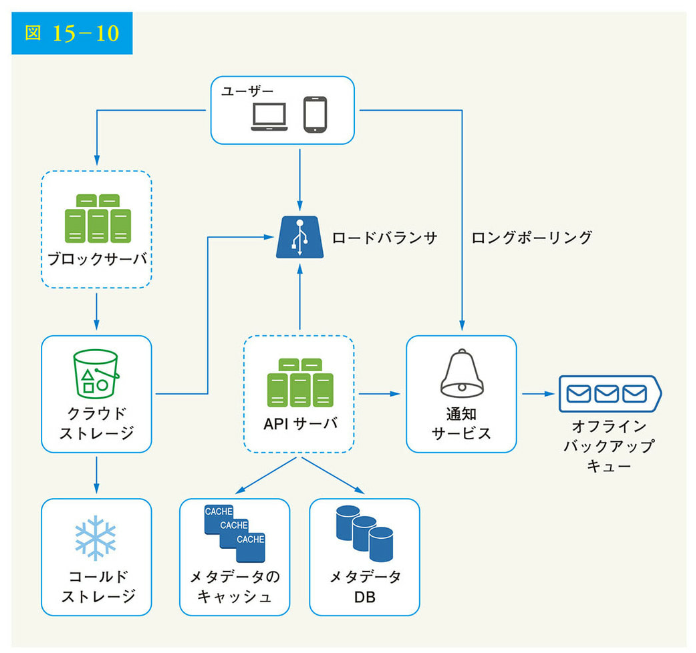

ユーザー：ユーザーはブラウザまたはモバイルアプリでアプリケーションを使用する

ブロックサーバ：ブロックサーバはブロックをクラウドストレージにアップロードする。ブロックレベルストレージとも呼ばれるブロックストレージは、クラウド環境上でデータファイルを保存する技術である。1 つのファイルを複数のブロックに分割し、それぞれに固有のハッシュ値を付けてメタデータ

データベースに格納できる。各ブロックは独立したオブジェクトとして扱われ、ストレージシステム（S3）に格納される。ファイルを再構成するには、ブロックを特定の順序で結合する。ブロックサイズについては、Dropbox を参考に、1 ブロックの最大サイズを 4MB に設定する

クラウドストレージ：ファイルは小さなブロックに分割され、クラウドストレージに保存される

コールドストレージ：コールドストレージとは、長期間アクセスされない非アクティブなデータを保存するために設計されたコンピュータシステムである

ロードバランサ：ロードバランサは、API サーバ間でリクエストを均等に分散させる

API サーバ：API サーバはアップロードのフロー以外のほぼすべてを担当する。ユーザー認証、ユーザープロファイルの管理、ファイルメタデータの更新などを担う

メタデータデータベース：メタデータデータベースは、ユーザー、ファイル、ブロック、バージョンなどのメタデータを保存する。なお、ファイルはクラウド上に保存され、メタデータデータベースにはメタデータのみが保存される

メタデータのキャッシュ：メタデータの一部がキャッシュされることで、高速な検索が可能になる

通知サービス：通知サービスは、特定のイベントが発生すると、通知サービスからクライアントにデータが転送されるようにするパブリッシャー/サブスクライバーシステム。この例では、あるファイルが他の場所に追加・編集・削除されると、通知サービスが関連するクライアントに通知し、最新の変更を取得できるようにする

オフラインバックアップキュー：クライアントがオフラインで最新のファイル変更を取得できない場合、オフラインバックアップキューが情報を保存し、クライアントがオンラインになったときに変更が同期されるようにする

ここまで、Google ドライブの設計を大まかに説明しました。いくつかのコンポーネントは複雑であり、慎重に検討する必要があります。これらの詳細について、設計の深堀りで議論しましょう。

## 【ステップ 3】設計の深堀り

ここでは、ブロックサーバ、メタデータデータベース、アップロードの流れ、ダウンロードの流れ、通知サービス、保存領域、障害処理について、詳しく見ていきます。

### ブロックサーバ

定期的に更新される大きなファイルでは、更新のたびにファイル全体を送信すると、多くの帯域幅を消費してしまいます。送信されるネットワークトラフィックの量を最小限に抑えるため、2 つの最適化が提案されます。

• デルタ同期：ファイルが変更されると、同期アルゴリズムを使用して、ファイル全体ではなく、変更されたブロックだけが同期される
• 圧縮：ブロックに圧縮をかけると、データサイズを大幅に削減できる。そこで、ファイルの種類に応じた圧縮アルゴリズムを用いて、ブロックを圧縮する。例えば、テキストファイルの圧縮には gzip や bzip2 が使用される。画像や動画の圧縮には、異なる圧縮アルゴリズムが必要である

本システムでは、ファイルのアップロードに必要な重い作業はブロックサーバが行います。ブロックサーバは、クライアントから渡されたファイルをブロックに分割し、各ブロックを圧縮して暗号化することで処理します。ファイル全体をストレージにアップロードするかわりに、変更したブロックのみを転送するのです。

図 15-11 は、新しいファイルが追加されたときのブロックサーバの動作を示しています。

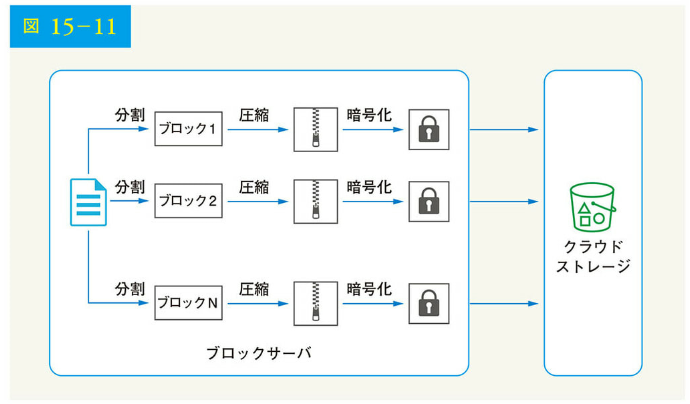

• ファイルはより小さなブロックに分割される
• 各ブロックは圧縮アルゴリズムで圧縮される
• セキュリティを確保するために、各ブロックはクラウドストレージに送信される前に暗号化される
• ブロックはクラウドストレージにアップロードされる

図 15-12 はデルタ同期を示しています。つまり、変更されたブロックのみがクラウドストレージに転送されるのです。ハイライトされた「ブロック 2」と「ブロック 5」は、変更されたブロックを表しています。デルタ同期を使用すると、これら 2 つのブロックのみがクラウドストレージにアップロードされます。

ブロックサーバは、デルタ同期と圧縮を提供することにより、ネットワークトラフィックの節約を可能にするのです。

### 高い一貫性の要求

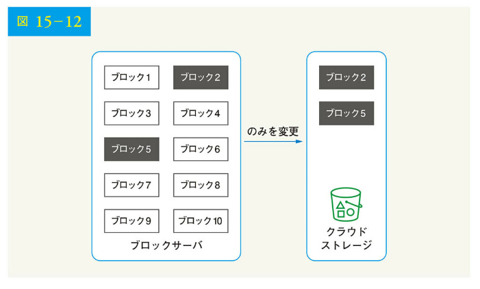

このシステムは、デフォルトで強い一貫性を要求します。あるファイルが、異なるクライアントから同時に異なるように表示されることは受け入れられません。メタデータキャッシュとデータベース層に対して強い一貫性を提供する必要があるのです。

メモリキャッシュはデフォルトで弱発的一貫性モデルを採用しているため、異なる複製は異なるデータを持つ可能性があります。強力な一貫性を実現するには、以下を保証する必要があるのです。

• キャッシュの複製データとマスターデータの整合性を確保する
• キャッシュとデータベースが同じ値を保持するように、データベースへの書き込み時にキャッシュを無効化する

リレーショナルデータベースでは、ACID（不可分性 = Atomicity、整合性 = Consistency、独立性 = Isolation、永続性 = Durability）特性を維持しているため、強力な一貫性の実現は容易です。しかし、NoSQL データベースはデフォルトでは ACID プロパティをサポートしていません。そのため、同期ロジックに ACID 特性を組み込む必要があります。この設計では、完全 ACID をサポートしているリレーショナルデータベースを選択しました。

### メタデータデータベース

図 15-13 にデータベーススキーマの設計を示します。最も重要なテーブルと興味深いフィールドのみが含まれているため、この設計は非常に単純化されていることに注意してください。

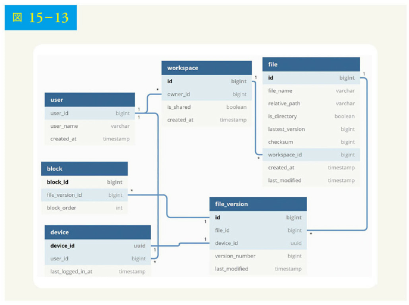

• user：user テーブルには、ユーザー名、電子メール、プロフィール写真などといったユーザーに関する基本情報が含まれる

• device：device テーブルには、デバイス情報が格納される。Push_id は、モバイルプッシュ通知の送受信に使用される。ユーザーは複数のデバイスを所有できることに注意されたい

• name space：name space は、ユーザーのルートディレクトリである

• file：file テーブルには、最新ファイルに関連するすべての情報が格納される

• file_version：file version テーブルには、ファイルのバージョン履歴が格納される。ファイルの改訂履歴の整合性を保つため、既存の行は読み取り専用である

• block：block には、ファイルブロックに関連するすべての情報が格納される。すべてのブロックを正しい順序で結合することにより、任意のバージョンのファイルを再構築できる

### アップロードの流れ

クライアントがファイルをアップロードするときに何が起こるかを説明しましょう。フローをよりよく理解するため、図 15-14 のようなシーケンス図を描きます。

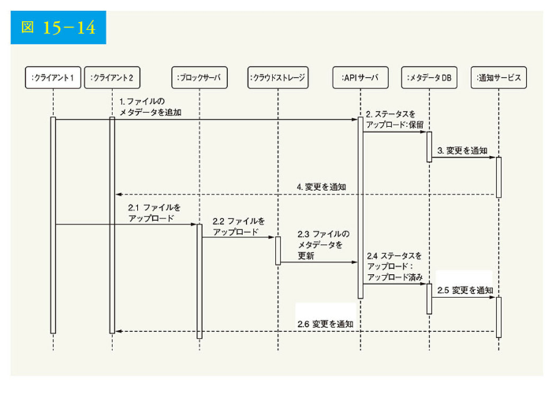

図 15-14 では、2 つのリクエストが並行して送信されています。すなわち、ファイルのメタデータを追加するリクエストと、ファイルをクラウドストレージにアップロードするリクエストです。どちらのリクエストもクライアントから発信されています。

• ファイルのメタデータを追加

1. クライアント 1 は新しいファイルのメタデータを追加するリクエストを送信する
2. 新しいファイルのメタデータをメタデータ DB に格納し、ファイルのアップロードステータスを「保留」に変更する
3. 通知サービスへ新規ファイル追加を通知する
4. 通知サービスは、関連するクライアント（クライアント 2）に対して、ファイルがアップロードされることを通知する

• クラウドストレージにファイルをアップロード
2.1 クライアント 1 がブロックサーバにファイルの内容をアップロードする
2.2 ブロックサーバは、ファイルをブロックに分割し、ブロックを圧縮、暗号化し、クラウドストレージにアップロードする
2.3 ファイルがアップロードされると、クラウドストレージがアップロード完了コールバックをトリガーする。そのリクエストは、API サーバに送信される
2.4 メタデータ DB のファイルステータスが「アップロード済み」に変更される
2.5 ファイルのステータスが「アップロード済み」に変更されたことを通知サービスへ通知する
2.6 通知サービスは、ファイルが完全にアップロードされたことを関連するクライアント（クライアント 2）へ通知する

ファイルを編集する場合についても、同様のフローとなります。そのため、説明は省略します。

### ダウンロードの流れ

ダウンロードの流れは、ファイルが他の場所に追加または編集されたときにトリガーされます。では、あるファイルが他のクライアントによって追加または編集されたことを、クライアントはどのように知るのでしょう。
クライアントが知る方法は 2 つあります：

• クライアント A がオンラインのとき、他のクライアントによってファイルが変更された場合、通知サービスがクライアント A に、どこかで変更が行われたために最新データを取得する必要があることを知らせる
• 他のクライアントがファイルを変更している間にクライアント A がオフラインになった場合、データはキャッシュに保存される。オフラインのクライアントが再びオンラインになったとき、最新の変更内容を取り込む

クライアントはファイルの変更を知ると、まず API サーバ経由でメタデータをリクエストし、次にファイルを構築するためのブロックをダウンロードします。図 15-15 に詳細なフローを示します。スペースの関係上、最も重要なコンポーネントのみを図に示していることに注意してください。

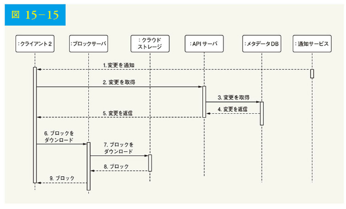

1. 通知サービスにより、クライアント 2 に他の場所でのファイル変更が通知される
2. クライアント 2 は、新しい更新が利用可能であると知り、メタデータを取得するためのリクエストを送信する
3. API サーバはメタデータデータベースを呼び出して、変更点のメタデータを取得する
4. メタデータが API サーバに返される
5. クライアント 2 がメタデータを取得する
6. メタデータを受け取ったクライアントは、ブロックサーバにリクエストを送り、ブロックをダウンロードする
7. ブロックサーバは、まずクラウドストレージからブロックをダウンロードする
8. クラウドストレージからブロックサーバにブロックが返される
9. クライアント 2 が新しいブロックをすべてダウンロードし、ファイルを再構築する

### 通知サービス

ファイルの一貫性を保つ上では、ローカルでのファイルの突然変異は競合を減らすために他のクライアントに通知する必要があります。通知サービスは、この目的を達成するために構築されています。高度な設計では、イベントが発生したとき、通知サービスがデータのクライアントへの転送を可能にしています。ここでは、いくつかの選択肢を紹介しましょう。

• ロングポーリング：Dropbox はロングポーリングを使用している
• WebSocket：WebSocket は、クライアント-サーバ間の持続的な接続を提供する。通信は双方向である

どちらのオプションもうまく機能しますが、次の 2 つの理由からロングポーリングを選択します。

• 通知サービスの通信は双方向ではない。サーバはファイルの変更に関する情報をクライアントに送信するが、その逆はない
• WebSocket はチャットアプリのようなリアルタイムの双方向通信に向いている。Google ドライブの場合、通知はバーストすることなく、不定期に送信される

ロングポーリングでは、各クライアントが通知サービスに対してロングポーリング接続を確立します。ファイルの変更が検出されると、クライアントはロングポーリング接続を閉じます。接続を閉じるということは、クライアントがメタデータ・サーバに接続して最新の変更をダウンロードする必要があることを意味します。レスポンスを受信するか、接続タイムアウトに達すると、クライアントは直ちに新しいリクエストを送信して、接続を開いたままにするのです。

### ストレージ容量の節約

ファイルのバージョン履歴をサポートして信頼性を確保するため、同じファイルの複数バージョンを複数のデータセンターで保存します。すべてのファイルのリビジョンを頻繁にバックアップしていると、ストレージ容量がすぐに一杯になってしまう可能性があります。そこで、ストレージのコストを削減するために、以下の 3 つの手法を提案します。

• データブロックの重複を排除する。アカウントレベルで冗長なブロックを削除することは、スペースを節約する簡単な方法である。同じハッシュ値を持つ場合、2 つのブロックは同一である
• インテリジェントなデータバックアップ戦略を採用する。2 つの最適化戦略が適用可能
• 制限を設ける：保存するバージョン数の制限を設けられる。もし制限に達したら、最も古いバージョンは新しいバージョンに置き換えられる
• 貴重なバージョンのみを保存する：一部のファイルは、頻繁に編集されるかもしれない。例えば、変更の多いドキュメントについてすべてのバージョンを保存すると、短期間に 1,000 回以上保存されることになりかねない。不必要なコピーを避けるため、保存されるバージョンの数を制限できる。ここでは、最近のバージョンに重きを置く。保存に最適なバージョン数を把握するには、実験が有効である

• 使用頻度の低いデータをコールドストレージに移動させる。コールドデータとは、数カ月から数年間アクティブになっていないデータである。Amazon S3 Glacier のようなコールドストレージは、S3 よりはるかに安価である

### 障害の処理

大規模システムには障害発生の可能性があり、その障害に対応するための設計戦略を採用する必要があります。以下のようなシステム障害にどのように対処しているかを聞くことに、面接官は興味を持つかもしれません。

• ロードバランサの障害：ロードバランサに障害が発生した場合、セカンダリーがアクティブになり、トラフィックをピックアップする。ロードバランサは通常、ロードバランサ間で送信される定期的な信号のハートビートを使って互いを監視している。ロードバランサは、しばらくハートビートを送信しないと、障害が起きたとみなされる

• ブロックサーバの障害：ブロックサーバに障害が発生した場合、他のサーバが未完成または保留のジョブを引き取る

• クラウドストレージの障害：S3 バケットは、異なる地域で複数回複製される。ある地域でファイルを利用できない場合、別の地域から取得可能である

• API サーバの障害：API サーバはステートレスサービスである。API サーバに障害が発生した場合、トラフィックはロードバランサによって他の API サーバにリダイレクトされる

• メタデータキャッシュの障害：メタデータキャッシュサーバは複数回複製される。1 つのノードがダウンしても、他のノードにアクセスしてデータを取得できる。障害が発生したキャッシュサーバの代わりに、新しいキャッシュサーバを立ち上げるのだ

• メタデータデータベースの障害：
• マスターがダウン：マスターがダウンした場合、スレーブの 1 つを昇格させて新しいマスターとして動作させ、新しいスレーブノードを立ち上げる
• スレーブがダウン：スレーブがダウンした場合、読み取り操作のために別のスレーブを使用し、故障したものを置き換えるために別のデータベースサーバを持ってくることが可能である

• 通知サービスの障害：すべてのオンラインユーザーは、通知サーバとのロングポーリング接続を保持する。したがって、各通知サーバは、多くのユーザーと接続されている。2012 年の Dropbox の講演によると、サーバ 1 台あたり 100 万以上の接続が開かれているそうだ。もしサーバがダウンしたら、すべてのロングポーリング接続が失われるため、クライアントは別のサーバに再接続しなければならない。1 台のサーバが多くのオープンな接続を維持できても、失われた接続を 1 度にすべて再接続するのは不可能である。失われたすべてのクライアントとの再接続は、比較的遅いプロセスとなる

• オフラインのバックアップキューの障害：キューは複数回複製される。あるキューに障害が発生した場合、そのキューの消費者は、バックアップキューに再加入する必要があるかもしれない

## 【ステップ 4】まとめ

この章では、Google ドライブをサポートするシステムの設計を提案しました。強力な一貫性、低いネットワーク帯域幅、高速な同期の組み合わせが、この設計を興味深いものにしています。この設計には、ファイルのメタデータを管理するフローと、ファイルの同期を行うフローの 2 つがあります。通知サービスは、システムのもう 1 つの重要な構成要素です。これは、ロングポーリングを使用して、クライアントにファイルの変更に関する最新情報を提供します。

他のシステム設計の面接試験の質問と同様に、完璧な解答は存在しません。どの企業にも独自の制約があり、その制約に合うようにシステムを設計しなければならないのです。設計と技術という選択のトレードオフを知ることは重要です。時間があれば、さまざまな設計の選択について会話できるでしょう。

例えば、ブロックサーバを経由せずに、クライアントから直接クラウドストレージにファイルをアップロードできます。この方法の利点は、ファイルがクラウドストレージに一度だけ転送されればよいので、ファイルアップロードが高速になることです。この設計では、ファイルはまずブロックサーバに転送され、その後、クラウドストレージに転送されます。ただし、この方法にはいくつかの欠点があります。

まず、異なるプラットフォーム（iOS、Android、Web）で同じ分割、圧縮、暗号化ロジックを実装する必要がある。これはエラーが発生しやすく、多くのエンジニアリングの労力を必要とする。設計では、これらのロジックはすべてブロックサーバという一元的な場所に実装される

第 2 に、クライアントは容易にハッキングされたり操作されたりするため、クライアント側での暗号化ロジックの実装は望ましくはない

もう 1 つの興味深い進展は、オンライン/オフラインのロジックを別のサービスに移行することです。これは、プレゼンスサービスと呼ばれます。プレゼンスサービスを通知サーバの外に出すことで、オンライン/オフラインの機能を他のサービスで容易に統合できます。

ここまで来られた方、おめでとうございます。さあ、自分をほめてあげてください。よくやったと。

参考文献：
[1] Google Drive: https://www.google.com/drive/
[2] Upload file data: https://developers.google.com/drive/api/v2/manage-uploads
[3] Amazon S3: https://aws.amazon.com/s3
[4] Differential Synchronization https://neil.fraser.name/writing/sync/
[5] Differential Synchronization YouTube talk: https://www.youtube.com/watch?v=S2Hp_1rpvY8
[6] How We've Scaled Dropbox: https://youtu.be/PE4gwstWhnc
[7] Tridgell, A., & Mackerras, P. (1996). The rsync algorithm.
[8] Librsync. (n.d.). Retrieved April 18, 2015, from https://github.com/librsync/librsync
[9] ACID: https://en.wikipedia.org/wiki/ACID
[10] Dropbox security white paper: https://www.dropbox.com/static/business/resources/Security_Whitepaper.pdf
[11] Amazon S3 Glacier: https://aws.amazon.com/glacier/faqs/
